# Universidad Peruana de Ciencias Aplicadas

## Ingeniería de Sistemas y Computación | Ingeniería de Software

### APLICACIONES WEB

#### TB1 REPORT

**Nombre del Startup**
Pecuario Pro 

**Docente:** Angel Augusto Velasquez Nuñez 

**Grupo 5**

**Team Members:**
- Rojas Velasquez, Maycol Jhordan **U202219984**
- Soriano Medrano, Diego		**U202114793**
- Casaverde de la Cruz, Ernesto David 	**U20221B657**
- Cantoral Sedamano, Alexander Alberto	**U20181B152**
- Vásquez Villalobos, Elverth Jair **U202213070**

 

<b>Ciclo 2024-01 | Sección WS53

 
 

## REGISTRO DE VERSIONES DEL INFORME
<table>
 <thead>
    <tr>
      <th>Versión</th>
      <th>Fecha</th>
      <th>Autor</th>
      <th>Descripción de modificación</th>
    </tr>
 </thead>
 <tbody>
    <tr>
      <td>1.0</td>
      <td>10/04/2024</td>
      <td>Rojas Velasquez, Maycol Jhordan. 
      Soriano Medrano, Diego. 
      Casaverde de la Cruz, Ernesto David. 
      Cantoral Sedamano, Alexander Alberto. 
      Vásquez Villalobos, Elverth Jair.
      </td>
      <td>
        - Creación del documento para la primera versión del informe. 
        - Implementación de Carátula, Contenido, Student Outcome. 
        - Apertura Capítulo 1: Introducción. 
        - Redacción Startup Profile: Descripción de la Startup, Perfiles de integrantes del equipo. 
        - Redacción Solution Profile: Antecedentes y problemática, Lean UX Process. 
        - Redacción Segmentos objetivo. 
        - Apertura Capítulo 2: Requirements Elicitation & Analysis. 
        - Redacción Competidores: Análisis competitivo, Estrategias y tácticas frente a competidores. 
        - Redacción Entrevistas: Diseño de entrevistas, Registro de entrevistas y Análisis de entrevistas. 
        - Redacción Needfinding: User Personas, User Task Matrix, User Journey Mapping, Empathy Mapping y As-is Scenario Mapping. 
        - Avance en la redacción de conclusiones. 
        - Incorporación de Bibliografía en base a las citas del documento de reporte.
      </td>
    </tr>
    <tr>
      <td>2.0</td>
      <td>01/05/2024</td>
      <td>Rojas Velasquez, Maycol Jhordan. 
      Soriano Medrano, Diego. 
      Casaverde de la Cruz, Ernesto David. 
      Cantoral Sedamano, Alexander Alberto. 
      Vásquez Villalobos, Elverth Jair.
      </td>
      <td></td>
    </tr>
    <tr>
      <td>3</td>
      <td></td>
      <td>Grupo 05</td>
      <td></td>
    </tr>
    <tr>
      <td>4</td>
      <td></td>
      <td>Grupo 05</td>
      <td></td>
    </tr>
 </tbody>
</table>

 
 

## Project Report Collaboration Insights

### Entregas

# CONTENIDO

# Tabla de Contenidos

1. [Capítulo I: Introducción](#capítulo-i-introducción) 
   1.1. [Startup Profile](#startup-profile) 
      1.1.1. [Descripción de la Startup](#descripción-de-la-startup) 
      1.1.2. [Perfiles de integrantes del equipo](#perfiles-de-integrantes-del-equipo) 
   1.2. [Solution Profile](#solution-profile) 
      1.2.1. [Antecedentes y problemática](#antecedentes-y-problemática) 
      1.2.2. [Lean UX Process](#lean-ux-process) 
         1.2.2.1. [Lean UX Problem Statements](#principio-1) 
         1.2.2.2. [Lean UX Assumptions](#principio-2) 
         1.2.2.3. [Lean UX Hypothesis Statements](#principio-3) 
         1.2.2.4. [Lean UX Canvas](#principio-4) 
   1.3. [Segmentos objetivo](#lean-ux-problem-statements-assumptions-hypothesis-statements-canvas-segmentos-objetivo) 
2. [Capítulo II: Requirements Elicitation & Analysis](#capítulo-ii-requirements-elicitation-analysis) 
   2.1. [Competidores](#competidores) 
      2.1.1. [Análisis competitivo](#análisis-competitivo) 
      2.1.2. [Estrategias y tácticas frente a competidores](#estrategias-y-tácticas-frente-a-competidores) 
   2.2. [Entrevistas](#entrevistas) 
      2.2.1. [Diseño de entrevistas](#diseño-de-entrevistas) 
      2.2.2. [Registro de entrevistas](#registro-de-entrevistas) 
      2.2.3. [Análisis de entrevistas](#análisis-de-entrevistas) 
   2.3. [Needfinding](#needfinding) 
      2.3.1. [User Personas](#user-personas) 
      2.3.2. [User Task Matrix](#user-task-matrix) 
      2.3.3. [User Journey Mapping](#user-journey-mapping) 
      2.3.4. [Empathy Mapping](#empathy-mapping) 
      2.3.5. [As-is Scenario Mapping](#as-is-scenario-mapping) 
   2.4. [Ubiquitous Language](#ubiquitous-language) 
3. [Capítulo III: Requirements Specification](#capítulo-iii-requirements-specification) 
   3.1. [To-Be Scenario Mapping](#to-be-scenario-mapping) 
   3.2. [User Stories](#user-stories) 
   3.3. [Impact Mapping](#impact-mapping) 
   3.4. [Product Backlog](#product-backlog) 
4. [Capítulo IV: Product Design](#capítulo-iv-product-design) 
   4.1. [Style Guidelines](#style-guidelines) 
      4.1.1. [General Style Guidelines](#general-style-guidelines) 
      4.1.2. [Web Style Guidelines](#web-style-guidelines) 
   4.2. [Information Architecture](#information-architecture) 
      4.2.1. [Organization Systems](#organization-systems) 
      4.2.2. [Labeling Systems](#labeling-systems) 
      4.2.3. [SEO Tags and Meta Tags](#seo-tags-and-meta-tags) 
      4.2.4. [Searching Systems](#searching-systems) 
      4.2.5. [Navigation Systems](#navigation-systems) 
   4.3. [Landing Page UI Design](#landing-page-ui-design) 
      4.3.1. [Landing Page Wireframe](#landing-page-wireframe) 
      4.3.2. [Landing Page Mock-up](#landing-page-mock-up) 
   4.4. [Web Applications UX/UI Design](#web-applications-uxui-design) 
      4.4.1. [Web Applications Wireframes](#web-applications-wireframes) 
      4.4.2. [Web Applications Wireflow Diagrams](#web-applications-wireflow-diagrams) 
      4.4.2. [Web Applications Mock-ups](#web-applications-mock-ups) 
      4.4.3. [Web Applications User Flow Diagrams](#web-applications-user-flow-diagrams) 
   4.5. [Web Applications Prototyping](#web-applications-prototyping) 
   4.6. [Domain-Driven Software Architecture](#domain-driven-software-architecture) 
      4.6.1. [Software Architecture Context Diagram](#software-architecture-context-diagram) 
      4.6.2. [Software Architecture Container Diagrams](#software-architecture-container-diagrams) 
      4.6.3. [Software Architecture Components Diagrams](#software-architecture-components-diagrams) 
   4.7. [Software Object-Oriented Design](#software-object-oriented-design) 
      4.7.1. [Class Diagrams](#class-diagrams) 
      4.7.2. [Class Dictionary](#class-dictionary) 
   4.8. [Database Design](#database-design) 
      4.8.1. [Database Diagram](#database-diagram) 
5. [Capítulo V: Product Implementation, Validation & Deployment](#capítulo-v-product-implementation-validation-deployment) 
   5.1. [Software Configuration Management](#software-configuration-management) 
      5.1.1. [Software Development Environment Configuration](#software-development-environment-configuration) 
      5.1.2. [Source Code Management](#source-code-management) 
      5.1.3. [Source Code Style Guide & Conventions](#source-code-style-guide-conventions) 
      5.1.4. [Software Deployment Configuration](#software-deployment-configuration) 
   5.2. [Landing Page, Services & Applications Implementation](#landing-page-services-applications-implementation) 
      5.2.1. [Sprint 1](#sprint-1) 
         5.2.1.1. [Sprint Planning 1](#sprint-planning-1) 
         5.2.1.2. [Sprint Backlog 1](#sprint-backlog-1) 
         5.2.1.3. [Development Evidence for Sprint Review](#development-evidence-for-sprint-review) 
         5.2.1.4. [Testing Suite Evidence for Sprint Review](#testing-suite-evidence-for-sprint-review) 
         5.2.1.5. [Execution Evidence for Sprint Review](#execution-evidence-for-sprint-review) 
         5.2.1.6. [Services Documentation Evidence for Sprint Review](#services-documentation-evidence-for-sprint-review) 
         5.2.1.7. [Software Deployment Evidence for Sprint Review](#software-deployment-evidence-for-sprint-review) 
         5.2.1.8. [Team Collaboration Insights during Sprint](#team-collaboration-insights-during-sprint) 

# STUDENT OUTCOME

# Capítulo I: Introducción
## 1.1. Startup Profile
### 1.1.1. Descripción de la Startup

__Nombre del Start:__ PecuarioPro

PecuarioPro es una avanzada aplicación web diseñada para capacitar a los ganaderos en la gestión eficiente y sostenible de su ganado. Esta plataforma ofrece una amplia gama de herramientas integrales que permiten a los usuarios realizar un seguimiento detallado de la salud, alimentación y reproducción de sus animales, lo que facilita una mejor toma de decisiones en la granja. Con PecuarioPro, los ganaderos pueden optimizar sus operaciones y maximizar sus ingresos, al tiempo que promueven prácticas agrícolas sostenibles y éticas, lo que contribuye al bienestar de los animales y al desarrollo sostenible de la industria ganadera.

__Logotipo de la Startup:__

### 1.1.2. Perfiles de integrantes del equipo

**Rojas Velasquez, Maycol Jhordan - U20221984**

Elegí la carrera de Ingeniería de Software debido a mi gusto por la innovación y la implementación de la tecnología en cualquier rubro  social, de una manera creativa y en todos los aspectos. Me considero una persona creativa, en busca de ideas, estrategias con mente nueva. También me gusta escuchar ideas de mi equipo, dar ideas de mejora, evaluar las ventajas y desventajas . Además, tengo conocimientos de programación en C + +, HTML, Python  y SQL server. Además, Tengo un enfoque responsable y dedicado mediante un aprendizaje rápido así puedo ayudar a mis compañeros en sus dudas. Por otro lado, mis hobbies son ver series, jugar , escuchar música, nadar y  manejar.

**Vásquez Villalobos Elverth Jair - U202213070**

Mi perfil se basa en ser una persona que cuando enfrenta un problema no se rinde hasta encontrar una solución. Considero que tengo una buena capacidad de análisis al momento de realizar algoritmos necesarios para el funcionamiento de algunos requerimientos en el software. Así mismo, me gusta siempre estar en comunicación con mi equipo de trabajo de una manera asertiva. Me apasiona el mundo de la tecnología y el emprendimiento, por ello trato de aportar al desarrollo del startup con mis habilidades en programación e investigación.

**Casaverde De La Cruz Ernesto - 20221b657**

Estudio la carrera de ingeniería de software en la universidad de Ciencias Aplicadas – UPC. Siempre me tomo los trabajos como parte de mi desarrollo personal tengo habilidades de programación en c++, HTML, css, JavaScript, SQL, mongoDB, Python Además se dominar las metodologías agiles y gestión de proyectos privados o públicos. Me gustaría aprender más sobre la programación. En mis tiempos libres practico fútbol, también me gusta leer libros, ver películas y viajar. Me considero responsable, respetuosa y amable, con estas habilidades comprometo a terminar el proyecto de la mejor manera para aportar a la sociedad.

**Cantoral Sedamano, Alexander Alberto - U20181B152**
Ingeniería de software
Acerca de mí: Conocimientos técnicos de programación en C++, PHP, Python. Conocimientos básicos de frontend en HTML. Usuario frecuente tanto de Visual Studio como Visual Studio Code. Habilidades mixtas en otros programas usuales para el desarrollo de trabajos universitarios. Además, mis habilidades blandas van desde saber trabajar en equipo, tener una tendencia a ser ordenado y ser comprometido con todas las entregas.

**Soriano Medrano, Diego - U202114793**

Ingeniería de software
Soy una persona creativa y paciente, tengo conocimiento en el uso de diferentes herramientas informáticas y lenguajes de programación como C++ y Python, estas herramientas me ayudan a realizar distintos tipos de trabajo y a resolver problemas, parte de mis habilidades blandas es siempre tomar en cuenta la opinión de mis compañeros, lo cual me facilita el poder trabajar en equipo, para agilizar y optimizar el trabajo. En mis tiempos libres suelo navegar por internet.

## 1.2. Solution Profile
## 1.2.1 Antecedentes y problemática

__Mediante la técnica de “5w’s & 2h’s” logramos identificar los antecedentes de nuestra problemática y comprender mejor la misma.__

What/ Qué: Una aplicación web para gestionar eficientemente el inventario de ganado, registrar información relevante (peso, salud, alimentación, etc.), realizar seguimiento de la producción y ventas, y generar informes y análisis.

__When / Cuándo:__ Esta aplicación sería utilizada de manera continua por los encargados de la gestión del ganado, permitiéndoles acceder y actualizar la información en tiempo real.

__Where/ Dónde:__ La aplicación web estaría accesible desde cualquier dispositivo con conexión a Internet, ya sea en la oficina, en el campo o en cualquier lugar donde se requiera acceder a la información.

__Who / Quién:__ Los usuarios principales serían las personas que trabajan de la granja o rancho, veterinarios, encargados de alimentación y personal involucrado en la gestión del ganado.

__Why / Por qué:__ La aplicación web facilitaría la gestión eficiente del ganado, mejorando la trazabilidad, optimizando los procesos y permitiendo la toma de decisiones informadas basadas en datos precisos.

__How/ Cómo:__ La aplicación se desarrollaría utilizando tecnologías web modernas, como HTML, CSS, JavaScript, frameworks de front-end y back-end, bases de datos y servicios en la nube. Además, se implementarían funcionalidades como registro de datos, generación de informes, visualización de datos en tiempo real, entre otras.

__How much / Cuánto:__  El costo del desarrollo de la aplicación dependería de factores como el alcance, las características requeridas, la complejidad, la integración con otros sistemas y la contratación de desarrolladores y personal de soporte técnico.

### 1.2.2 Lean UX Process.
#### 1.2.2.1. Lean UX Problem Statements

__Problem statement 1:__  Como ganadero o productor pecuario necesito una solución para gestionar mis animales de manera eficiente, ya que actualmente dependo de una organización manual no muy eficiente para recopilar y rastrear información importante sobre mis animales, mi negocio y mi trabajo. Esto afectó negativamente el producto y la rentabilidad de mi negocio al dificultarme la toma de decisiones, la mejora de procesos y el cumplimiento de las reglas.

__Problem statement 2:__ Como administrador o encargado de una granja de animales necesito una aplicación web de gestión animal que cumple con los más altos estándares en términos de rendimiento, seguridad y escalabilidad, ya que las soluciones existentes en el mercado carecen de solidez, funciones avanzadas y potencial de crecimiento. Esto limitó mi capacidad para utilizar nuevas tecnologías, garantizar la integridad de los datos y brindar la mejor experiencia de usuario para mi equipo, lo que afectaría el rendimiento, la longevidad y la competitividad de mi negocio.

#### 1.2.2.2. Lean UX Assumptions

1.- __Ganaderos usan la tecnología:__ se asume que los ganaderos estén dispuestos a hacer uso de la tecnología para mejorar su negocio, y consideran que la administración de la ganadería es una herramienta valiosa para alcanzar este objetivo. 

__2.- Priorizar la Accesibilidad:__ Se asume que los ganaderos, independientemente de su experiencia tecnológica, valorarán una aplicación fácil de usar, accesible desde diferentes dispositivos, incluidos teléfonos móviles, tabletas y computadoras de escritorio.

__3.-Buena Conectividad:__ Se asume, que los ganaderos puedan contar con una Buena eficiencia en la conectividad ya que su rubro u oficio lo realizan desde zonas con poca conectividad o incluso no llegar a contar con ella. Para ello priorizaremos evitar las dependencias de la conectividad.

__4.-Gestion del Ganado:__ Se asume, que los ganaderos al usar nuestra aplicación web, aumente su productividad y mejor toma de decisiones para una mejor Calidad de los alimentos que provienen de los animales domésticos o incluso gestionar la Calidad de vida en zoológicos de animales silvestres o estado de conservación.

__5.-Personalización:__ Se asume, que el ganadero este cómodo usando una tecnología que se adecue a sus necesidades o acorde a su rango como trabajador o encargado para mejorar el confort y el mayor uso posible de la aplicación web evitando así incomodidad por falta de soporte.

__6.-Seguridad y privacidad:__ Se asume, que los ganaderos puedan contar con mucha confianza al usar nuestra aplicación debemos estar comprometidos con todos los métodos se seguridad y privacidad evitando posibles estafas o publicación de información sensible fuera de la aplicación.

#### 1.2.2.3. Lean UX Hypothesis Statements

1. __Hipótesis del problema:__ Basándonos en nuestras observaciones preliminares y en la investigación de mercado, creemos que los ganaderos están enfrentando desafíos significativos en la gestión eficiente de su ganado debido a la falta de herramientas de seguimiento y gestión adecuadas. Validaremos esta hipótesis realizando entrevistas en profundidad con un número representativo de ganaderos y analizando sus respuestas para identificar patrones y problemas comunes.
2. __Hipótesis de los usuarios:__ Suponemos que nuestros usuarios son ganaderos que manejan rebaños de varios tamaños y que buscan mejorar la eficiencia de su gestión del ganado. Validaremos esta hipótesis a través de encuestas y entrevistas con posibles usuarios para entender mejor sus necesidades y desafíos.
3.	__Hipótesis de las características:__ Creemos que al desarrollar una aplicación móvil que permita a los ganaderos rastrear la salud, la alimentación y el rendimiento de su ganado, podremos satisfacer sus necesidades y resolver sus problemas. Validaremos esta hipótesis mediante la creación de prototipos de las características propuestas y la realización de pruebas de usabilidad con nuestros usuarios objetivo.
4.	__Hipótesis de negocio:__ Suponemos que, al resolver estos problemas para los ganaderos, seremos capaces de monetizar nuestra aplicación a través de suscripciones o compras en la aplicación. Validaremos esta hipótesis a través de pruebas de mercado y análisis de la disposición de los usuarios a pagar por tales servicios.

#### 1.2.2.4. Lean UX Canvas

Link del figma [here](https://www.figma.com/file/MjkbNsmp6xjbCwMJWu7eRm/Lean-UX-Canvas?type=whiteboard&node-id=2%3A268&t=IfnuiT4QukKtG1cG-1 "Lean ux canvas").

## 1.3. Segmentos objetivo.

### Descripción de cada segmento objetivo:

#### Productores Ganadores independientes:
Este segmento objetivo de nuestra plataforma se centra en los ganaderos independientes comprometidos y preocupados por obtener ganancias de manera ética y sostenible, mientras garantizan una excelente calidad en el cuidado de sus animales en propiedad. Este grupo comprende a ganaderos que poseen una variedad de animales, tales como ovejas, vacas, reses, corderos, gallinas, entre otros, y que residen en Perú. Su principal objetivo es asegurarse de que el estado y cuidado de sus animales sea óptimo, priorizando el bienestar y la salud de estos. Además, están interesados en llevar a cabo prácticas de venta honestas, con un enfoque en productos más naturales y de alta calidad. Como obtener información de nuevos métodos de cuidado animal.

#### Empresas Ganaderas:
El segmento objetivo de nuestra plataforma se dirige específicamente a grandes empresas corporativas involucradas en la gestión y cuidado de animales. Estas empresas se destacan por su firme compromiso con prácticas éticas y sostenibles en la producción ganadera. Su principal preocupación radica en garantizar que sus animales reciban una alimentación precisa, óptima y honesta, priorizando la salud y el bienestar de cada individuo. Asimismo, estas empresas se preocupan por brindar un cuidado individual a cada animal, asegurándose de que reciban la atención necesaria para su desarrollo y bienestar. Asimismo, contar con un sistema integral de gestión veterinaria, que garantiza un acceso constante y adecuado a servicios de atención médica veterinaria para sus animales.

### Datos cuantitativos del problema:

#### Productores Ganadores independientes:
Se han registrado numerosos incidentes en los que los productores ganaderos peruanos no reciben una compensación justa en los mercados, y enfrentan dificultades significativas en la gestión del cuidado de sus animales debido a la escasez de recursos económicos y la limitada accesibilidad a servicios veterinarios para consultas y atención adecuada. Estas circunstancias han creado desafíos sustanciales para los ganaderos, quienes luchan por mantener la salud y el bienestar de sus animales mientras buscan asegurar su propio sustento económico en un entorno cada vez más desafiante y competitivo. Se estima que al menos el 15% de los animales muertos en las granjas se debe a la falta de acceso oportuno a servicios veterinarios adecuados, lo que genera pérdidas económicas significativas para los productores, estimadas en un 20% de sus ingresos anuales debido a la falta de compensación justa de los mercados hacia ellos.

#### Empresas Ganaderas:
En el Perú, el bienestar animal en las empresas ganaderas es a menudo insuficiente, con un preocupante porcentaje del 60% de las operaciones que no cumplen con estándares aceptables en este aspecto. Esta deficiencia se refleja en condiciones de vida inadecuadas para el ganado, como la falta de espacio y la alimentación deficiente, lo que afecta negativamente su salud y bienestar. Además, la gestión de residuos en estas empresas es inadecuada en aproximadamente un 70% de los casos, lo que resulta en una incorrecta disposición de los desechos animales y una potencial contaminación del medio ambiente. Esta situación representa un desafío significativo para la industria ganadera, ya que no solo compromete el bienestar de los animales, sino que también puede tener repercusiones negativas en la salud pública y el medio ambiente.

### Variables geográficas, demográficas y psicológicas:

#### Variable geográfica:
- País: Perú
- Ciudad: zonas rurales 

#### Variable demográfica:
- Género: Femenino / Masculino.
- Ocupación: Productores ganaderos 
- Estado civil: Todos los estados
- Edad y etapa de ciclo de vida:
- Ciudadanos mayores a 18 años.

#### Variable psicográfica:
- Nivel Socioeconómico (NSE): todos los niveles socioeconomicos
- Características de personalidad:
 - Altruismo 
 - Perseverante
 - Honestidad

# Capítulo II: Requirements Elicitation & Analysis
## 2.1 Competidores
### 2.1.1. Análisis competitivo.

| Competitive Analysis Landscape |  |  |  |  |  |
| --- | --- | --- | --- | --- | --- |
| ¿Por qué llevar a cabo este análisis? |  | Escriba en el recuadro la pregunta que busca responder o el objetivo de este análisis. |  |  |  |
|  |  | Por qué asi ampliamos nuestro conocimiento sobre nuestro negocio |  |  |  |
| (En la cabecera colocar por cada competidor nombre )
 |  | |PecuarioPro | Control Ganadero | Agroptima | App Ganadera |
| Perfil | Overview | Somos una empresa emergente en pleno desarrollo contamos con todas las últimas tecnologías, buena eficiencia y compatibilidad con muchos dispositivos | Es una aplicación español, británico y brasileño en el sector de la ganadería. | Agroptima es un sitio web multiplataforma cofundado por la unión europea para los países de España, Francia e Inglaterra | Es una empresa fundada en Colombia que cuenta con una para la gestión de ganado. |
|  | Ventaja competitiva ¿Qué valor ofrece a los clientes? | Lo último en tecnología mucha productividad y buena gestión | es una app para la gestión de vacas y enfocada para móviles | cuenta con multiplataforma cuenta con algoritmos matemáticos para una mayor gestión del ganado. | Tiene gran variedad de herramientas y gran cantidad de distribuidores |
| Perfil de Marketing | Mercado objetivo | productores ganaderos independientes y empresas privadas o públicas. | Para ganaderos españoles, brasileños e ingleses. | Para ganaderos españoles, franceses   e ingleses. | Para ganaderos colombianos |
|  | Estrategias de marketing | Difusión en redes sociales y anuncios pagados | Estrategia de posicionamiento | Estrategia de segmentación | Estrategia
segmentación |
| Perfil de Servicio | Servicio | Web app de gestión de ganado.| Web app de gestión de ganado. | Web app de gestión de ganado. | Web app de gestión de ganado. |
|  | Precio del servicio | suscripción  Bajo costo | suscripción  Bajo costo | suscripción  Bajo costo| Subscripcion Bajo costo |
|  | Canales de distribución (Web y/o Móvil) | Web y móvil | app | web y móvil | app |
| Análisis SOT | Realice esto para su empresa emergente y sus competidores. Sus fortalezas deberían apoyar sus oportunidades y contribuir a lo que ustedes definen como su posible ventaja competitiva. |  |  |  |  |
|  | Fortalezas | Contamos con lo último en tecnología e implementamos lo nuevo en desarrollo para mejorar la productividad del servicio | Es una app netamente para la gestión de vacas cuenta con buena personalización | Es famoso por ser bueno en gestión ya que usa algoritmos matemáticos para un mejor cálculo del ganado. | Su ecosistema está basado en un país de origen conoce muy bien a sus clientes y se adapta a ellos |
|  | Debilidades | Está en pleno desarrollo puede ser un éxito o fracaso | Solo es de móvil eso limita que sea multiplataforma | Solo opera en Europa y se basa en reglas ya establecidas por la unión europea | Solo es una app y para la zona de Colombia por lo tanto solo está disponible en su país de origen |
|  | Oportunidades | Puede hacer productivos a los ganaderos y empresas de este rubro mejorando sus tomas de decisiones y eficiencia | Si planeas ir a Europa es buena idea ya que ese es su público objetivo y contará con más servicios. | Si planeas ir a Europa es buena idea ya que ese es su público objetivo y contará con más servicios. | Si eres colombiano estarás contento con la app ya que es de uso nacional. |
|  | Amenazas | Al no tener buenos conocimientos o malas prácticas de desarrollo porque estamos en pleno rubro académico puede limitar su desarrollo. | no cuenta con muchos clientes la ganadería sigue siendo a la antigua por tanto no hace falta usarla. | no cuenta con muchos clientes la ganadería sigue siendo a la antigua por tanto no hace falta usarla. | Falta de apoyo económico los gobiernos locales de Colombia no ven viable esta innovación puede llegar a su desaparición |

### 2.1.2. Estrategias y tácticas frente a competidores.

Para nuestra web App queremos contar con la última tecnología disponible tales como:

1. __Integración de tecnologías disruptivas:__

-IA: análisis predictivo, monitoreo de comportamiento, optimización de alimentación.
-IOT: sensores para monitoreo en tiempo real, automatización de tareas.
-RA/RV: visualización 3D, entrenamiento virtual, simulación de producción.

2. __Enfoque en la experiencia del usuario:__

-Interfaz intuitiva y personalizable.
-Atención al cliente excepcional.
-Comunidad de usuarios para compartir experiencias.

3. __Funcionalidades avanzadas:__

-Módulo de trazabilidad completo.
-Análisis de datos con KPIs, comparación con benchmarks.
-Gestión de la reproducción y planificación financiera.

4. __Integración con otras aplicaciones:__

-Software de contabilidad y facturación.
-Plataformas de comercio electrónico.
-Dispositivos móviles y wearables.

5. __Marketing y promoción efectiva:__

-Posicionamiento SEO, marketing digital, participación en eventos.
-Colaboración con asociaciones de ganaderos e influencers.

## 2.2. Entrevistas.
Esta parte del informe presentará la parte objetiva de las entrevistas junto con el análisis relevante de cada una de ellas.
### 2.2.1. Diseño de entrevistas.

# Segmento #1 Productores Ganaderos independientes

Nuestra plataforma ha desarrollado un conjunto de preguntas diseñadas específicamente para abordar las necesidades, experiencias y expectativas de los productores ganaderos en relación con la gestión eficiente de sus operaciones y el cuidado óptimo de sus animales. La transparencia y la confianza son fundamentales en la industria ganadera, ya que aseguran una relación sólida con los consumidores y garantizan la calidad y seguridad de los productos. Nuestro objetivo es ayudar a los productores ganaderos a alcanzar estos objetivos proporcionándoles herramientas y recursos para gestionar sus actividades, mejorar el cuidado de sus animales y medir su impacto en la comunidad y el medio ambiente. Además, buscamos identificar formas de simplificar los procesos de gestión y ofrecer una plataforma intuitiva que se adapte a las necesidades específicas de los productores ganaderos. Al aprovechar la tecnología, nuestra plataforma puede ofrecer importantes beneficios a los productores ganaderos, incluida una mayor eficiencia operativa, mejor control de calidad y una mayor conexión con los consumidores finales.

## Preguntas Principales

- ¿Nos podría indicar su nombre, edad y tiempo que se dedica a la ganadería?
- ¿Cómo gestionas la alimentación y nutrición de tus animales?
- ¿Qué medidas tomas para garantizar la salud y el bienestar de tus animales?
- ¿Qué aspectos de la gestión de la salud veterinaria de tus animales consideras más importantes?
- ¿Qué herramientas o recursos utilizas para llevar un registro de la salud y el rendimiento de tus animales?
- ¿Qué desafíos enfrentas al administrar tu ganadería y cómo crees que una aplicación podría ayudarte a superarlos?
- ¿Qué funcionalidades te gustaría ver en una aplicación de gestión ganadera?
- ¿Qué tipo de información te gustaría poder acceder fácilmente desde tu aplicación?
- ¿Cómo te gustaría llevar un registro de la alimentación y el consumo de tus animales?
- ¿Qué esperas lograr al implementar una aplicación como PecuarioPro en tu ganadería?

# Segmento #2 Empresas Ganaderas

PecuarioPro se centra en mejorar la eficiencia y la gestión en las empresas ganaderas corporativas, donde se manejan grandes cantidades de animales. Para lograr esto, la plataforma formula preguntas específicas a los administradores y responsables de estas empresas sobre sus necesidades, experiencias y expectativas en cuanto a una plataforma de gestión ganadera. Además, mediante estas entrevistas, se pueden identificar las estrategias que consideran cruciales para una gestión ganadera efectiva y sostenible. Algunas de las preguntas que se pueden hacer a los responsables de las empresas ganaderas incluyen qué herramientas y recursos necesitan para gestionar sus operaciones de manera eficiente y cómo les gustaría que se les brinde apoyo para mejorar el cuidado y la producción de sus animales.

## Preguntas Principales

- ¿Nos podría indicar su nombre, edad y puesto en la empresa?
- ¿Cuántos animales maneja tu empresa en sus operaciones ganaderas?
- ¿Qué funcionalidades te gustaría ver en una aplicación de gestión ganadera a nivel corporativo?
- ¿Qué aspectos de la gestión ganadera consideras más críticos para el éxito de tu empresa?
- ¿Qué información o datos son más importantes para el seguimiento y la toma de decisiones en tu empresa ganadera?
- ¿Qué funcionalidades te gustaría ver para facilitar la gestión del personal y la planificación de horarios en tu empresa ganadera?
- ¿Qué tipo de informes o análisis te gustaría generar para evaluar el desempeño de tu empresa ganadera?
- ¿Cómo te gustaría interactuar con proveedores y otros socios comerciales a través de una plataforma como PecuarioPro?
- ¿Qué nivel de personalización o adaptabilidad esperas de una aplicación de gestión ganadera para satisfacer las necesidades específicas de tu empresa?
- ¿Qué mejoras esperas obtener al implementar una aplicación como PecuarioPro en tus operaciones ganaderas corporativas?

### 2.2.2. Registro de entrevistas.

### Segmento: Ganadero Independiente

#### Entrevista 1
| **Información del entrevistado** | 
|--------------------------|
| **Timing de entrevista:**   ... - ... |
| **Nombre:**  Ivan Jesus Lavado Vallejos |
| **Edad:**  20 años |
| **Procedencia:**  Lambayeque, Chiclayo, Chiclayo |
| |  |
| **Resumen:**  El entrevistado, Ivan Lavado Vallejos, destaca la transformación que la tecnología ha traído a la agricultura y cree en el potencial de las aplicaciones web para mejorar la gestión animal. Sin embargo, admite que sus decisiones de negocio sobre nutrición y salud del ganado las toma de manera empírica, apoyándose en métodos tradicionales y su experiencia. Realiza registros manuales de vacunas y seguimiento animal a través de apuntes en cuadernos. Respecto a la implementación de una solución de software, le gustaría que incluyera funciones como seguimiento de salud, alimentación, recordatorios de vacunas y tratamientos, así como informes sobre estadísticas y rendimiento de su ganadería. Prefiere una interfaz intuitiva y fácil de entender, idealmente para su teléfono móvil. |

#### Entrevista 2
| **Información del entrevistado** | 
|----------------------------------|
| **Timing de entrevista:** ... - ... |
| **Nombre:** Godofredo Quispe |
| **Edad:** 21 años |
| **Procedencia:** Puno |
| |  |
| **Resumen:** Godofredo, en su entrevista, destaca los desafíos que enfrenta en la gestión de su granja ganadera y propone una solución innovadora: implementar una aplicación móvil. Reconoce la importancia de registrar eventos como alimentación y tratamientos, así como la necesidad de acceder fácilmente a datos sobre la salud y producción animal. Además, subraya la relevancia de una planificación nutricional efectiva y la supervisión individualizada de los animales. En conclusión, Godofredo ofrece valiosas sugerencias para mejorar la gestión ganadera a través de la tecnología móvil. |

### Entrevista 3  
| **Información del entrevistado** | 
|----------------------------------|
| **Timing de entrevista:** ... - ... |
| **Nombre:** Manuel Quispe Rodríguez |
| **Edad:** 30 años |
| **Procedencia:** Cuzco, Cuzco |
| **mp4 el entrevistado, no accedio a mostrar su rostro** |
| **Resumen:** Manuel Quispe Rodríguez, durante la entrevista, expuso los desafíos y necesidades en la gestión de su granja ganadera, proponiendo la implementación de una aplicación móvil centralizada, como PecuarioPro, para facilitar el acceso y la visualización de datos relevantes. Expresó su interés en que la aplicación permita registrar eventos como alimentación, tratamientos, compras y ventas de animales, así como proporcionar información detallada sobre inventarios, salud y producción de cada animal. Además, destacó la importancia de poder acceder fácilmente a registros de alimentación y consumo de los animales para una mejor planificación nutricional. En resumen, junto con identificar las necesidades, el entrevistado ofreció valiosas sugerencias sobre las funciones y características que le gustaría ver en la aplicación móvil. |

### Segmento: Empresa ganadera

### Entrevista 4
| **Información del entrevistado** | 
|----------------------------------|
| **Timing de entrevista:** ... - ... |
| **Nombre:** Elver Vásquez Villalobos |
| **Edad:** 45 años |
| **Procedencia:** Lambayeque, Chiclayo, Chiclayo |
| |  |
| **Resumen:** Elver Vásquez, tesorero en una empresa ganadera en Lambayeque, supervisa aproximadamente 200 animales mensualmente, centrándose principalmente en bovinos. Destaca la importancia de aspectos como la salud, el clima, el bienestar animal, la reproducción eficiente, la nutrición adecuada, el manejo financiero y la planificación para el éxito empresarial. Subraya que los costos de producción, la rentabilidad y las tendencias del mercado son fundamentales para la toma de decisiones. Sugiere informes que analicen la producción, rentabilidad por lote y campaña de bovinos, costos de producción y salud animal. Respecto a la solución de software, destaca la necesidad de funciones para simplificar la programación de turnos y el seguimiento de horas trabajadas del personal. Espera que la implementación de esta solución mejore la eficiencia operativa, la gestión de recursos, la toma de decisiones y la rentabilidad, adaptándose mejor a los cambios del mercado. |

 
 

### Entrevista 5

| **Información del entrevistado** | 
|----------------------------------|
| **Timing de entrevista:** ... - ... |
| **Nombre:** Camila Fernanda Morales Farias |
| **Edad:** 23 años |
| **Procedencia:** Piura, Piura, Piura |
| |  |
| **Resumen:** Camila Fernanda Morales Farias está realizando prácticas en una empresa ganadera mientras estudia en la Universidad Nacional Agraria La Molina, en Lima. Destacó que, a pesar de los avances tecnológicos, persiste un proceso manual en el cuidado del ganado, lo que afecta el control de calidad del cuidado animal. Subrayó la dificultad en el seguimiento de las vacunas y la necesidad de una solución de software para monitorear la vida de los animales y garantizar su bienestar y seguridad de manera más efectiva. Expresó su esperanza de que esta implementación mejore la eficiencia en las operaciones de la empresa ganadera. |

 
 

| Empresa Ganadera | **Descripción** |
|------------------------|-----------------|
| **Entrevista #6** |
| **Nombre del entrevistado:** | **Edad**: 21 años |
| Renzo Silva   | **Ciudad**: Lima |
| **Link del audio evidenciando la entrevista : [Link de la entrevista](https://upcedupe-my.sharepoint.com/:v:/g/personal/u20221b657_upc_edu_pe/Ebh5nQG8UIxEkAcwJWUzewYByInE1uMurjyvmi8PWE9VFw?nav=eyJyZWZlcnJhbEluZm8iOnsicmVmZXJyYWxBcHAiOiJPbmVEcml2ZUZvckJ1c2luZXNzIiwicmVmZXJyYWxBcHBQbGF0Zm9ybSI6IldlYiIsInJlZmVycmFsTW9kZSI6InZpZXciLCJyZWZlcnJhbFZpZXciOiJNeUZpbGVzTGlua0NvcHkifX0&e=PXRW8f)** | **Profesión**: estudiante con mini empresa ganadera   |

### 2.2.3. Análisis de entrevistas.

#### Analisis de entrevistas al segmento Ganadero Independiente

**Datos demograficos**

**Edad:**

Promedio: 23.67 = 24 años

Rango: 20-30 años

**Sexo:** El 100% de los entrevistados son de género Masculino

**Procedencia:**
- El 33.3 % (1) proviene de Lambayeque - Chiclayo  

- El 33.3 % (1) proviene de Puno 

- El 33.3 % (1) proviene de Cusco - Cusco 

**Estadísticas:**

- El 100 % de los entrevistados reconocen el impacto positivo de la tecnología en la gestión ganadera.

- El 100 % de los entrevistados mencionan tomar decisiones de negocio de manera empírica y tradicional. 

- El 100 % de los entrevistados realizan registros manuales de datos sobre sus animales o aspectos de negocio.

**Funcionalidades deseadas en la aplicación:**

- Seguimiento de la salud y alimentación : 100 %

- Recordatorios de vacunas y tratamientos: 100 %

- Informes estadísticos: 66.67 %

- Interfaz intuitiva para dispositivos móviles: 100 %

**Conclusiones y recomendaciones diseñadas para este segmento:**

- Todos los entrevistados realizan sus actividades de negocio de manera empírica o haciendo uso de su teléfono móvil. Por tanto, se debe desarrollar una interfaz web en móvil que incluya las funcionalidades deseadas por este segmento.

- Se puede concluir que el conocimiento tecnológico de los entrevistados y por tanto de este segmento es  básico o medio.

- Algunos entrevistados mencionaron la necesidad de recibir ayuda para aprender a utilizar las funcionalidades de la aplicación.

- Se concluye que será necesario desarrollar una interfaz intuitiva y fácil de entender para este segmento.

- La aplicación debe ser de fácil acceso para este segmento. 

#### Analisis de entrevistas al segmento Empresa Ganadera

**Datos demograficos**

**Edad:**
Promedio: 29.67 = 30 años

Rango: 21-45 años

**Sexo:** El 66.7% de los entrevistados son de género Masculino y el 33.3 % son de género Femenino.

**Procedencia:**
- El 33.3 % (1) proviene de Lambayeque - Chiclayo  

- El 66.7 % (2) proviene de la capital Lima. 

**Estadísticas:**

- El 100 % de los entrevistados expresaron la necesidad de una mejora en la gestión de sus empresas ganaderas.

- El 100 % de los entrevistados mencionaron la importancia del análisis de datos para tomar mejores decisiones de negocio.

- El 33.3  % de los entrevistados mencionaron la necesidad de mejorar el bienestar animal de sus animales.

- El 66.7 % de los entrevistados maifestaron la necesidad de aumentar la rentabilidad de sus empresas.

- E 66.7 % de los entrevistados manifestaron la necesidad de aumentar la eficiencia operativa de sus empresas.

**Funcionalidades deseadas en la aplicación:**

- El 100 % de los entrevistados mencionaron la necesidad de tener una funcionalidad para analizar la producción de sus animales. Esto incluye un análisis por cada lote y campaña realizada.

- El 100 % de los entrevistados mencionaron la importancia de tener una funcionalidad para analizar los costos de producción.

- El 33.3 % mencionaron la necesidad de tener una funcionalidad para la gestión de personal.

- El 33.3 % de los entrevistados mencionaron la necesidad de tener una funcionalidad para el monitoreo de la salud de los animales.

-  El 33.3 % de los entrevistados mencionaron la necesidad de tener una funcionalidad para la gestión de inventarios.

**Conclusiones y recomendaciones diseñadas para este segmento:**

- Se aclara que aunque todos los entrevistados hayan coincidido en la necesidad de analizar datos y mejorar la gestión ganadera, las funcionalidades específicas han variado según las necesidades de cada empresa.

- Diseñar una interfaz fácil de usar y que sea intuitiva.

- Proporcionar capacitación a las empresas ganaderas sobre cómo utilizar la aplicación.

- La aplicación debe ser de fácil acceso para este segmento. 

- Es importante tener en cuenta que para el desarrollo de las funcionalidades para este segmento se debe considerar las diferentes necesidades de las empresas ganaderas según diferentes criterios como: tamaño de la empresa, ubicación, necesidades específicas, etc. 

<!-- __Entrevista #1:__ 

El entrevistado, Godofredo, identifica los desafíos en la gestión de su granja ganadera y propone la implementación de una aplicación móvil para optimizarla. Destaca la necesidad de registrar eventos como alimentación y tratamientos, así como acceder de manera ágil a datos sobre la salud y producción animal. También enfatiza la importancia de una planificación nutricional efectiva y la supervisión individualizada de los animales. En resumen, Godofredo ofrece valiosas sugerencias para transformar la gestión ganadera mediante una aplicación móvil.

__Entrevista #2:__ 

El entrevistado, Manuel Quispe Rodríguez, además de exponer los desafíos y necesidades en la gestión de su granja ganadera, sugiere la implementación de una aplicación móvil centralizada, como PecuarioPro, para facilitar el acceso y la visualización de datos relevantes. Expresa su interés en que la aplicación permita registrar eventos como alimentación, tratamientos, compras y ventas de animales, así como proporcionar información detallada sobre inventarios, salud y producción de cada animal. Además, destaca la importancia de poder acceder fácilmente a registros de alimentación y consumo de los animales para una mejor planificación nutricional. En resumen, junto con identificar las necesidades, el entrevistado ofrece valiosas sugerencias sobre las funciones y características que le gustaría ver en la aplicación móvil.

__Entrevista #3:__

El entrevistado, Ivan Lavado Vallejos dice que a visto cómo la tecnología ha transformado muchos aspectos de la agricultura, y creo que las aplicaciones web pueden ser una herramienta poderosa para mejorar la gestión animal.
pero que La aplicación puede proporcionar un lugar centralizado para registrar toda la información relevante sobre los animales, como su raza, edad, historial médico, producción de leche o carne, y registros de vacunación. Esto facilita el seguimiento del progreso de cada animal y tomar decisiones informadas sobre su cuidado.

__Entrevista #4:__

El entrevistado, Elver Vásquez Rodrigo dice que La aplicación puede ayudar a los ganaderos a optimizar la reproducción de sus animales mediante el seguimiento de los ciclos de celo, la predicción de los mejores momentos para la inseminación artificial y el registro de los resultados de la reproducción. asi ayudaria a mejorar la industria ganadera de todo el peru.

__Entrevista #5__

La Entrevistadda,Camila Fernanda Morales Farias que la aplicación puede analizar los datos recopilados para identificar tendencias y patrones que pueden ayudar a los ganaderos a tomar mejores decisiones sobre la gestión de sus animales y su negocio.
y ademas Al proporcionar a los ganaderos herramientas para mejorar la eficiencia, la toma de decisiones y el bienestar animal, estas aplicaciones pueden ayudar a crear un futuro más sostenible y rentable para la ganadería.

__Entrevista #6__

En la entrevista 3, Renzo Silva el ganadero independiente menciona que gestionar cantidades pequeñas de animales no le dificulta mucho, pero en cambio una app de gestión de animales le serviría para una mejor calidad de los animales menciono que tiene planes a seguir y desea expandir su negocio por ello necesita las bases correspondientes para poder gestionar bien a sus empleados y que la aplicación puede ayudar a los ganaderos a mejorar el bienestar animal al proporcionarles información y herramientas para detectar y prevenir problemas de salud, optimizar la reproducción y gestionar los pastos de manera sostenible. -->

## 2.3. Needfinding.
#### 2.3.1. User Personas.

Para la elaboración de nuestros User Persona se tomaron en cuenta los datos encontrados y analizados en nuestras enrevistas. Se determinó que ambos segmentos deben ser representados por el sexo masculino.

 Así mismo, en base a las respuestas de los entrevistados se ha producido un User Persona con los objetivos, motivaciones y frustraciones que más se repitieron en las respuestas.

Finalmente, se hizo un análisis y se concluyó con los valores , skills y una frase que representen las características más frecuentes en cada uno de los segmentos representados.

**Segmento Ganadero Independiente**

**Segmento Empresa Ganadera**

### 2.3.2. User Task Matrix.
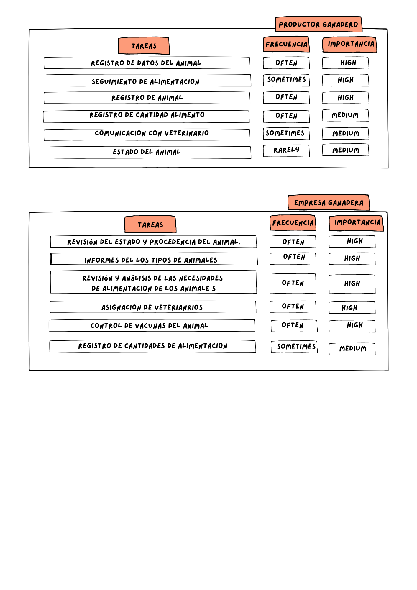 

## 2.3.3. User Journey Mapping.

**Ganadero Independiente Journey Map**

.png) 

**Empresa Ganadera Journey Map**

 

### 2.3.4. Empathy Mapping.

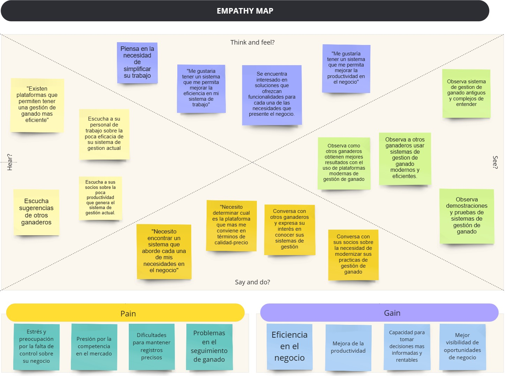

### 2.3.5. As-is Scenario Mapping.

## 2.4. Ubiquitous Language.

- Health Monitoring (Monitoreo de salud): Se menciona en el texto en relación con el seguimiento manual de la salud de los animales por parte de los ganaderos independientes.
- Nutritional Management (Gestión nutricional): Se menciona indirectamente en el texto en relación con las decisiones de negocio sobre la nutrición del ganado que los ganaderos independientes toman de manera empírica.
- Vaccination Reminders (Recordatorios de vacunación): Se menciona en el texto en relación con las funciones deseadas en una aplicación de gestión ganadera por parte de los ganaderos independientes.
- Treatment Tracking (Seguimiento de tratamientos): Se menciona en el texto en relación con el seguimiento manual de tratamientos y vacunas por parte de los ganaderos independientes.
- Statistical Reports (Informes estadísticos): Se menciona en el texto en relación con las funcionalidades deseadas en una aplicación de gestión ganadera por parte de los ganaderos independientes y las empresas ganaderas.
- Intuitive Interface (Interfaz intuitiva): Se menciona en el texto en relación con las preferencias de diseño de interfaz de usuario por parte de los ganaderos independientes.
- Mobile Accessibility (Accesibilidad móvil): Se menciona en el texto en relación con las preferencias de accesibilidad móvil de los ganaderos independientes.
- Inventory Management (Gestión de inventarios): No se menciona directamente en el texto.
- Production Analysis (Análisis de producción): Se menciona en el texto en relación con las funcionalidades deseadas en una aplicación de gestión ganadera por parte de las empresas ganaderas.
- Cost Tracking (Seguimiento de costos): Se menciona en el texto en relación con las necesidades de análisis de costos y rentabilidad de las empresas ganaderas.
- Personnel Scheduling (Programación de personal): Se menciona en el texto en relación con las funcionalidades deseadas en una aplicación de gestión ganadera por parte de las empresas ganaderas.
- Market Trends (Tendencias del mercado): Se menciona en el texto en relación con la importancia de conocer las tendencias del mercado para la toma de decisiones por parte de las empresas ganaderas.
- Financial Planning (Planificación financiera): Se menciona en el texto en relación con la importancia de una buena planificación financiera para el éxito de las empresas ganaderas.
- Data Visualization (Visualización de datos): No se menciona directamente en el texto.
- Customization Options (Opciones de personalización): Se menciona en el texto en relación con las preferencias de personalización de las aplicaciones de gestión ganadera por parte de las empresas ganaderas.
- Training Resources (Recursos de capacitación): No se menciona directamente en el texto.
- Real-time Updates (Actualizaciones en tiempo real): No se menciona directamente en el texto.
- Remote Collaboration (Colaboración remota): No se menciona directamente en el texto.
- Campaign (Campaña): Un período específico de tiempo durante el cual se llevan a cabo actividades específicas en la gestión de ganadería, como la cría, el engorde o la comercialización de animales, con objetivos definidos y metas establecidas.

# Capítulo III: Requirements Specification
## 3.1. To-Be Scenario Mapping.

## 3.2. User Stories.
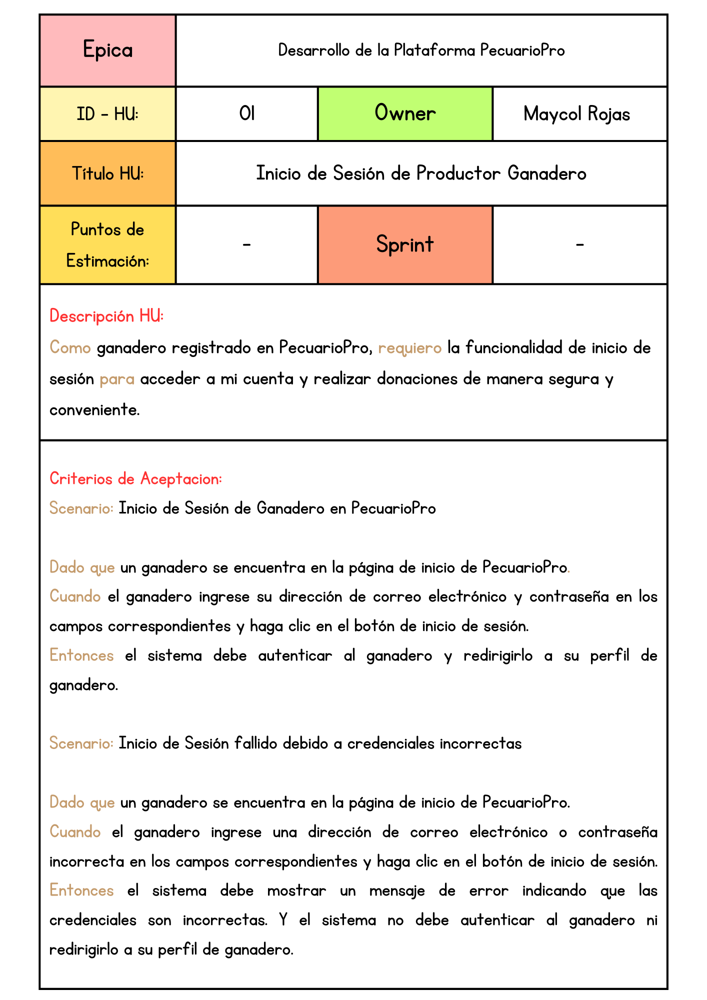
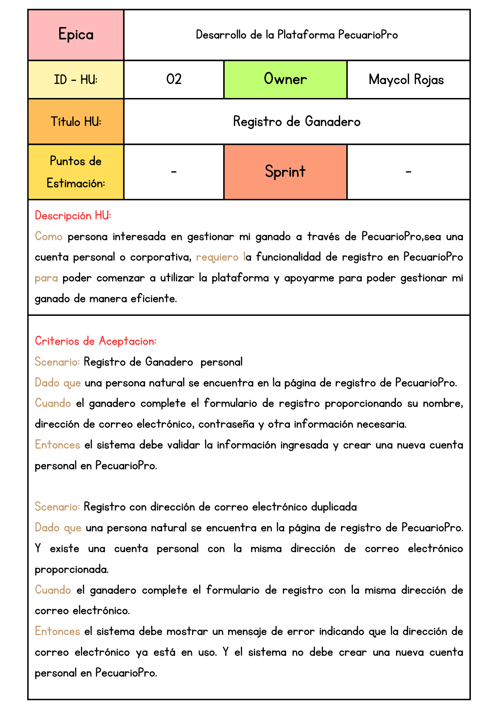
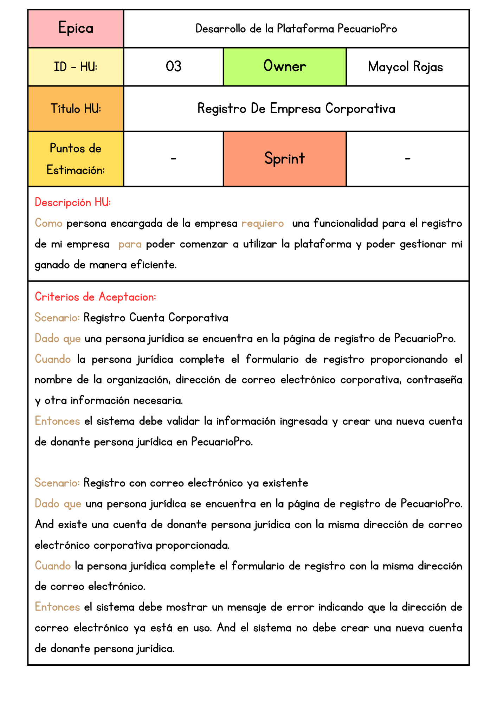
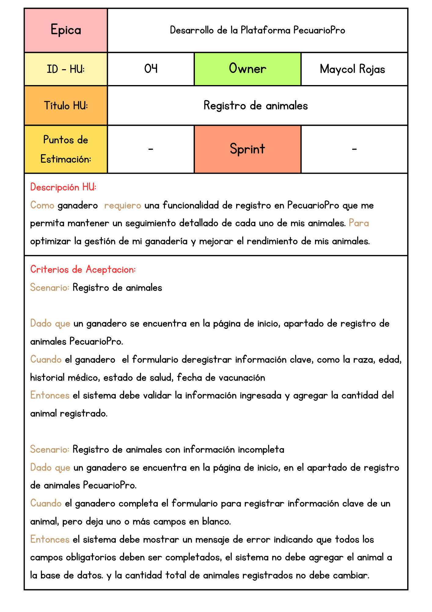
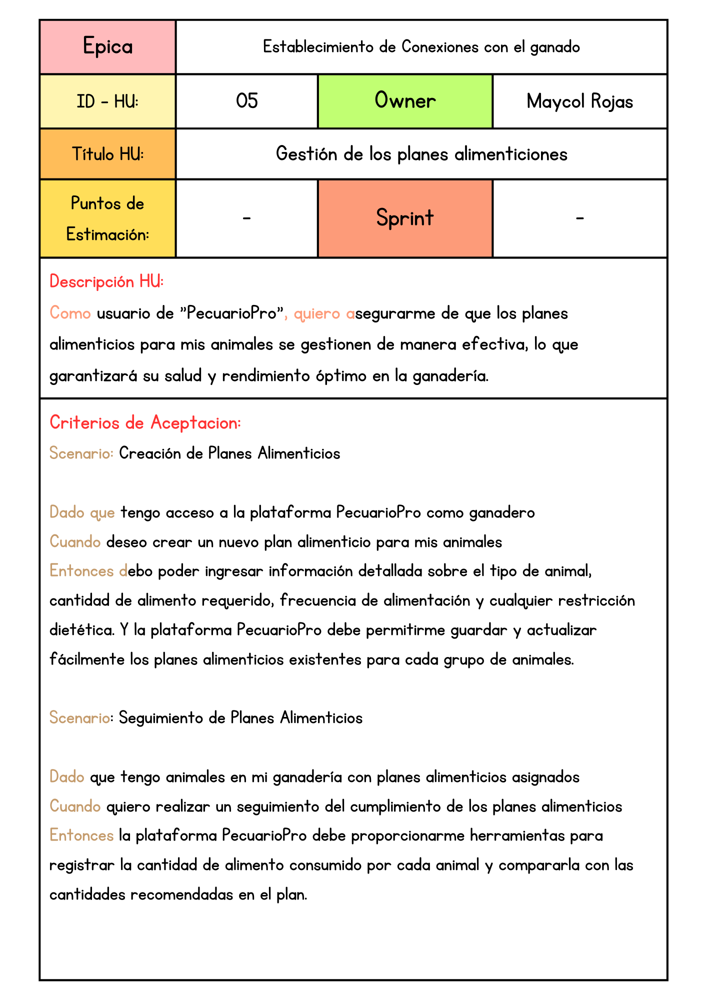
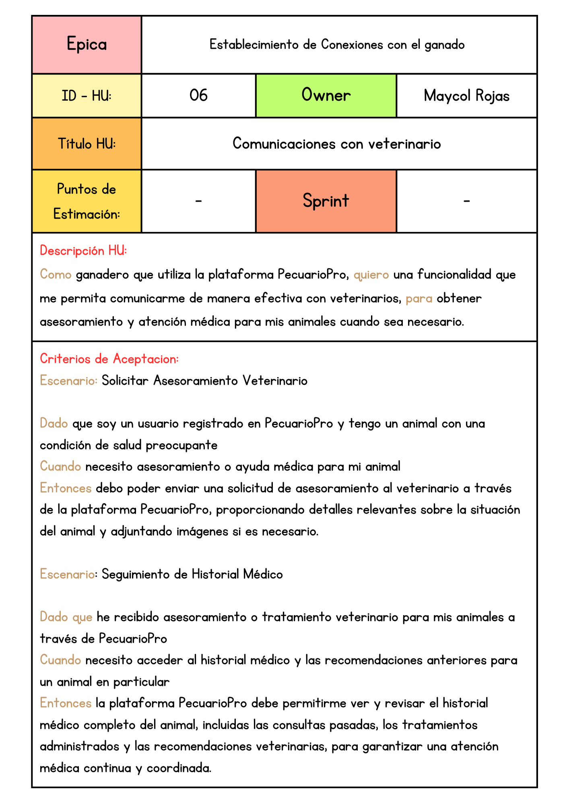

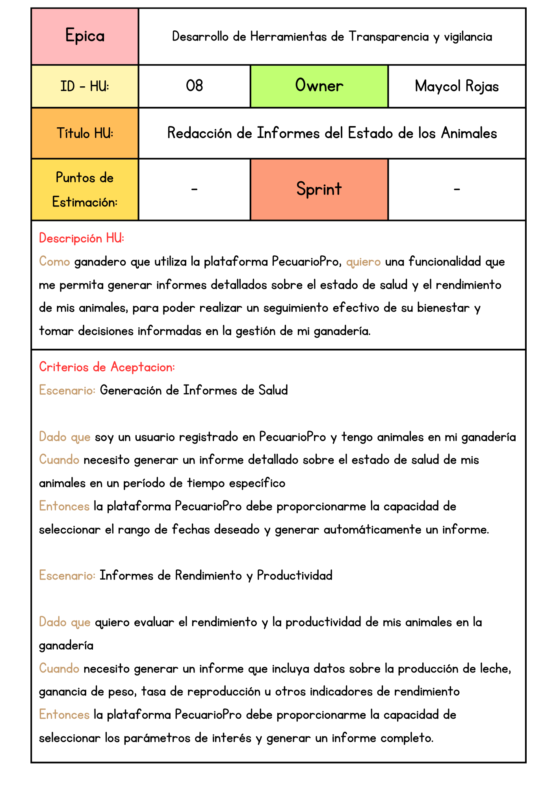
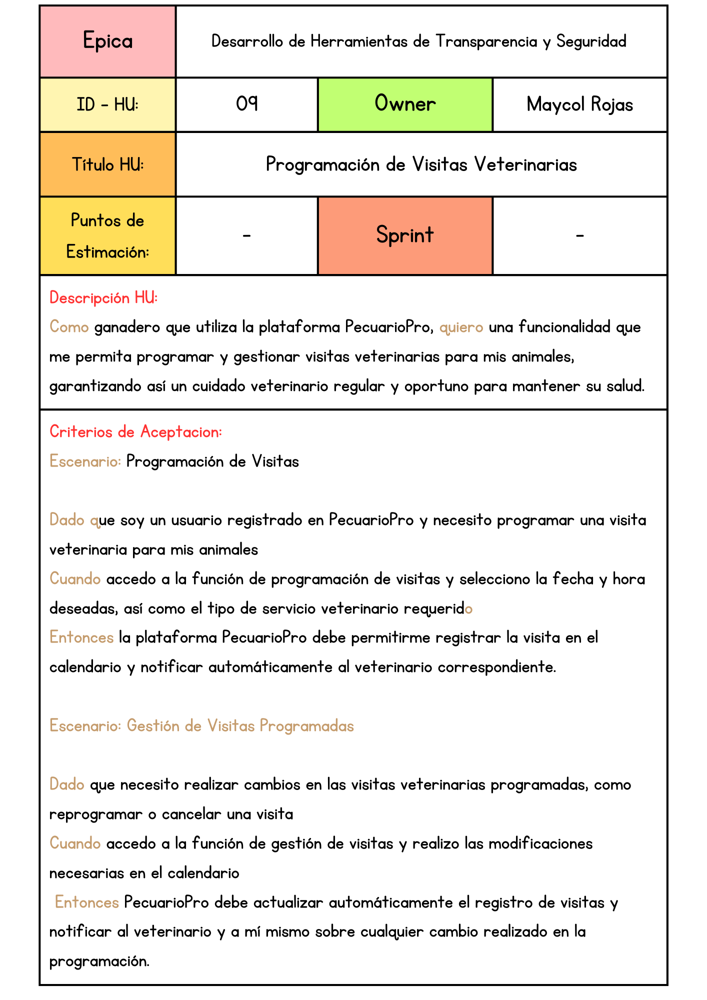

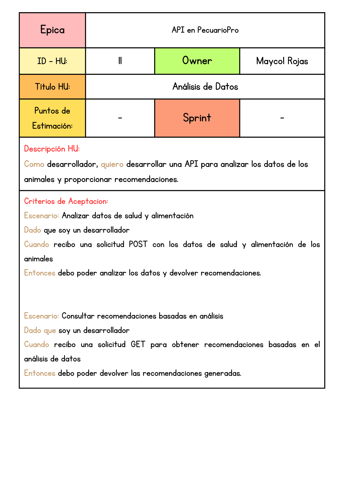
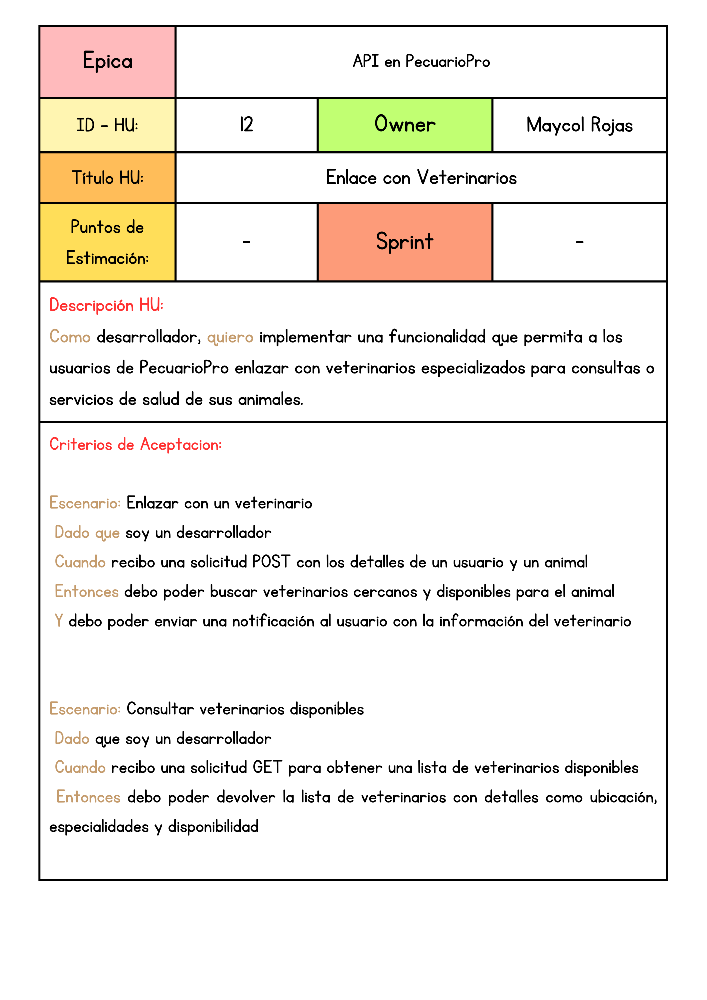
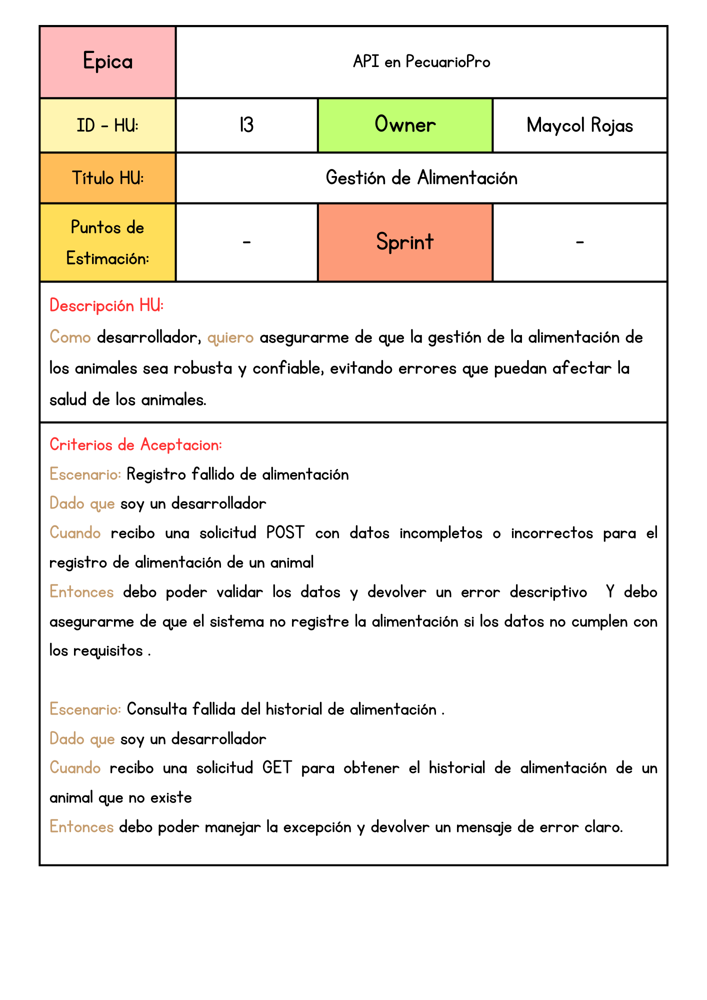
 
Link donde se hizo las User Stories : 
[Canvas](https://www.canva.com/design/DAFnx0PwxDA/SUwwPGid2HJj28K1XF_Mig/edit?utm_content=DAFnx0PwxDA&utm_campaign=designshare&utm_medium=link2&utm_source=sharebutton)

 

## 3.3. Impact Mapping.

A continuación presentaremos 3 Business Goals que consideramos importantes en nuestro proyecto:

**Business Goal 1**

**Business Goal 2**

**Business Goal 3**

## 3.4. Product Backlog.
# Product Backlog

| Orden | Código | Título                                    | Descripción                                                                                                                                                            |
|-------|--------|-------------------------------------------|------------------------------------------------------------------------------------------------------------------------------------------------------------------------|
| 1     | HU05   | Gestión de los planes alimenticios       | Como usuario de "PecuarioPro", quiero asegurarme de que los planes alimenticios para mis animales se gestionen de manera efectiva, lo que garantizará su salud y rendimiento óptimo en la ganadería. |
| 2     | HU06   | Comunicaciones con veterinario            | Como ganadero que utiliza la plataforma PecuarioPro, quiero una funcionalidad que me permita comunicarme de manera efectiva con veterinarios, para obtener asesoramiento y atención médica para mis animales cuando sea necesario. |
| 3     | HU08   | Redacción de Informes del Estado de los Animales | Como ganadero que utiliza la plataforma PecuarioPro, quiero una funcionalidad que me permita generar informes detallados sobre el estado de salud y el rendimiento de mis animales, para poder realizar un seguimiento efectivo de su bienestar y tomar decisiones informadas en la gestión de mi ganadería. |
| 4     | HU09   | Programación de Visitas Veterinarias     | Como ganadero que utiliza la plataforma PecuarioPro, quiero una funcionalidad que me permita programar y gestionar visitas veterinarias para mis animales, garantizando así un cuidado veterinario regular y oportuno para mantener su salud. |
| 5     | HU10   | Seguimiento de reproducción y cría       | Como ganadero que utiliza la plataforma PecuarioPro, quiero una funcionalidad que me permita realizar un seguimiento detallado del proceso de reproducción y cría de mis animales, garantizando así una gestión eficiente y una mejora continua en mi ganadería. |

# Capítulo IV: Product Design
## 4.1. Style Guidelines.
Las Style Guidelines son fundamentales para mantener una comunicación cohesiva y profesional en todos los aspectos de la marca o proyecto, ya sea en publicaciones impresas, en línea o en cualquier otro medio de difusión. En esta sección estableceremos el conjunto de directrices que usará nuestro equipo para diseñar el proyecto PecuarioPro. En estas pautas definiremos aspectos como la elección de colores, tipografía, estructura del documento, entre otros elementos. Por ello, para el diseño de PecuarioPro emplearemos la plataforma Figma para la creación de la aplicación web y la página de inicio. En ambas, se incluirá una paleta de colores con tonalidades de verde y crema, que reflejen la naturaleza y la confianza asociadas con la gestión sostenible de animales. A continuación, se presenta un detalle más amplio de cada aspecto mencionado

### 4.1.1. General Style Guidelines.
**Branding:** El logotipo de nuestro startup es mucho más que una simple imagen; es la manifestación visual de nuestra identidad. En el centro, el símbolo único que nos representa es nuestro nombre, que se basa en fusionar las palabras ganado  y confianza, fusiona estas dos palabras, debido a que nuestro startup se basa en el control de ganado y el bienestar animal . Este logotipo es versátil y se adapta a una variedad de plataformas y aplicaciones, asegurando que nuestra marca se destaque en cualquier entorno. Este logo refleja la transparencia y seguridad que queremos transmitir los ganaderos y empresas ganaderas.

    

<b> Horizontal layout </b> 

    

     
    

<b>Inverted Colors</b> 

    

     
    

<b>Logo mark only</b> 

 

**Typography:** La tipografía de PecuarioPro encapsula la esencia de nuestra innovadora startup, que busca revolucionar el proceso de gestión y cuidado de animales para consumo en Perú. Con un estilo moderno, ordenado y minimalista, se alinea perfectamente con la imagen que deseamos proyectar: una plataforma fácil de usar y confiable para la gestión de animales. Nuestra elección de tipografía refleja nuestro compromiso con la simplicidad y la accesibilidad, utilizando un lenguaje casual y sencillo que invita a nuestros usuarios a sentirse cómodos y empoderados al utilizar nuestra aplicación.

**Tipos de letras a usar:**

- **Roboto slab:** Para el logo de nuestro proyecto.

     
    
    

 

- **Poppins (encabezados):** Poppins es una tipografía moderna y legible que puede ser ideal para los encabezados y títulos de su plataforma. Transmite confianza y es fácil de leer en pantallas digitales.

     
    

 

- **Noto Sans (cuerpo de texto):** Noto Sans es una tipografía versátil que funciona bien para el cuerpo de texto en su plataforma. Su calidad ayudará a que la información sea fácil de absorber.

     
    

 

- **Roboto (botones):** Roboto es una tipografía limpia que puede funcionar bien para los botones y llamados a la acción. Ayuda a crear un aspecto moderno y atractivo que alienta a los usuarios a participar.

     
    

 

- **Raleway (detalles):** Raleway puede usarse para resaltar detalles importantes o elementos de diseño. Su aspecto contemporáneo y elegante puede añadir un toque de sofisticación a su plataforma.

     
    

 

- **Arial (texto legal y pie de página):** Para el texto legal y el pie de página, Arial es una elección segura. Es altamente legible y transmite profesionalismo.

     
    

 

**Colors:** La selección de colores en PecuarioPro se ha llevado a cabo de manera estratégica, utilizando una paleta que refleja nuestra visión y valores. Los tonos #004229, #E1D29A y #f5f4f4 han sido elegidos meticulosamente para transmitir la esencia de nuestra innovadora plataforma de gestión de animales. Estos colores no solo crean una armonía visual, sino que también establecen un equilibrio entre la naturaleza (representada por el verde profundo), la integridad (encarnada en el tono cálido del beige) y la transparencia (reflejada en el blanco puro). Esta combinación refuerza nuestra identidad como una solución moderna y confiable en el ámbito de la ganadería, destacándonos por nuestra singularidad y compromiso con el bienestar animal y la eficiencia en la gestión ganadera.

**Gama de colores:**

**#004229**
 

**#E1D29A**

 

**#f5f4f4**

## Espaciado en la Plataforma Web de Pecuario Pro

La plataforma web de Pecuario Pro está diseñada con un enfoque en la legibilidad y la comodidad del ganadero. A continuación, se detallan las especificaciones de espaciado recomendadas:

### Espaciado entre líneas (line-height)
- **Texto de cuerpo**: Debe ser de 1.4 a 1.6 veces el tamaño de la fuente.

### Espaciado entre párrafos
- **Margen inferior**: Debe ser al menos el 120% del tamaño de fuente entre párrafos.

### Margen y espaciado alrededor de elementos de la interfaz
- **Al menos 20 píxeles de espacio**: Se debe mantener entre elementos de la interfaz.

### Espaciado entre secciones o módulos
- **Margen superior e inferior**: Debe ser de al menos 45 píxeles.

### Espaciado entre elementos de menú y navegación
- **Al menos 15 píxeles de espacio**: Se debe mantener entre elementos de navegación.

### Espaciado alrededor de imágenes y gráficos
- **Al menos 20 píxeles de margen**: Debe haber alrededor de las imágenes.

### Espaciado en el pie de página
- **Margen superior e inferior**: Debe ser de alrededor de 40 a 60 píxeles.

 

**Lenguaje y tono de la comunicación:**

El tono de comunicación y lenguaje ideal para PecuarioPro, nuestra plataforma de gestión ganadera en Perú, se caracteriza por ser cálido, empático, claro y comprometido. En PecuarioPro, creemos en la importancia de establecer una conexión emocional con nuestros usuarios y en comunicar de manera efectiva nuestro compromiso con el bienestar animal y la sostenibilidad en la industria ganadera. Nuestro tono es amigable y accesible, lo que refleja nuestra misión de hacer que la gestión de animales sea una experiencia positiva y gratificante para todos los involucrados. Además, nos esforzamos por diseñar nuestra plataforma de manera intuitiva y fácil de usar, especialmente para ganaderos menos experimentados en tecnología. Ofrecemos tutoriales paso a paso y asistencia personalizada para garantizar que todos los usuarios, independientemente de su nivel de experiencia tecnológica, puedan aprovechar al máximo todas las funciones de PecuarioPro. Al mismo tiempo, mantenemos un enfoque profesional y serio cuando se trata de la responsabilidad en el cuidado de los animales y la transparencia en nuestros procesos. En nuestras comunicaciones, utilizamos un lenguaje claro y sencillo para garantizar que los usuarios comprendan fácilmente cómo funciona nuestra plataforma y cómo pueden contribuir al bienestar de sus animales. Fomentamos la confianza al proporcionar información detallada sobre las prácticas de manejo animal y al ofrecer transparencia en la trazabilidad de los productos ganaderos. Queremos que nuestros usuarios se sientan cómodos, informados y motivados a ser parte del cambio positivo que estamos impulsando en la industria ganadera en Perú.

### 4.1.2. Web Style Guidelines.
Nuestro enfoque en las "Web Style Guidelines" se centra en la creación de una experiencia de usuario consistente y atractiva en entornos de navegación web. Esto implica el uso de una paleta de colores cohesiva, tipografía legible y un diseño responsivo que se adapte a una variedad de dispositivos y tamaños de pantalla. 

**En español:**

## 4.2. Information Architecture.
### 4.2.1. Organization Systems.
<<<<<<< HEAD
En esta sección, definiremos los sistemas de organización que guiarán la estructura y el flujo de información en el proyecto PecuarioPro.
*    Jerarquía de contenido: Organizaremos el contenido en una estructura jerárquica clara, con secciones principales y subsecciones relacionadas con la gestión ganadera.
*    Categorización: Los elementos de contenido se agruparán en categorías lógicas relacionadas con la salud animal, la alimentación, la reproducción y la gestión de la granja.
*    Taxonomía:  Implementaremos una taxonomía sólida para etiquetar y clasificar el contenido de manera efectiva, mejorando la capacidad de búsqueda y gestión.
  
### 4.2.2. Labeling Systems.
En esta sección, describiremos los sistemas de etiquetado utilizados para nombrar y describir elementos dentro del proyecto PecuarioPro.
*    Nombres de página: Cada página de la aplicación web tendrá un nombre descriptivo que refleje su contenido, centrándose en la gestión ganadera.
*    Etiquetas de menú: Selección cuidadosa de etiquetas de menú para representar con precisión las diferentes herramientas y funciones de PeruarioPro.
*    Etiquetas de contenido: Etiquetado de elementos de contenido con palabras clave relevantes y descripciones breves relacionadas con la gestión eficiente y sostenibles del ganado.
  
### 4.2.3. SEO Tags and Meta Tags
En esta sección, se detallarán las etiquetas de Seo Y metaetiquetas que se utilizarán para mejorar la visibilidad del proyecto PecuarioPro en los motores de búsqueda.
*    Etiquetas de título: Creación de etiquetas de título únicas y descriptivas para cada herramienta y sección de PecuarioPro, incluyendo palabras clave relevantes.
*    Meta descripciones: Desarrollo de meta descripciones atractivas y concisas que resuman la funcionalidad de cada herramienta, fomentando la interacción con los usuarios.
*    Etiquetas de encabezado: Uso adecuado de etiquetas de encabezado para estructurar el contenido y mejorar la gestión ganadera que ofrece la aplicación.
*    Meta etiquetas de palabras clave: Asignación de meta etiquetas de palabras clave para indicar los temas clave que aborda PecuarioPro, mejorando la indexación en motores de búsqueda.

### 4.2.4. Searching Systems.
En esta sección, se describirán los sistemas de búsqueda que permitirán a los usuarios encontrar información eficiente en el proyecto PecuarioPro.
*    Motor de búsqueda interna: Implementación de un motor de búsqueda interno que permita a los usuarios encontrar información específica sobre la salud, alimentación, reproducción y gestión de su ganado.
*    Filtros de búsqueda: Ofrecimiento de filtros de búsqueda avanzados para permitir a los usuarios refinar los resultados según diferentes criterios, como especie animal, estado de salud o tipo de alimentación.
     
### 4.2.5. Navigation Systems.
En esta sección, se detallarán los sistemas de navegación que guiarán a los usuarios a través del proyecto PecuarioPro de manera intuitiva.
*    Menú de navegación: Mantenimiento de un menú de navegación claro y accesible en todas las páginas de aplicación, facilitando el acceso a las herramientas y secciones principales relacionadas con la gestión ganadera.
*    Breadcumbs: Implementación de breadcrumbs en las páginas para mostrar la ubicación del usuario dentro de la estructura de la plataforma y facilitar la navegación de regreso.
*    Enlaces relacionados: Provisión de enlaces relacionados en cada herramienta y sección para guiar a los usuarios a contenido relevante y promover una gestión ganadera más eficiente y sostenible.
=======

## 4.3. Landing Page UI Design.
### 4.3.1. Landing Page Wireframe.
 

**WIRE FRAME DE SOBRE NOSOTROS:**
 

BR>

**WIRE FRAME DE COMO FUNCIONA:**
 

BR>

**WIRE FRAME DE PLANES:**
 

BR>

**WIRE FRAME DE CONTACTANOS:**
 

 

### 4.3.2. Landing Page Mock-up.

**Mock-up DE SOBRE NOSOTROS:**
 

 

**Mock-up DE COMO FUNCIONA:**
 

 

**Mock-up DE PLANES:**
 

 

**Mock-up DE CONTACTANOS:**
 

 

## 4.4. Web Applications UX/UI Design.
### 4.4.1. Web Applications Wireframes.

**Inicio de sesión y registro:**
 

 

**User Home y vistas previas para el usuario en Organizaciones y Gestión del Ganado:**
 

 

**Configuración de Perfiles para usuarios administración de cuentas y configuración para Cliente independiente y Negocio:**
 

 

**En organizaciones acceso a estadísticas control de animales, estadísticas inventario y suministros:**
 

 

### 4.4.2. Web Applications Wireflow Diagrams.

**Usuario ingresa a la aplicación iniciando sesión o se registrándose:**
 

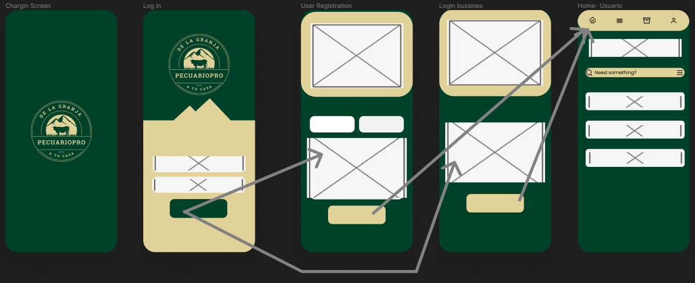
 

**Desplazamiento entre pagina inicial, organizaciones y administrar ganado:**
 

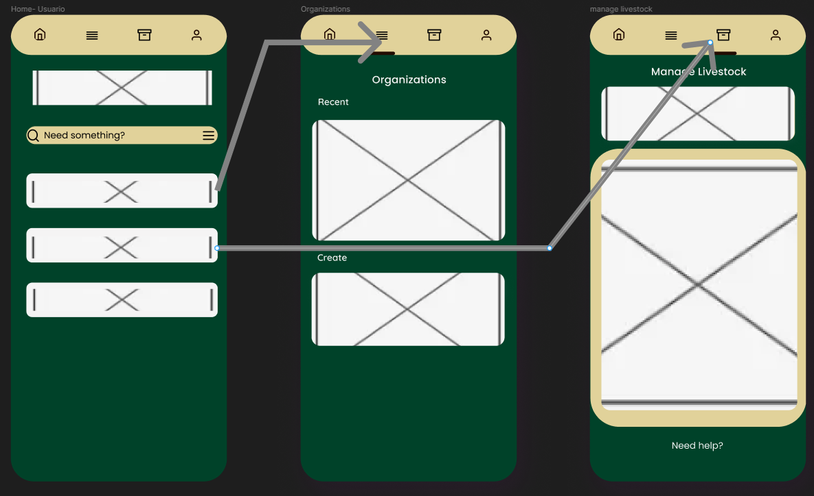
 

**Opciones de usuario, cuenta de usuario, administrar cuenta y configuraciones:**
 

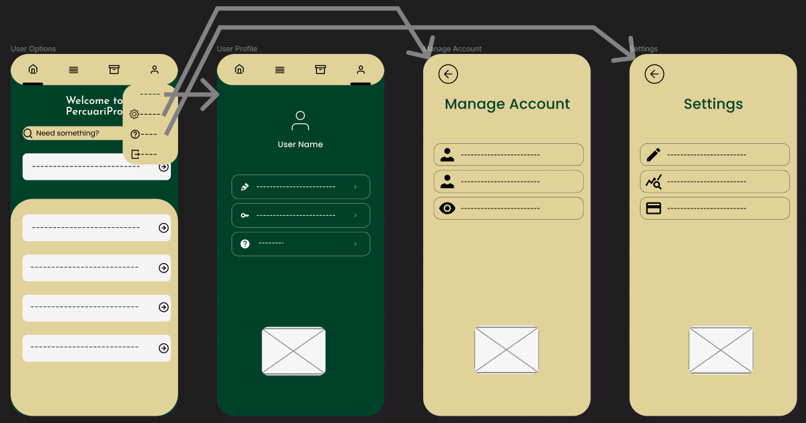
 

**Navegación desde página administrar ganado a paginas derivadas Control de animales, Inventario y Suministros, Tareas y actividades y Contacto con veterinarios:**
 

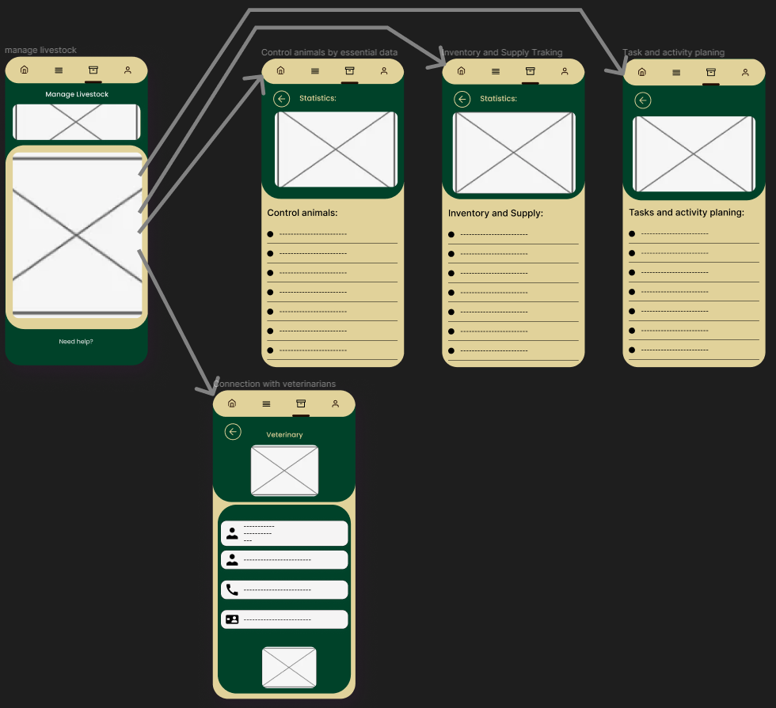
 

### 4.4.2. Web Applications Mock-ups.

**Inicio de sesión y registro:**
 

 

**User Home y vistas previas para el usuario en Organizaciones y Gestión del Ganado:**
 

 

**Configuración de Perfiles para usuarios administración de cuentas y configuración para Cliente independiente y Negocio:**
 

 

**En organizaciones acceso a estadísticas control de animales, estadísticas inventario y suministros:**
 

 

### 4.4.3. Web Applications User Flow Diagrams.

**User Flow: Inicio de sesión o creación de cuenta:**
 

 

**User Flow: Pagina principal y desplazamiento entre Organizaciones y Gestión del ganado:**
 

 

**User Flow: Opciones y configuración del usuario:**
 

 

**User Flow: Navegación entre Control de animales, Inventario y Suministros, Planeamiento de Tareas y Actividades y Contacto con el veterinario:**
 

 

## 4.5. Web Applications Prototyping.

## 4.6. Domain-Driven Software Architecture.
### 4.6.1. Software Architecture Context Diagram
### 4.6.2. Software Architecture Container Diagrams.
### 4.6.3. Software Architecture Components Diagrams.

## 4.7. Software Object-Oriented Design.

### 4.7.1. Class Diagram

### 4.7.2. Class Dictionary

| Entidad | Nombre de Atributos | Definición | Tipo de dato | Unidad de Medida | Valores Restringidos |
|---------|---------------------|------------|--------------|------------------|----------------------|
| User |
| 1 | id | Identificador del usuario | integer | 2 bytes | Mayor a Cero |
| 2 | emailAddress | Correo del usuario | string | Cadena de caracteres | Permite solo caracteres o letras |
| 3 | password | Contraseña del usuario | string | Cadena de caracteres | Permite solo caracteres o letras |
| 4 | loginDate | Fecha de inicio de sesión | boolean | 2 bytes | uno o cero |
| 5 | registerDate | Fecha de registro | date | Días | Permite solo fechas |
| 6 | subscriptionType | Tipo de suscripción | string | Cadena de caracteres | Permite solo caracteres o letras |
| Business Account |
| 1 | businessName | Nombre del negocio | string | Cadena de caracteres | Permite solo caracteres o letras |
| 2 | businessAdress | Dirección fisica del negocio | string | Cadena de caracteres | Permite solo caracteres o letras |
| 3 | numberRuc | Número de Ruc del negocio | int | 2 bytes | Mayor a Cero |
| Customer |
| 1 | firstName | Nombre del cliente | string | Cadena de caracteres | Permite solo caracteres o letras |
| 2 | lastName | Apellido del cliente | string | Cadena de caracteres | Permite solo caracteres o letras |
| 3 | numberDNI | Número de DNI | int | 2 bytes | Mayor a Cero |
| Subscription |
| 1 | id | Identificador de la suscripción | int | 2 bytes | Mayor a Cero |
| 2 | subscriptionType | Tipo de suscripción | string | Cadena de caracteres | Permite solo caracteres o letras |
| 3 | subscriptionOwner | Dueño de la suscripción | string | Cadena de caracteres | Permite solo caracteres o letras |
| Livestock Producer |
| 1 | firstName | Nombre del productor ganadero | string | Cadena de caracteres | Permite solo caracteres o letras |
| 2 | lastName | Apellido del productor ganadero | string | Cadena de caracteres | Permite solo caracteres o letras |
| 3 | numberDNI | Número de DNI | int | 2 bytes | Mayor a Cero |
| Animal Manager |
| 1 | id | Identificador del administrador de animales | int | 2 bytes | Mayor a Cero |
| Animal |
| 1 | animalId | Identificador del animal | int | 2 bytes | Mayor a Cero |
| 2 | animalName | Nombre del animal | string | Cadena de caracteres | Permite solo caracteres o letras |
| 3 | bornDate | Fecha de nacimiento del animal | date | Días | Permite solo fechas |
| 4 | motherId | Identificador del administrador de animales | string | Cadena de caracteres | Permite solo caracteres o letras |
| 5 | originCountry | Identificador del administrador de animales | string | Cadena de caracteres | Permite solo caracteres o letras |
| 6 | animalGender | Identificador del administrador de animales | string | Cadena de caracteres | Permite solo caracteres o letras |
| 7 | animalLocation | Identificador del administrador de animales | string | Cadena de caracteres | Permite solo caracteres o letras |
| Animal Groups |
| 1 | groupId | Identificador de los grupos de animales | int | 2 bytes | Mayor a Cero |
| 2 | groupLocation | Ubicacion del grupo | string | Cadena de caracteres | Permite solo caracteres o letras |
| Bovine Identification Document |
| 1 | documentId | Identificador del documento | int | 2 bytes | Mayor a Cero |
| 2 | expiryDate | Fecha de expiración del documento | date | Días | Permite solo fechas |
| Animal Performance |
| 1 | id | Identificador para el redimiento del animal | int | 2 bytes | Mayor a Cero |
| 2 | animalState | Descripción estado del animal | string | Cadena de caracteres | Permite solo caracteres o letras |
| 3 | createDate | Registro fecha de creación | date | Días | Permite solo fechas |
| 4 | performance | Rendimiento del animal como porcentaje | int | 2 bytes | Mayor a Cero |
| Animal Status Report |
| 1 | reportId | Identificador para cada reporte | int | 2 bytes | Mayor a Cero |
| 2 | createdDate | Registro fecha de creación del reporte | date | Días | Permite solo fechas |
| Animal Medical History |
| 1 | historyId | Identificador para historia medica | int | 2 bytes | Mayor a Cero |
| 2 | createdDate | Registro fecha de creación de la historia medica | date | Días | Permite solo fechas |
| 3 | acessDate | Registro fecha de acceso a la historia medica | date | Días | Permite solo fechas |
| Notification |
| 1 | notificationId | Identificador para cada notificación | int | 2 bytes | Mayor a Cero |
| 2 | notificationType | Tipo de cada notificación | string | Cadena de caracteres | Permite solo caracteres o letras |
| 3 | notificationContent | Contenido de la notificación | string | Cadena de caracteres | Permite solo caracteres o letras |
| Meal Plans |
| 1 | mealPlanId | Identificador para cada plan alimenticio | int | 2 bytes | Mayor a Cero |
| 2 | typeFood | Tipo de comida de cada plan alimenticio | string | Cadena de caracteres | Permite solo caracteres o letras |
| 3 | modifiedDate | Fecha de modificación | date | Días | Permite solo fechas |
| Vaccine |
| 1 | vaccineId | Identificador para cada registro de vacunación | int | 2 bytes | Mayor a Cero |
| 2 | vaccineName | Nombre del cada vacuna | string | Cadena de caracteres | Permite solo caracteres o letras |
| 3 | vaccineCode | Codigo de cada vacuna | int | 2 bytes | Mayor a Cero |
| 4 | applicationReason | Razón de aplicación | string | Cadena de caracteres | Permite solo caracteres o letras |
| Reproduction |
| 1 | reproductionId | Identificador para cada registro de reproducción | int | 2 bytes | Mayor a Cero |
| 2 | registerDate | Fecha de registro | date | Días | Permite solo fechas |
| 3 | offspringNumber | Número de crías | int | 2 bytes | Mayor a Cero |
| Veterinary |
| 1 | veterinaryId | Identificador para cada veterinario | int | 2 bytes | Mayor a Cero |
| 2 | firstName | Nombre del veterinario | string | Cadena de caracteres | Permite solo caracteres o letras |
| 3 | lastName | Apellido del veterinario | string | Cadena de caracteres | Permite solo caracteres o letras |
| 4 | vetPermit | Autorización del veterinario | int | 2 bytes | Mayor a Cero |
| Veterinary Report |
| 1 | reportId | Identificador para cada reporte | int | 2 bytes | Mayor a Cero |
| 2 | createdDate | Fecha de creación de cada reporte | date | Días | Permite solo fechas |
| 3 | animalId | Identificador de cada animal | int | 2 bytes | Mayor a Cero |
| 4 | contactNumber | Número de contacto del veterinario | int | 2 bytes | Mayor a Cero |

## 4.8. Database Design.

### 4.8.1. Database Diagram

# Capítulo V: Implementation , Validation & Deployment.
## 5.1. Software Configuration Management.

El Software Configuration Management (SCM) resulta importante en cualquier solución ya que ayuda a gestionar y controlar los cambios realizados en el proyecto, teniendo como objetivo la integridad de cada uno de los elementos del software. Es por ello que en esta sección apreciaremos detalladamente los software utilizados por el equipo, las convenciones en la gestión de versión y gestión de cambios en repositorios remotos. 

### 5.1.1. Software Development Environment Configuration.

En esta sección definiremos las herramientas que utilizaremos en cada una de las fases del software.

| Herramienta | Propósito | Ruta de Descarga/Referencia |
|-------------|-----------|----------------------------|
| Git         | Control de versiones y colaboración en el código fuente del proyecto | [Git](https://git-scm.com/) |
| Jira Software | Gestión de tareas, seguimiento de problemas y planificación de tareas. Se podrá llevar a cabo una mejor gestión para cumplir con la metodología SCRUM | [Jira Software](https://www.atlassian.com/software/jira) |
| Figma | Diseño de todas las interfaces de la aplicación y elaboración de un prototipo interactivo | [Figma](https://www.figma.com/) |
| Rider | Codificación y desarrollo de software | [Rider](https://www.jetbrains.com/rider/) |
| WebStorm | Codificación y desarrollo de software | [WebStorm](https://www.jetbrains.com/webstorm/) |
| Azure | Despliegue y alojamiento de la aplicación | [Azure](https://azure.microsoft.com/) |
| Markdown | Documentación técnica y de usuario | [Markdown Guide](https://www.markdownguide.org/getting-started/) |

### 5.1.2. Source Code Management.

En esta sección detallaremos el esquema de organización que utilizaremos para aplicar el seguimiento de modificaciones que realizaremos en nuestro proyeto.

**Repositorio Remoto**

Haremos uso de la plataforma GitHub para crear nuestros repositorios remotos. Estos repositorios serán de gran utilidad ya que nos sirven para almacenar y gestionar nuestro código fuente y la documentación. Así mismo, nos facilita la colaboración entre todos los integrantes del grupo y permite tener un control de versiones de nuestro proyecto.

[Repositorio en Github](https://github.com/PecuarioPro/PecuarioPro/tree/main)

**Implementación de GitFlow**

Utilizaremos el flujo de trabajo GitFlow, el cual nos permite tener un trabajo claro en el desarrollo de nuestro software. Para implementarlo crearemos ramas especificas que cubrirán cada aspecto de nuestro producto.

- **master:** La rama master será la principal, en ella se subirán los cambios finales del proyecto. Utilizaremos etiquetas(tags) para indicar las versiones del software según la importancia de los cambios.
- **develop:** Está sera la rama de desarrollo, aquí agregaremos características y funcionalidades desarrolladas en la rama feature.
- **feature:** En la rama feature se desarrollarán las nuevas funcionalidades y características del software. Así mismo, aquí se harán las correciones de bugs y detalles que impiden el despliegue de la aplicación.
- **release:** En esta rama se realizarán cambios mínimos los cuales no alteran la funcionalidad del software. Por lo general se suelen arreglar errores de ortografía y bugs mínimos. Además, en esta rama desarrollaremos la documentación respectiva del proyecto.
- **hotfix:** Esta será una rama para la resolución de bugs de manera inmediata. En la rama hotfix se corrigen errores que impiden ciertas funcionalidades importantes del software y su correción es necesaria para la correcta operación del producto.

**Conventional Commits**

Haremos uso de Conventional Commits para tener una mejor comprensión de los cambios realizados en el repositorio. Utilizaremos palabras clave como `fix` o `feature` para indicar el tipo de cambio realizado en los archivos, ya sea para el arreglo de bugs o la agregación de nuevo contenido. 

**Versionamiento del software**

Para el versionamiento de nuestro software haremos uso de etiquetas en git (git tag). Las etiquetas que representan las versiones del proyecto están conformadas por 3 números `(vX.Y.Z)`:

- Primer número de la etiqueta `(X)`: Este representa la versión mayor del proyecto y se cambia cuando existen modificaciones importantes en las funcionalidades principales del sistema. 

- Segundo número de la etiqueta `(Y)`: Este representa la agregación o el retiro de funcionalidades al sistema sin alterar su estructura principal.

- Tercer número de la etiqueta `(Z)`: Este número final representa los parches realizados al software y es utilizado cuando se realiza una revisión. Suele utilizarse para corregir errores simples.

Es así como en nuestro repositorio será observable el uso de etiquetas como `v0.1.0` o `v1.0.0` indicando la versión respectiva según el avance del proyecto .

### 5.1.3. Source Code Style Guide & Conventions.
Para esta sección se explicará las directrices que respectan a la nomenclatura y uso del lenguaje para la programación y documentación del proyecto.
- Convención del idioma: Se optó por el idioma inglés para todo lo relacionado al código, D.D. arquitecture y para la base de datos.
- Herramientas: Desarrollamos nuestro proyecto con herramientas fundamentales como Github, Gitflow, Visual Studio Code, Figma y Miro.
- Tecnologías: Para la creación de la Landing Page se uso principalmente HTML, CSS y Javascript.

### 5.1.4. Software Deployment Configuration
En esta sección se explicará el proceso del despliegue del proyecto.
#### Landing Page:
- Deployment Configuration:
  

- Deployment with Firebase:
  

## 5.2. Landing Page, Services & Applications Implementation

### 5.2.1. Sprint 1 
Los Sprint son segmentos de tiempo claramente definidos en Scrum, en los que un equipo se enfoca en llevar a cabo un conjunto específico de actividades o elementos del proyecto. Su principal objetivo es impulsar un desarrollo eficiente del producto, concentrándose en sus características clave, con la meta de atraer a los usuarios hacia nuestra aplicación

#### 5.2.1.1 Sprint Planning 1

| Sprint # | Sprint 1 |
|---|---|
| Sprint Planning Background |
| Date | 2024-04-01 |
| Time | 10:00 AM |
| Location | presencial (UPC-San Miguel) |
| Prepared By | Rojas Velasquez, Maycol Jhordan|
| Attendees | Rojas Velasquez, Maycol Jhordan/ Soriano Medrano, Diego/ Casaverde de la Cruz, Ernesto David/Cantoral Sedamano, Alexander Alberto |
| Sprint 1 - 1 Review Summary | - |
| Sprint 1 - 1 Retrospective Summary | - |
| Sprint Goal & User Stories |
| Sprint 1 Goal | Diseñar y desarrollar la página web de PecuarioPro, enfocándose en la usabilidad y la estética. |
| Sprint 1 Velocity | 20 Story Points |
| Sum of Story Points | 15 Story Points |
 

 

| Sprint # | Sprint 2 |
|---|---|
| Sprint Planning Background |
| Date | 2024-04-06 |
| Time | 10:00 AM |
| Location | Virtual (Zoom Meeting) |
| Prepared By | Rojas Velasquez, Maycol |
| Attendees | Rojas Velasquez, Maycol Jhordan/ Soriano Medrano, Diego/ Casaverde de la Cruz, Ernesto David/Cantoral Sedamano, Alexander Alberto |
| Sprint 2 - 1 Review Summary | Revisión del diseño y funcionalidad de la página web de PecuarioPro. Feedback de los usuarios y product owner. |
| Sprint 2 - 1 Retrospective Summary | El equipo trabajó bien en conjunto, pero se identificaron oportunidades para mejorar en la comunicación interna y en la gestión del tiempo. Se sugiere establecer horarios de reuniones más claros, asignar roles de liderazgo más definidos y mejorar la gestión del tiempo para evitar retrasos. |
| Sprint Goal & User Stories |
| Sprint 2 Goal | Revisar y mejorar la página web de PecuarioPro basado en el feedback recibido. Comenzar el diseño de la aplicación móvil de PecuarioPro. |
| Sprint 2 Velocity | 25 Story Points |
| Sum of Story Points | 20 Story Points |

#### 5.2.1.2 Sprint  Backlogs 

| Orden | Código | Título | Descripción | Story Points |
|-------|--------|--------|-------------|--------------|
| 1     | HU05   | Gestión de los planes alimenticios | Como usuario de "PecuarioPro", quiero asegurarme de que los planes alimenticios para mis animales se gestionen de manera efectiva, lo que garantizará su salud y rendimiento óptimo en la ganadería. | 8 |
| 2     | HU06   | Comunicaciones con veterinario | Como ganadero que utiliza la plataforma PecuarioPro, quiero una funcionalidad que me permita comunicarme de manera efectiva con veterinarios, para obtener asesoramiento y atención médica para mis animales cuando sea necesario. | 5 |
| 3     | HU08   | Redacción de Informes del Estado de los Animales | Como ganadero que utiliza la plataforma PecuarioPro, quiero una funcionalidad que me permita generar informes detallados sobre el estado de salud y el rendimiento de mis animales, para poder realizar un seguimiento efectivo de su bienestar y tomar decisiones informadas en la gestión de mi ganadería. | 13 |
| 4     | HU09   | Programación de Visitas Veterinarias | Como ganadero que utiliza la plataforma PecuarioPro, quiero una funcionalidad que me permita programar y gestionar visitas veterinarias para mis animales, garantizando así un cuidado veterinario regular y oportuno para mantener su salud. | 3 |
| 5     | HU10   | Seguimiento de reproducción y cría | Como ganadero que utiliza la plataforma PecuarioPro, quiero una funcionalidad que me permita realizar un seguimiento detallado del proceso de reproducción y cría de mis animales, garantizando así una gestión eficiente y una mejora continua en mi ganadería. | 8 |

 
 

 
 

#### 5.2.1.3 Development Evidence for Sprint Review

| Repository      | Branch      | Commit ID | Commit Message          | Commited on date |
|-----------------|-------------|-----------|-------------------------|-------------------|
| PecuarioPro     | Landing-Page| 93d7c02   | Agregate Landing Page   | 12/04/2024        |
| PecuarioPro     | Landing-Page| 93d7c02…68cd9f4 | Fix: Changed href       | 12/04/2024        |
| PecuarioPro     | Landing-Page| 68cd9f4…ddaedfe | fix: Agregate Domain name| 12/04/2024      |
| PecuarioPro     | Landing-Page| ddaedfe8dafe6b5b03db07b9eaedc7eb5403cfcd | Feature: Agregate Firebase Hosting | 12/04/2024 |
| PecuarioPro     | Landing-Page| 5bdb4a44eb881dad0703410065b6a464e28e1e9d | Feature: AdditionalFix Firebase | 1270472024 

#### 5.2.1.4 Testing Suite Evidence for Sprint Review

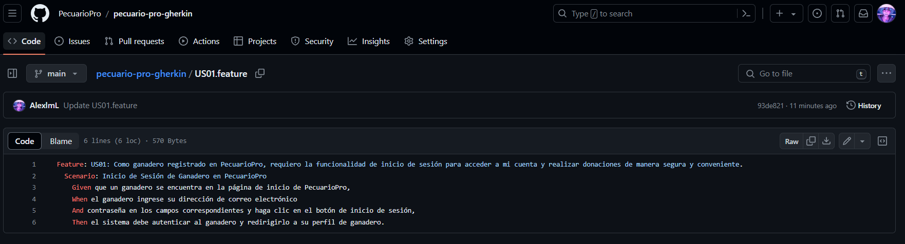

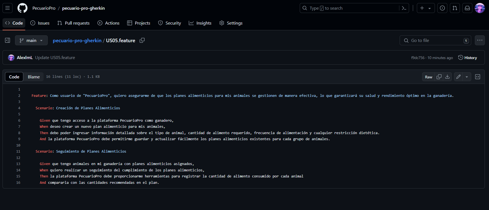

[Repositorio del gherkin](https://github.com/PecuarioPro/pecuario-pro-gherkin) 

#### 5.2.1.5 Execution Evidence for Sprint Review

Durante el primer sprint, en términos generales, hemos alcanzado los siguientes hitos:
- Establecimiento de múltiples repositorios en GitHub:

- Elaboración de los Mock-ups del landing page:

- Implementacion del landing page:

- Diseño de Mock-ups para Movile aplication:

Enlace del video: [Video for Sprint Review](https://upcedupe-my.sharepoint.com/personal/u202219984_upc_edu_pe/_layouts/15/stream.aspx?id=%2Fpersonal%2Fu202219984%5Fupc%5Fedu%5Fpe%2FDocuments%2Fupc%2Dpre%2D202401si730%2Dws53%2DPecuarioPro%2Dkeynote%2Dtb1%2Emp4&nav=eyJyZWZlcnJhbEluZm8iOnsicmVmZXJyYWxBcHAiOiJTdHJlYW1XZWJBcHAiLCJyZWZlcnJhbFZpZXciOiJTaGFyZURpYWxvZy1MaW5rIiwicmVmZXJyYWxBcHBQbGF0Zm9ybSI6IldlYiIsInJlZmVycmFsTW9kZSI6InZpZXcifX0&ga=1&referrer=StreamWebApp%2EWeb&referrerScenario=AddressBarCopied%2Eview)

#### 5.2.1.6 Services Documentation Evidence for Sprint Review

Durante el primer sprint, se logro lo siguiente en relación a Web Services:

- Despliegue de Landing Page:

Documentacion del código para despliegue:

Documentación index.html:

Link Landing Page desplegada: [Link de LP desplegada](https://pecuariopro.web.app)

Interacción y explicacion Landing Page: [Interacción LP](https://upcedupe-my.sharepoint.com/personal/u202219984_upc_edu_pe/_layouts/15/stream.aspx?id=%2Fpersonal%2Fu202219984%5Fupc%5Fedu%5Fpe%2FDocuments%2Fupc%2Dpre%2D202401si730%2Dws53%2DPecuarioPro%2Dkeynote%2Dtb1%2Emp4&nav=eyJyZWZlcnJhbEluZm8iOnsicmVmZXJyYWxBcHAiOiJTdHJlYW1XZWJBcHAiLCJyZWZlcnJhbFZpZXciOiJTaGFyZURpYWxvZy1MaW5rIiwicmVmZXJyYWxBcHBQbGF0Zm9ybSI6IldlYiIsInJlZmVycmFsTW9kZSI6InZpZXcifX0&ga=1&referrer=StreamWebApp%2EWeb&referrerScenario=AddressBarCopied%2Eview)

#### 5.2.1.7 Software Deployment Evidence for Sprint Review

Se encuentra desplegado en Firebase.

[Link de LP desplegada](https://pecuariopro.web.app)

#### 5.2.1.8 Team Collaboration Insights during Sprint

# Conclusiones

- En resumen, el proyecto PecuarioPro se destaca por su diseño objetivo y su enfoque en mejorar el bienestar animal. Con un compromiso continuo con la actualización tecnológica, la capacitación de los usuarios y la colaboración con expertos, esta aplicación tiene el potencial de hacer una contribución significativa a la industria pecuaria al tiempo que promueve prácticas más éticas y sostenibles. Poniendo en primer lugar la salud de los animales y su buen cuidado como una buena gestion de ellos.

- PecuarioPro se presenta como una alternativa tecnologica para aquellas personas y empresas que se encuentran en la industria pecuaria y requieren de mejoras en la gestión de su negocio. Se busca diseñar una plataforma intuitiva, fácil de entender y sobre todo eficiente para nuestros segmentos objetivos. Con el uso del framework Vue y la aplicación de conocimientos sobre ingeniería de software este proyecto busca además explorar nuevas formas de construir una solución de software teniendo un enfoque en las necesidades del cliente.

