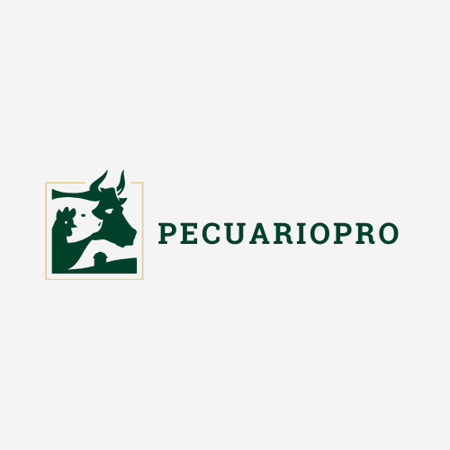

# Universidad Peruana de Ciencias Aplicadas

## Ingeniería de Sistemas y Computación | Ingeniería de Software

### APLICACIONES WEB

#### TB1 REPORT

**Nombre del Startup**
PecuarioPro

**Docente:** 

**Grupo**

**Team Members:**

- Casaverde De La Cruz, Ernesto David | u20221b657
- Rojas Velasquez, Maycol Jhordan | U202219984
- Cantoral Sedamano, Alexander Alberto | U20181B152
- Soriano Medrano, Diego | U202114793
- Vásquez Villalobos, Elverth Jair | U202213070

Ciclo 2024-01 | Sección 

## REGISTRO DE VERSIONES DEL INFORME
<table>
 <thead>
    <tr>
      <th>Versión</th>
      <th>Fecha</th>
      <th>Autor</th>
      <th>Descripción de modificación</th>
    </tr>
 </thead>
 <tbody>
    <tr>
      <td>1.0</td>
      <td>10/04/2024</td>
      <td>Grupo 05</td>
      <td>
        - Creación del documento para la primera versión del informe. 
        - Implementación de Carátula, Contenido, Student Outcome. 
        - Apertura Capítulo 1: Introducción. 
        - Redacción Startup Profile: Descripción de la Startup, Perfiles de integrantes del equipo. 
        - Redacción Solution Profile: Antecedentes y problemática, Lean UX Process. 
        - Redacción Segmentos objetivo. 
        - Apertura Capítulo 2: Requirements Elicitation & Analysis. 
        - Redacción Competidores: Análisis competitivo, Estrategias y tácticas frente a competidores. 
        - Redacción Entrevistas: Diseño de entrevistas, Registro de entrevistas y Análisis de entrevistas. 
        - Redacción Needfinding: User Personas, User Task Matrix, User Journey Mapping, Empathy Mapping y As-is Scenario Mapping. 
        - Avance en la redacción de conclusiones. 
        - Incorporación de Bibliografía en base a las citas del documento de reporte.
      </td>
    </tr>
    <tr>
      <td>2</td>
      <td></td>
      <td>Grupo 05</td>
      <td></td>
    </tr>
    <tr>
      <td>3</td>
      <td></td>
      <td>Grupo 05</td>
      <td></td>
    </tr>
    <tr>
      <td>4</td>
      <td></td>
      <td>Grupo 05</td>
      <td></td>
    </tr>
 </tbody>
</table>

 
 

# PROJECT REPORT COLLABORATION INSIGHTS

....

# CONTENIDO

<ul>
    <li>STUDENT OUTCOME</li>
</ul>

<h2>Capítulo I: Introducción</h2>
<h3>1.1. Startup Profile</h3>
<ul>
    <li>1.1.1. Descripción de la Startup</li>
    <li>1.1.2. Perfiles de integrantes del equipo</li>
</ul>

<h3>1.2. Solution Profile</h3>
<ul>
    <li>1.2.1 Antecedentes y problemática</li>
    <li>1.2.2 Lean UX Process.
        <ul>
            <li>1.2.2.1. Lean UX Problem Statements</li>
            <li>1.2.2.2. Lean UX Assumptions</li>
            <li>1.2.2.3. Lean UX Hypothesis Statements</li>
            <li>1.2.2.4. Lean UX Canvas</li>
        </ul>
    </li>
</ul>

<h3>1.3. Segmentos objetivo.</h3>

<h2>Capítulo II: Requirements Elicitation & Analysis</h2>
<h3>2.1. Competidores.</h3>
<ul>
    <li>2.1.1. Análisis competitivo.</li>
    <li>2.1.2. Estrategias y tácticas frente a competidores.</li>
</ul>

<h3>2.2. Entrevistas.</h3>
<ul>
    <li>2.2.1. Diseño de entrevistas</li>
    <li>2.2.2. Registro de entrevistas</li>
    <li>2.2.3. Análisis de entrevistas.</li>
</ul>

<h3>2.3. Needfinding.</h3>
<ul>
    <li>2.3.1. User Personas.</li>
    <li>2.3.2. User Task Matrix</li>
    <li>2.3.3. User Journey Mapping.</li>
    <li>2.3.4. Empathy Mapping.</li>
    <li>2.3.5. As-is Scenario Mapping.</li>
</ul>

<h3>2.4. Ubiquitous Language.</h3>

<h2>Capítulo III: Requirements Specification</h2>
<ul>
    <li>3.1. To-Be Scenario Mapping.</li>
    <li>3.2. User Stories.</li>
    <li>3.3. Impact Mapping.</li>
    <li>3.4. Product Backlog.</li>
</ul>

<h2>Capítulo IV: Product Design</h2>
<h3>4.1. Style Guidelines.</h3>
<ul>
    <li>4.1.1. General Style Guidelines.</li>
    <li>4.1.2. Web Style Guidelines.</li>
</ul>

<h3>4.2. Information Architecture.</h3>
<ul>
    <li>4.2.1. Organization Systems.</li>
    <li>4.2.2. Labeling Systems.</li>
    <li>4.2.3. SEO Tags and Meta Tags</li>
    <li>4.2.4. Searching Systems.</li>
    <li>4.2.5. Navigation Systems.</li>
</ul>

<h3>4.3. Landing Page UI Design.</h3>
<ul>
    <li>4.3.1. Landing Page Wireframe</li>
    <li>4.3.2. Landing Page Mock-up.</li>
</ul>

<h3>4.4. Web Applications UX/UI Design.</h3>
<ul>
    <li>4.4.1. Web Applications Wireframes</li>
    <li>4.4.2. Web Applications Wireflow Diagrams.</li>
    <li>4.4.2. Web Applications Mock-ups.</li>
    <li>4.4.3. Web Applications User Flow Diagrams.</li>
</ul>

<h3>4.5. Web Applications Prototyping.</h3>

<h3>4.6. Domain-Driven Software Architecture.</h3>
<ul>
    <li>4.6.1. Software Architecture Context Diagram.</li>
    <li>4.6.2. Software Architecture Container Diagrams.</li>
    <li>4.6.3. Software Architecture Components Diagrams.</li>
</ul>

<h3>4.7. Software Object-Oriented Design.</h3>
<ul>
    <li>4.7.1. Class Diagrams.</li>
    <li>4.7.2. Class Dictionary.</li>
</ul>

<h3>4.8. Database Design.</h3>
<ul>
    <li>4.8.1. Database Diagram.</li>
</ul>

# STUDENT OUTCOME

| Criterio específico | Acciones realizadas | Conclusiones |
|---------------------|---------------------|--------------|
| Comunica oralmente sus ideas y/o resultados con objetividad a público de diferentes especialidades y niveles jerárquicos, en el marco del desarrollo de un proyecto en ingeniería. | TB1 | TB1 |

# Capítulo I: Introducción
## 1.1. Startup Profile
### 1.1.1. Descripción de la Startup
### 1.1.2. Perfiles de integrantes del equipo

**Rojas Velasquez, Maycol Jhordan - U20221984**

Elegí la carrera de Ingeniería de Software debido a mi gusto por la innovación y la implementación de la tecnología en cualquier rubro  social, de una manera creativa y en todos los aspectos. Me considero una persona creativa, en busca de ideas, estrategias con mente nueva. También me gusta escuchar ideas de mi equipo, dar ideas de mejora, evaluar las ventajas y desventajas . Además, tengo conocimientos de programación en C + +, HTML, Python  y SQL server. Además, Tengo un enfoque responsable y dedicado mediante un aprendizaje rápido así puedo ayudar a mis compañeros en sus dudas. Por otro lado, mis hobbies son ver series, jugar , escuchar música, nadar y  manejar.

**Vásquez Villalobos Elverth Jair - U202213070**

Mi perfil se basa en ser una persona que cuando enfrenta un problema no se rinde hasta encontrar una solución. Considero que tengo una buena capacidad de análisis al momento de realizar algoritmos necesarios para el funcionamiento de algunos requerimientos en el software. Así mismo, me gusta siempre estar en comunicación con mi equipo de trabajo de una manera asertiva. Me apasiona el mundo de la tecnología y el emprendimiento, por ello trato de aportar al desarrollo del startup con mis habilidades en programación e investigación.

**Casaverde De La Cruz Ernesto - 20221b657**

Estudio la carrera de ingeniería de software en la universidad de Ciencias Aplicadas – UPC. Siempre me tomo los trabajos como parte de mi desarrollo personal tengo habilidades de programación en c++, HTML, css, JavaScript, SQL, mongoDB, Python Además se dominar las metodologías agiles y gestión de proyectos privados o públicos. Me gustaría aprender más sobre la programación. En mis tiempos libres practico fútbol, también me gusta leer libros, ver películas y viajar. Me considero responsable, respetuosa y amable, con estas habilidades comprometo a terminar el proyecto de la mejor manera para aportar a la sociedad.

## 1.2. Solution Profile
## 1.2.1 Antecedentes y problemática

__Mediante la técnica de “5w’s & 2h’s” logramos identificar los antecedentes de nuestra problemática y comprender mejor la misma.__

What/ Qué: Una aplicación web para gestionar eficientemente el inventario de ganado, registrar información relevante (peso, salud, alimentación, etc.), realizar seguimiento de la producción y ventas, y generar informes y análisis.

__When / Cuándo:__ Esta aplicación sería utilizada de manera continua por los encargados de la gestión del ganado, permitiéndoles acceder y actualizar la información en tiempo real.

__Where/ Dónde:__ La aplicación web estaría accesible desde cualquier dispositivo con conexión a Internet, ya sea en la oficina, en el campo o en cualquier lugar donde se requiera acceder a la información.

__Who / Quién:__ Los usuarios principales serían las personas que trabajan de la granja o rancho, veterinarios, encargados de alimentación y personal involucrado en la gestión del ganado.

__Why / Por qué:__ La aplicación web facilitaría la gestión eficiente del ganado, mejorando la trazabilidad, optimizando los procesos y permitiendo la toma de decisiones informadas basadas en datos precisos.

__How/ Cómo:__ La aplicación se desarrollaría utilizando tecnologías web modernas, como HTML, CSS, JavaScript, frameworks de front-end y back-end, bases de datos y servicios en la nube. Además, se implementarían funcionalidades como registro de datos, generación de informes, visualización de datos en tiempo real, entre otras.

__How much / Cuánto:__  El costo del desarrollo de la aplicación dependería de factores como el alcance, las características requeridas, la complejidad, la integración con otros sistemas y la contratación de desarrolladores y personal de soporte técnico.

### 1.2.2 Lean UX Process.
#### 1.2.2.1. Lean UX Problem Statements

__Problem statement 1:__  Como ganadero o productor pecuario necesito una solución para gestionar mis animales de manera eficiente, ya que actualmente dependo de una organización manual no muy eficiente para recopilar y rastrear información importante sobre mis animales, mi negocio y mi trabajo. Esto afectó negativamente el producto y la rentabilidad de mi negocio al dificultarme la toma de decisiones, la mejora de procesos y el cumplimiento de las reglas.

__Problem statement 2:__ Como administrador o encargado de una granja de animales necesito una aplicación web de gestión animal que cumple con los más altos estándares en términos de rendimiento, seguridad y escalabilidad, ya que las soluciones existentes en el mercado carecen de solidez, funciones avanzadas y potencial de crecimiento. Esto limitó mi capacidad para utilizar nuevas tecnologías, garantizar la integridad de los datos y brindar la mejor experiencia de usuario para mi equipo, lo que afectaría el rendimiento, la longevidad y la competitividad de mi negocio.

#### 1.2.2.2. Lean UX Assumptions

1.- __Ganaderos usan la tecnología:__ se asume que los ganaderos estén dispuestos a hacer uso de la tecnología para mejorar su negocio, y consideran que la administración de la ganadería es una herramienta valiosa para alcanzar este objetivo. 

__2.- Priorizar la Accesibilidad:__ Se asume que los ganaderos, independientemente de su experiencia tecnológica, valorarán una aplicación fácil de usar, accesible desde diferentes dispositivos, incluidos teléfonos móviles, tabletas y computadoras de escritorio.

__3.-Buena Conectividad:__ Se asume, que los ganaderos puedan contar con una Buena eficiencia en la conectividad ya que su rubro u oficio lo realizan desde zonas con poca conectividad o incluso no llegar a contar con ella. Para ello priorizaremos evitar las dependencias de la conectividad.

__4.-Gestion del Ganado:__ Se asume, que los ganaderos al usar nuestra aplicación web, aumente su productividad y mejor toma de decisiones para una mejor Calidad de los alimentos que provienen de los animales domésticos o incluso gestionar la Calidad de vida en zoológicos de animales silvestres o estado de conservación.

__5.-Personalización:__ Se asume, que el ganadero este cómodo usando una tecnología que se adecue a sus necesidades o acorde a su rango como trabajador o encargado para mejorar el confort y el mayor uso posible de la aplicación web evitando así incomodidad por falta de soporte.

__6.-Seguridad y privacidad:__ Se asume, que los ganaderos puedan contar con mucha confianza al usar nuestra aplicación debemos estar comprometidos con todos los métodos se seguridad y privacidad evitando posibles estafas o publicación de información sensible fuera de la aplicación.

#### 1.2.2.3. Lean UX Hypothesis Statements

1. __Hipótesis del problema:__ Basándonos en nuestras observaciones preliminares y en la investigación de mercado, creemos que los ganaderos están enfrentando desafíos significativos en la gestión eficiente de su ganado debido a la falta de herramientas de seguimiento y gestión adecuadas. Validaremos esta hipótesis realizando entrevistas en profundidad con un número representativo de ganaderos y analizando sus respuestas para identificar patrones y problemas comunes.
2. __Hipótesis de los usuarios:__ Suponemos que nuestros usuarios son ganaderos que manejan rebaños de varios tamaños y que buscan mejorar la eficiencia de su gestión del ganado. Validaremos esta hipótesis a través de encuestas y entrevistas con posibles usuarios para entender mejor sus necesidades y desafíos.
3.	__Hipótesis de las características:__ Creemos que al desarrollar una aplicación móvil que permita a los ganaderos rastrear la salud, la alimentación y el rendimiento de su ganado, podremos satisfacer sus necesidades y resolver sus problemas. Validaremos esta hipótesis mediante la creación de prototipos de las características propuestas y la realización de pruebas de usabilidad con nuestros usuarios objetivo.
4.	__Hipótesis de negocio:__ Suponemos que, al resolver estos problemas para los ganaderos, seremos capaces de monetizar nuestra aplicación a través de suscripciones o compras en la aplicación. Validaremos esta hipótesis a través de pruebas de mercado y análisis de la disposición de los usuarios a pagar por tales servicios.

#### 1.2.2.4. Lean UX Canvas

Link del figjam [here](https://www.figma.com/file/MjkbNsmp6xjbCwMJWu7eRm/Lean-UX-Canvas?type=whiteboard&node-id=2%3A268&t=IfnuiT4QukKtG1cG-1 "Lean ux canvas").

## 1.3. Segmentos objetivo.

### Descripción de cada segmento objetivo:

#### Productores Ganadores independientes:
Este segmento objetivo de nuestra plataforma se centra en los ganaderos independientes comprometidos y preocupados por obtener ganancias de manera ética y sostenible, mientras garantizan una excelente calidad en el cuidado de sus animales en propiedad. Este grupo comprende a ganaderos que poseen una variedad de animales, tales como ovejas, vacas, reses, corderos, gallinas, entre otros, y que residen en Perú. Su principal objetivo es asegurarse de que el estado y cuidado de sus animales sea óptimo, priorizando el bienestar y la salud de estos. Además, están interesados en llevar a cabo prácticas de venta honestas, con un enfoque en productos más naturales y de alta calidad. Como obtener información de nuevos métodos de cuidado animal.

#### Empresas Ganaderas:
El segmento objetivo de nuestra plataforma se dirige específicamente a grandes empresas corporativas involucradas en la gestión y cuidado de animales. Estas empresas se destacan por su firme compromiso con prácticas éticas y sostenibles en la producción ganadera. Su principal preocupación radica en garantizar que sus animales reciban una alimentación precisa, óptima y honesta, priorizando la salud y el bienestar de cada individuo. Asimismo, estas empresas se preocupan por brindar un cuidado individual a cada animal, asegurándose de que reciban la atención necesaria para su desarrollo y bienestar. Asimismo, contar con un sistema integral de gestión veterinaria, que garantiza un acceso constante y adecuado a servicios de atención médica veterinaria para sus animales.

### Datos cuantitativos del problema:

#### Productores Ganadores independientes:
Se han registrado numerosos incidentes en los que los productores ganaderos peruanos no reciben una compensación justa en los mercados, y enfrentan dificultades significativas en la gestión del cuidado de sus animales debido a la escasez de recursos económicos y la limitada accesibilidad a servicios veterinarios para consultas y atención adecuada. Estas circunstancias han creado desafíos sustanciales para los ganaderos, quienes luchan por mantener la salud y el bienestar de sus animales mientras buscan asegurar su propio sustento económico en un entorno cada vez más desafiante y competitivo. Se estima que al menos el 15% de los animales muertos en las granjas se debe a la falta de acceso oportuno a servicios veterinarios adecuados, lo que genera pérdidas económicas significativas para los productores, estimadas en un 20% de sus ingresos anuales debido a la falta de compensación justa de los mercados hacia ellos.

#### Empresas Ganaderas:
En el Perú, el bienestar animal en las empresas ganaderas es a menudo insuficiente, con un preocupante porcentaje del 60% de las operaciones que no cumplen con estándares aceptables en este aspecto. Esta deficiencia se refleja en condiciones de vida inadecuadas para el ganado, como la falta de espacio y la alimentación deficiente, lo que afecta negativamente su salud y bienestar. Además, la gestión de residuos en estas empresas es inadecuada en aproximadamente un 70% de los casos, lo que resulta en una incorrecta disposición de los desechos animales y una potencial contaminación del medio ambiente. Esta situación representa un desafío significativo para la industria ganadera, ya que no solo compromete el bienestar de los animales, sino que también puede tener repercusiones negativas en la salud pública y el medio ambiente.

### Variables geográficas, demográficas y psicológicas:

#### Variable geográfica:
- País: Perú
- Ciudad: zonas rurales 

#### Variable demográfica:
- Género: Femenino / Masculino.
- Ocupación: Productores ganaderos 
- Estado civil: Todos los estados
- Edad y etapa de ciclo de vida:
- Ciudadanos mayores a 18 años.

#### Variable psicográfica:
- Nivel Socioeconómico (NSE): todos los niveles socioeconomicos
- Características de personalidad:
 - Altruismo 
 - Perseverante
 - Honestidad

# Capítulo II: Requirements Elicitation & Analysis
## 2.1 Competidores
### 2.1.1. Análisis competitivo.

| Competitive Analysis Landscape |  |  |  |  |  |
| --- | --- | --- | --- | --- | --- |
| ¿Por qué llevar a cabo este análisis? |  | Escriba en el recuadro la pregunta que busca responder o el objetivo de este análisis. |  |  |  |
|  |  | Por qué asi ampliamos nuestro conocimiento sobre nuestro negocio |  |  |  |
| (En la cabecera colocar por cada competidor nombre )
 |  | |PecuarioPro | Control Ganadero | Agroptima | App Ganadera |
| Perfil | Overview | Somos una empresa emergente en pleno desarrollo contamos con todas las últimas tecnologías, buena eficiencia y compatibilidad con muchos dispositivos | Es una aplicación español, británico y brasileño en el sector de la ganadería. | Agroptima es un sitio web multiplataforma cofundado por la unión europea para los países de España, Francia e Inglaterra | Es una empresa fundada en Colombia que cuenta con una para la gestión de ganado. |
|  | Ventaja competitiva ¿Qué valor ofrece a los clientes? | Lo último en tecnología mucha productividad y buena gestión | es una app para la gestión de vacas y enfocada para móviles | cuenta con multiplataforma cuenta con algoritmos matemáticos para una mayor gestión del ganado. | Tiene gran variedad de herramientas y gran cantidad de distribuidores |
| Perfil de Marketing | Mercado objetivo | productores ganaderos independientes y empresas privadas o públicas. | Para ganaderos españoles, brasileños e ingleses. | Para ganaderos españoles, franceses   e ingleses. | Para ganaderos colombianos |
|  | Estrategias de marketing | Difusión en redes sociales y anuncios pagados | Estrategia de posicionamiento | Estrategia de segmentación | Estrategia
segmentación |
| Perfil de Servicio | Servicio | Web app de gestión de ganado.| Web app de gestión de ganado. | Web app de gestión de ganado. | Web app de gestión de ganado. |
|  | Precio del servicio | suscripción  Bajo costo | suscripción  Bajo costo | suscripción  Bajo costo| Subscripcion Bajo costo |
|  | Canales de distribución (Web y/o Móvil) | Web y móvil | app | web y móvil | app |
| Análisis SOT | Realice esto para su empresa emergente y sus competidores. Sus fortalezas deberían apoyar sus oportunidades y contribuir a lo que ustedes definen como su posible ventaja competitiva. |  |  |  |  |
|  | Fortalezas | Contamos con lo último en tecnología e implementamos lo nuevo en desarrollo para mejorar la productividad del servicio | Es una app netamente para la gestión de vacas cuenta con buena personalización | Es famoso por ser bueno en gestión ya que usa algoritmos matemáticos para un mejor cálculo del ganado. | Su ecosistema está basado en un país de origen conoce muy bien a sus clientes y se adapta a ellos |
|  | Debilidades | Está en pleno desarrollo puede ser un éxito o fracaso | Solo es de móvil eso limita que sea multiplataforma | Solo opera en Europa y se basa en reglas ya establecidas por la unión europea | Solo es una app y para la zona de Colombia por lo tanto solo está disponible en su país de origen |
|  | Oportunidades | Puede hacer productivos a los ganaderos y empresas de este rubro mejorando sus tomas de decisiones y eficiencia | Si planeas ir a Europa es buena idea ya que ese es su público objetivo y contará con más servicios. | Si planeas ir a Europa es buena idea ya que ese es su público objetivo y contará con más servicios. | Si eres colombiano estarás contento con la app ya que es de uso nacional. |
|  | Amenazas | Al no tener buenos conocimientos o malas prácticas de desarrollo porque estamos en pleno rubro académico puede limitar su desarrollo. | no cuenta con muchos clientes la ganadería sigue siendo a la antigua por tanto no hace falta usarla. | no cuenta con muchos clientes la ganadería sigue siendo a la antigua por tanto no hace falta usarla. | Falta de apoyo económico los gobiernos locales de Colombia no ven viable esta innovación puede llegar a su desaparición |

### 2.1.2. Estrategias y tácticas frente a competidores.

Para nuestra web App queremos contar con la última tecnología disponible tales como:

1. __Integración de tecnologías disruptivas:__

-IA: análisis predictivo, monitoreo de comportamiento, optimización de alimentación.
-IOT: sensores para monitoreo en tiempo real, automatización de tareas.
-RA/RV: visualización 3D, entrenamiento virtual, simulación de producción.

2. __Enfoque en la experiencia del usuario:__

-Interfaz intuitiva y personalizable.
-Atención al cliente excepcional.
-Comunidad de usuarios para compartir experiencias.

3. __Funcionalidades avanzadas:__

-Módulo de trazabilidad completo.
-Análisis de datos con KPIs, comparación con benchmarks.
-Gestión de la reproducción y planificación financiera.

4. __Integración con otras aplicaciones:__

-Software de contabilidad y facturación.
-Plataformas de comercio electrónico.
-Dispositivos móviles y wearables.

5. __Marketing y promoción efectiva:__

-Posicionamiento SEO, marketing digital, participación en eventos.
-Colaboración con asociaciones de ganaderos e influencers.

## 2.2. Entrevistas.
### 2.2.1. Diseño de entrevistas.
### 2.2.2. Registro de entrevistas.
### 2.2.3. Análisis de entrevistas.
## 2.3. Needfinding.
#### 2.3.1. User Personas.

### 2.3.2. User Task Matrix.
 
## 2.3.3. User Journey Mapping.

|   | Motivación | Investigación | Navegar por la interfaz de la plataforma | Evaluación de producto | Adquisición de servicio |
|---|---|---|---|---|---|
| **Doing** | El ganadero busca una solución que simplifique la gestión de su ganado. | Investiga sobre sistemas de gestión de ganado. Mira reseñas y recomendaciones. | Visita el sitio web o descarga la aplicación. Encuentra descuentos en diferentes planes de suscripciones | Explora las funcionalidades disponibles. Identifica que el software pueda cumplir con sus necesidades específicas. Observa que la plataforma ofrece diferentes planes de suscripción. | El ganadero pasa por los procesos de pago. El ganadero decide por su método de pago de preferencia. |
| **Feeling** | Curiosidad | Interés Evaluación crítica de todas las opciones disponibles | Expectativas altas Interés Expectativa Confusión | Confusión Satisfacción | |
| **Experience** | El ganadero espera una solución que mejore su productividad y que sea de fácil uso. | Feliz por encontrar diversas opciones. Confusión por cuál de todas las propuestas es la mejor. | Expectante por ver lo que ofrece la plataforma. Sorprendido al ver diferentes descuentos en los planes de suscripción. | Observa que la plataforma ofrece funcionalidades para diferentes situaciones. Revisa que el software pueda resolver su problema en específico. Observa y evalúa los beneficios que ofrece cada uno de planes de suscripción y para quién está dirigido. | El ganadero tiene que proporcionar sus datos en los diferentes procesos de pago. Se siente feliz al ver que la plataforma admite diferentes métodos de pago. |
| **Customer expectation** | Una solución que aborde todas sus necesidades de gestión de ganado y con un soporte confiable. | Espera encontrar diferentes propuestas. Identificar las mejores plataformas para explorar sus funcionalidades. | Una interfaz amigable e intuitiva. Los descuentos ofrecen una oferta irresistible al ganadero. | Funcionalidades que le proporcionen valor real al negocio. Soluciones eficaces y fáciles de entender. Cada suscripción ofrece diferentes beneficios y es fácil identificar la adecuada. | Los procesos de pago deben ser fáciles de entender y se deben de realizar de la manera más rápida posible. Todos los métodos de pago funcionan de manera correcta. |

### 2.3.4. Empathy Mapping.

### 2.3.5. As-is Scenario Mapping.

## 2.4. Ubiquitous Language.
# Capítulo III: Requirements Specification
## 3.1. To-Be Scenario Mapping.

## 3.2. User Stories.

## 3.3. Impact Mapping.
## 3.4. Product Backlog.
# Product Backlog

| Orden | Código | Título                                    | Descripción                                                                                                                                                            |
|-------|--------|-------------------------------------------|------------------------------------------------------------------------------------------------------------------------------------------------------------------------|
| 1     | HU05   | Gestión de los planes alimenticios       | Como usuario de "PecuarioPro", quiero asegurarme de que los planes alimenticios para mis animales se gestionen de manera efectiva, lo que garantizará su salud y rendimiento óptimo en la ganadería. |
| 2     | HU06   | Comunicaciones con veterinario            | Como ganadero que utiliza la plataforma PecuarioPro, quiero una funcionalidad que me permita comunicarme de manera efectiva con veterinarios, para obtener asesoramiento y atención médica para mis animales cuando sea necesario. |
| 3     | HU08   | Redacción de Informes del Estado de los Animales | Como ganadero que utiliza la plataforma PecuarioPro, quiero una funcionalidad que me permita generar informes detallados sobre el estado de salud y el rendimiento de mis animales, para poder realizar un seguimiento efectivo de su bienestar y tomar decisiones informadas en la gestión de mi ganadería. |
| 4     | HU09   | Programación de Visitas Veterinarias     | Como ganadero que utiliza la plataforma PecuarioPro, quiero una funcionalidad que me permita programar y gestionar visitas veterinarias para mis animales, garantizando así un cuidado veterinario regular y oportuno para mantener su salud. |
| 5     | HU10   | Seguimiento de reproducción y cría       | Como ganadero que utiliza la plataforma PecuarioPro, quiero una funcionalidad que me permita realizar un seguimiento detallado del proceso de reproducción y cría de mis animales, garantizando así una gestión eficiente y una mejora continua en mi ganadería. |

# Capítulo IV: Product Design
## 4.1. Style Guidelines.
Las Style Guidelines son fundamentales para mantener una comunicación cohesiva y profesional en todos los aspectos de la marca o proyecto, ya sea en publicaciones impresas, en línea o en cualquier otro medio de difusión. En esta sección estableceremos el conjunto de directrices que usará nuestro equipo para diseñar el proyecto PecuarioPro. En estas pautas definiremos aspectos como la elección de colores, tipografía, estructura del documento, entre otros elementos. Por ello, para el diseño de PecuarioPro emplearemos la plataforma Figma para la creación de la aplicación web y la página de inicio. En ambas, se incluirá una paleta de colores con tonalidades de verde y crema, que reflejen la naturaleza y la confianza asociadas con la gestión sostenible de animales. A continuación, se presenta un detalle más amplio de cada aspecto mencionado

### 4.1.1. General Style Guidelines.
**Branding:** El logotipo de nuestro startup es mucho más que una simple imagen; es la manifestación visual de nuestra identidad. En el centro, el símbolo único que nos representa es nuestro nombre, que se basa en fusionar las palabras ganado  y confianza, fusiona estas dos palabras, debido a que nuestro startup se basa en el control de ganado y el bienestar animal . Este logotipo es versátil y se adapta a una variedad de plataformas y aplicaciones, asegurando que nuestra marca se destaque en cualquier entorno. Este logo refleja la transparencia y seguridad que queremos transmitir los ganaderos y empresas ganaderas.

    

<b> Horizontal layout </b> 

    

     
    

<b>Inverted Colors</b> 

    

     
    

<b>Logo mark only</b> 

 

**Typography:** La tipografía de PecuarioPro encapsula la esencia de nuestra innovadora startup, que busca revolucionar el proceso de gestión y cuidado de animales para consumo en Perú. Con un estilo moderno, ordenado y minimalista, se alinea perfectamente con la imagen que deseamos proyectar: una plataforma fácil de usar y confiable para la gestión de animales. Nuestra elección de tipografía refleja nuestro compromiso con la simplicidad y la accesibilidad, utilizando un lenguaje casual y sencillo que invita a nuestros usuarios a sentirse cómodos y empoderados al utilizar nuestra aplicación.

**Tipos de letras a usar:**

- **Roboto slab:** Para el logo de nuestro proyecto.

     
    
    

 

- **Poppins (encabezados):** Poppins es una tipografía moderna y legible que puede ser ideal para los encabezados y títulos de su plataforma. Transmite confianza y es fácil de leer en pantallas digitales.

     
    

 

- **Noto Sans (cuerpo de texto):** Noto Sans es una tipografía versátil que funciona bien para el cuerpo de texto en su plataforma. Su calidad ayudará a que la información sea fácil de absorber.

     
    

 

- **Roboto (botones):** Roboto es una tipografía limpia que puede funcionar bien para los botones y llamados a la acción. Ayuda a crear un aspecto moderno y atractivo que alienta a los usuarios a participar.

     
    

 

- **Raleway (detalles):** Raleway puede usarse para resaltar detalles importantes o elementos de diseño. Su aspecto contemporáneo y elegante puede añadir un toque de sofisticación a su plataforma.

     
    

 

- **Arial (texto legal y pie de página):** Para el texto legal y el pie de página, Arial es una elección segura. Es altamente legible y transmite profesionalismo.

     
    

 

**Colors:** La selección de colores en PecuarioPro se ha llevado a cabo de manera estratégica, utilizando una paleta que refleja nuestra visión y valores. Los tonos #004229, #E1D29A y #f5f4f4 han sido elegidos meticulosamente para transmitir la esencia de nuestra innovadora plataforma de gestión de animales. Estos colores no solo crean una armonía visual, sino que también establecen un equilibrio entre la naturaleza (representada por el verde profundo), la integridad (encarnada en el tono cálido del beige) y la transparencia (reflejada en el blanco puro). Esta combinación refuerza nuestra identidad como una solución moderna y confiable en el ámbito de la ganadería, destacándonos por nuestra singularidad y compromiso con el bienestar animal y la eficiencia en la gestión ganadera.

**Gama de colores:**

**#004229**
 

**#E1D29A**

 

**#f5f4f4**

## Espaciado en la Plataforma Web de Pecuario Pro

La plataforma web de Pecuario Pro está diseñada con un enfoque en la legibilidad y la comodidad del ganadero. A continuación, se detallan las especificaciones de espaciado recomendadas:

### Espaciado entre líneas (line-height)
- **Texto de cuerpo**: Debe ser de 1.4 a 1.6 veces el tamaño de la fuente.

### Espaciado entre párrafos
- **Margen inferior**: Debe ser al menos el 120% del tamaño de fuente entre párrafos.

### Margen y espaciado alrededor de elementos de la interfaz
- **Al menos 20 píxeles de espacio**: Se debe mantener entre elementos de la interfaz.

### Espaciado entre secciones o módulos
- **Margen superior e inferior**: Debe ser de al menos 45 píxeles.

### Espaciado entre elementos de menú y navegación
- **Al menos 15 píxeles de espacio**: Se debe mantener entre elementos de navegación.

### Espaciado alrededor de imágenes y gráficos
- **Al menos 20 píxeles de margen**: Debe haber alrededor de las imágenes.

### Espaciado en el pie de página
- **Margen superior e inferior**: Debe ser de alrededor de 40 a 60 píxeles.

 

**Lenguaje y tono de la comunicación:**

El tono de comunicación y lenguaje ideal para PecuarioPro, nuestra plataforma de gestión ganadera en Perú, se caracteriza por ser cálido, empático, claro y comprometido. En PecuarioPro, creemos en la importancia de establecer una conexión emocional con nuestros usuarios y en comunicar de manera efectiva nuestro compromiso con el bienestar animal y la sostenibilidad en la industria ganadera. Nuestro tono es amigable y accesible, lo que refleja nuestra misión de hacer que la gestión de animales sea una experiencia positiva y gratificante para todos los involucrados. Además, nos esforzamos por diseñar nuestra plataforma de manera intuitiva y fácil de usar, especialmente para ganaderos menos experimentados en tecnología. Ofrecemos tutoriales paso a paso y asistencia personalizada para garantizar que todos los usuarios, independientemente de su nivel de experiencia tecnológica, puedan aprovechar al máximo todas las funciones de PecuarioPro. Al mismo tiempo, mantenemos un enfoque profesional y serio cuando se trata de la responsabilidad en el cuidado de los animales y la transparencia en nuestros procesos. En nuestras comunicaciones, utilizamos un lenguaje claro y sencillo para garantizar que los usuarios comprendan fácilmente cómo funciona nuestra plataforma y cómo pueden contribuir al bienestar de sus animales. Fomentamos la confianza al proporcionar información detallada sobre las prácticas de manejo animal y al ofrecer transparencia en la trazabilidad de los productos ganaderos. Queremos que nuestros usuarios se sientan cómodos, informados y motivados a ser parte del cambio positivo que estamos impulsando en la industria ganadera en Perú.

### 4.1.2. Web Style Guidelines.
Nuestro enfoque en las "Web Style Guidelines" se centra en la creación de una experiencia de usuario consistente y atractiva en entornos de navegación web. Esto implica el uso de una paleta de colores cohesiva, tipografía legible y un diseño responsivo que se adapte a una variedad de dispositivos y tamaños de pantalla. 

## 4.2. Information Architecture.
### 4.2.1. Organization Systems.
### 4.2.2. Labeling Systems.
### 4.2.3. SEO Tags and Meta Tags
### 4.2.4. Searching Systems.
### 4.2.5. Navigation Systems.
## 4.3. Landing Page UI Design.
### 4.3.1. Landing Page Wireframe.
### 4.3.2. Landing Page Mock-up.
## 4.4. Web Applications UX/UI Design.
### 4.4.1. Web Applications Wireframes.
### 4.4.2. Web Applications Wireflow Diagrams.
### 4.4.2. Web Applications Mock-ups.
### 4.4.3. Web Applications User Flow Diagrams.
## 4.5. Web Applications Prototyping.

## 4.6. Domain-Driven Software Architecture.

### 4.6.1. Software Architecture Context Diagram

### 4.6.2. Software Architecture Container Diagrams.

### 4.6.3. Software Architecture Components Diagrams.

# Capítulo V: Implementation , Validation & Deployment.
## 5.1. Software Configuration Management.
### 5.1.1. Software Development Environment Configuration.
### 5.1.2. Source Code Management.

En esta sección detallaremos el esquema de organización que utilizaremos para aplicar el seguimiento de modificaciones que realizaremos en nuestro proyeto.

**Repositorio Remoto**

Haremos uso de la plataforma GitHub para crear nuestros repositorios remotos. Estos repositorios serán de gran utilidad ya que nos sirven para almacenar y gestionar nuestro código fuente y la documentación. Así mismo, nos facilita la colaboración entre todos los integrantes del grupo y permite tener un control de versiones de nuestro proyecto.

**Implementación de GitFlow**

Utilizaremos el flujo de trabajo GitFlow, el cual nos permite tener un trabajo claro en el desarrollo de nuestro software. Para implementarlo crearemos ramas especificas que cubrirán cada aspecto de nuestro producto.

- **master:** La rama master será la principal, en ella se subirán los cambios finales del proyecto. Utilizaremos etiquetas(tags) para indicar las versiones del software según la importancia de los cambios.
- **develop:** Está sera la rama de desarrollo, aquí agregaremos características y funcionalidades desarrolladas en la rama feature.
- **feature:** En la rama feature se desarrollarán las nuevas funcionalidades y características del software. Así mismo, aquí se harán las correciones de bugs y detalles que impiden el despliegue de la aplicación.
- **release:** En esta rama se realizarán cambios mínimos los cuales no alteran la funcionalidad del software. Por lo general se suelen arreglar errores de ortografía y bugs mínimos. Además, en esta rama desarrollaremos la documentación respectiva del proyecto.
- **hotfix:** Esta será una rama para la resolución de bugs de manera inmediata. En la rama hotfix se corrigen errores que impiden ciertas funcionalidades importantes del software y su correción es necesaria para la correcta operación del producto.

**Convetional Commits**

Haremos uso de Conventional Commits para tener una mejor comprensión de los cambios realizados en el repositorio. Utilizaremos palabras clave como "fix" o "feature" para indicar el tipo de cambio realizado en los archivos, ya sea para el arreglo de bugs o la agregación de nuevo contenido. 

### 5.1.3. Source Code Style Guide & Conventions.
