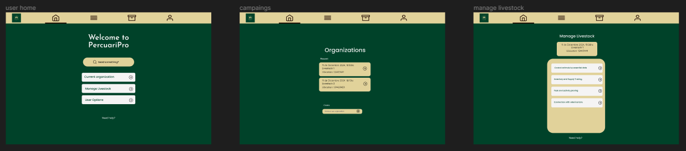
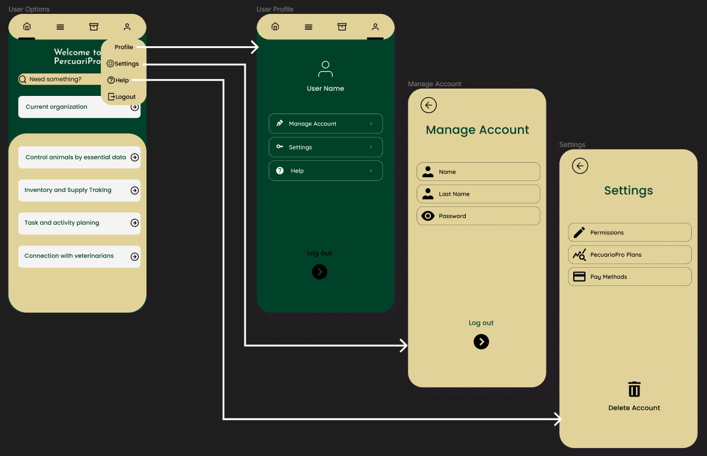

# Universidad Peruana de Ciencias Aplicadas

## Ingeniería de Sistemas y Computación | Ingeniería de Software

### APLICACIONES WEB

#### TB1 REPORT

**Nombre del Startup**
Pecuario Pro 

**Docente:** Angel Augusto Velasquez Nuñez 

**Grupo 5**

**Team Members:**
- Rojas Velasquez, Maycol Jhordan **U202219984**
- Soriano Medrano, Diego		**U202114793**
- Casaverde de la Cruz, Ernesto David 	**U20221B657**
- Cantoral Sedamano, Alexander Alberto	**U20181B152**
- Vásquez Villalobos, Elverth Jair **U202213070**

 

<b>Ciclo 2024-01 | Sección WS53

 
 

## REGISTRO DE VERSIONES DEL INFORME

<table border="1">
  <tr>
    <th>Version</th>
    <th>Fecha</th>
    <th>Autor</th>
    <th>Descripción y Modificación</th>
  </tr>
  <tr>
    <td>1.0</td>
    <td>01/04/2024</td>
    <td>Maycol Jhordan Rojas</td>
    <td>- Implementación de Contenido, Student Outcome.  - Apertura Capítulo 1: Introducción.  - Redacción Segmentos objetivo y Redacción Entrevistas: Diseño de entrevistas y Registro de entrevistas. 
  </tr>
<tr>
  <td>2.0</td>
  <td>03/04/2024</td>
  <td>Diego Soriano Medrano</td>
  <td> - Student Outcome.  -User Journey Mapping.  - As-is Scenario Mapping.</td>
</tr>
<tr>
  <td>3.0</td>
  <td>10/04/2024</td>
  <td>Ernesto David Casaverde</td>
  <td>- Corrección de errores encontrados en la versión 2.0.  - Análisis de las entrevistas.</td>
</tr>
<tr>
    <td>4.0</td>
    <td>15/04/2024</td>
    <td>Alexander Alberto Cantoral</td>
    <td>- As-is Scenario Mapping. - Desarrollo de la primera versión de la aplicación web. - Ubiquitous Language.</td> 
</tr>
<tr>
  <td>5.0</td>
  <td>18/04/2024</td>
  <td>Elverth Jair Vásquez</td>
  <td>-  To-Be Scenario Mapping.  - User Stories.  - Impact Mapping.  - Style Guidelines. - General Style Guidelines.</td>
</tr>
<tr>
    <td>6.0</td>
    <td>20/04/2024</td>
    <td>Maycol Jhordan Rojas</td>
    <td>-  Information Architecture.  - Landing Page UI Design.  - Landing Page Mock-up. - Web Applications UX/UI Design.  - Redacción Needfinding:  User Task Matrix  - Avance en la redacción de conclusiones.  -Redacción Domain-Driven Software Architecture:  Diagramas de Contexto, Contenedores y Componentes. 
</tr>
<tr>
  <td>7.0</td>
  <td>26/04/2024</td>
  <td>Diego Soriano Medrano</td>
  <td> - Software Object-Oriented Design.  -  Database Design.</td>
</tr>
<tr>
  <td>8.0</td>
  <td>29/04/2024</td>
  <td>Ernesto David Casaverde</td>
  <td>- Software Configuration Management. </td>
</tr>
<tr>
    <td>09.0</td>
    <td>01/05/2024</td>
    <td>Alexander Cantoral Sedamano</td>
    <td>- Source Code Style Guide & Conventions. - Software Deployment Configuration. - Development Evidence for Sprint Review</td> 
</tr>
<tr>
  <td>10.0</td>
  <td>02/05/2024</td>
  <td>Elverth Jair Vásquez</td>
  <td>-  Execution Evidence for Sprint Review.  - Services Documentation Evidence for Sprint Review.  - Impact Mapping.  - Team Collaboration Insights during Sprint.</td>
</tr>
<tr>
  <td>11.0</td>
  <td>08/06/2024</td>
  <td>Alexander Cantoral Sedamano</td>
  <td>- Sprint 3.  -  Validation Interviews.   - Video About-the-Product.</td>
</tr>
</table>

## Project Report Collaboration Insights

| URL del Repositorio |
|----------------------|
| https://github.com/orgs/PecuarioPro/repositories |

| Descripción de Actividades |
|-----------------------------|
| Se ha redactado el informe siguiendo un proceso de redacción, revisión y edición. |
| Se ha utilizado la plataforma GitHub para la colaboración en línea entre los miembros del equipo. |
| Se han organizado reuniones periódicas para discutir el progreso del informe y asignar tareas. |
| Se han utilizado herramientas como Google Docs para la colaboración en tiempo real en secciones específicas del informe. |

| Capturas de Pantalla |
|----------------------|
||
| |

| Participación de los Miembros del Equipo |
|------------------------------------------|
| Todos los miembros del equipo han contribuido en la elaboración del informe. |
| Se han asignado tareas específicas a cada miembro del equipo para garantizar una distribución equitativa del trabajo. |
| Se han realizado revisiones cruzadas entre los miembros del equipo para asegurar la calidad del contenido del informe. |
| Se han proporcionado comentarios y sugerencias para mejorar el contenido y la estructura del informe. |

# CONTENIDO

# Tabla de Contenidos

1. [Capítulo I: Introducción](#capítulo-i-introducción) 
   1.1. [Startup Profile](#startup-profile) 
      1.1.1. [Descripción de la Startup](#descripción-de-la-startup) 
      1.1.2. [Perfiles de integrantes del equipo](#perfiles-de-integrantes-del-equipo) 
   1.2. [Solution Profile](#solution-profile) 
      1.2.1. [Antecedentes y problemática](#antecedentes-y-problemática) 
      1.2.2. [Lean UX Process](#lean-ux-process) 
         1.2.2.1. [Lean UX Problem Statements](#principio-1) 
         1.2.2.2. [Lean UX Assumptions](#principio-2) 
         1.2.2.3. [Lean UX Hypothesis Statements](#principio-3) 
         1.2.2.4. [Lean UX Canvas](#principio-4) 
   1.3. [Segmentos objetivo](#lean-ux-problem-statements-assumptions-hypothesis-statements-canvas-segmentos-objetivo) 
2. [Capítulo II: Requirements Elicitation & Analysis](#capítulo-ii-requirements-elicitation-analysis) 
   2.1. [Competidores](#competidores) 
      2.1.1. [Análisis competitivo](#análisis-competitivo) 
      2.1.2. [Estrategias y tácticas frente a competidores](#estrategias-y-tácticas-frente-a-competidores) 
   2.2. [Entrevistas](#entrevistas) 
      2.2.1. [Diseño de entrevistas](#diseño-de-entrevistas) 
      2.2.2. [Registro de entrevistas](#registro-de-entrevistas) 
      2.2.3. [Análisis de entrevistas](#análisis-de-entrevistas) 
   2.3. [Needfinding](#needfinding) 
      2.3.1. [User Personas](#user-personas) 
      2.3.2. [User Task Matrix](#user-task-matrix) 
      2.3.3. [User Journey Mapping](#user-journey-mapping) 
      2.3.4. [Empathy Mapping](#empathy-mapping) 
      2.3.5. [As-is Scenario Mapping](#as-is-scenario-mapping) 
   2.4. [Ubiquitous Language](#ubiquitous-language) 
3. [Capítulo III: Requirements Specification](#capítulo-iii-requirements-specification) 
   3.1. [To-Be Scenario Mapping](#to-be-scenario-mapping) 
   3.2. [User Stories](#user-stories) 
   3.3. [Impact Mapping](#impact-mapping) 
   3.4. [Product Backlog](#product-backlog) 
4. [Capítulo IV: Product Design](#capítulo-iv-product-design) 
   4.1. [Style Guidelines](#style-guidelines) 
      4.1.1. [General Style Guidelines](#general-style-guidelines) 
      4.1.2. [Web Style Guidelines](#web-style-guidelines) 
   4.2. [Information Architecture](#information-architecture) 
      4.2.1. [Organization Systems](#organization-systems) 
      4.2.2. [Labeling Systems](#labeling-systems) 
      4.2.3. [SEO Tags and Meta Tags](#seo-tags-and-meta-tags) 
      4.2.4. [Searching Systems](#searching-systems) 
      4.2.5. [Navigation Systems](#navigation-systems) 
   4.3. [Landing Page UI Design](#landing-page-ui-design) 
      4.3.1. [Landing Page Wireframe](#landing-page-wireframe) 
      4.3.2. [Landing Page Mock-up](#landing-page-mock-up) 
   4.4. [Web Applications UX/UI Design](#web-applications-uxui-design) 
      4.4.1. [Web Applications Wireframes](#web-applications-wireframes) 
      4.4.2. [Web Applications Wireflow Diagrams](#web-applications-wireflow-diagrams) 
      4.4.2. [Web Applications Mock-ups](#web-applications-mock-ups) 
      4.4.3. [Web Applications User Flow Diagrams](#web-applications-user-flow-diagrams) 
   4.5. [Web Applications Prototyping](#web-applications-prototyping) 
   4.6. [Domain-Driven Software Architecture](#domain-driven-software-architecture) 
      4.6.1. [Software Architecture Context Diagram](#software-architecture-context-diagram) 
      4.6.2. [Software Architecture Container Diagrams](#software-architecture-container-diagrams) 
      4.6.3. [Software Architecture Components Diagrams](#software-architecture-components-diagrams) 
   4.7. [Software Object-Oriented Design](#software-object-oriented-design) 
      4.7.1. [Class Diagrams](#class-diagrams) 
      4.7.2. [Class Dictionary](#class-dictionary) 
   4.8. [Database Design](#database-design) 
      4.8.1. [Database Diagram](#database-diagram) 
5. [Capítulo V: Product Implementation, Validation & Deployment](#capítulo-v-product-implementation-validation-deployment) 
   5.1. [Software Configuration Management](#software-configuration-management) 
      5.1.1. [Software Development Environment Configuration](#software-development-environment-configuration) 
      5.1.2. [Source Code Management](#source-code-management) 
      5.1.3. [Source Code Style Guide & Conventions](#source-code-style-guide-conventions) 
      5.1.4. [Software Deployment Configuration](#software-deployment-configuration) 
   5.2. [Landing Page, Services & Applications Implementation](#landing-page-services-applications-implementation) 
      5.2.1. [Sprint 1](#sprint-1) 
         5.2.1.1. [Sprint Planning 1](#sprint-planning-1) 
         5.2.1.2. [Sprint Backlog 1](#sprint-backlog-1) 
         5.2.1.3. [Development Evidence for Sprint Review](#development-evidence-for-sprint-review) 
         5.2.1.4. [Testing Suite Evidence for Sprint Review](#testing-suite-evidence-for-sprint-review) 
         5.2.1.5. [Execution Evidence for Sprint Review](#execution-evidence-for-sprint-review) 
         5.2.1.6. [Services Documentation Evidence for Sprint Review](#services-documentation-evidence-for-sprint-review) 
         5.2.1.7. [Software Deployment Evidence for Sprint Review](#software-deployment-evidence-for-sprint-review) 
         5.2.1.8. [Team Collaboration Insights during Sprint](#team-collaboration-insights-during-sprint) 

# STUDENT OUTCOME

| Criterio específico                                                                                          | Acciones realizadas                                                               | Conclusiones                                                                   |
|--------------------------------------------------------------------------------------------------------------|-----------------------------------------------------------------------------------|---------------------------------------------------------------------------------|
| Participa en equipos multidisciplinarios con eficacia, eficiencia y objetividad, en el marco de un proyecto en soluciones de ingeniería de software. |**1.- Maycol Jhordan Rojas Velasquez:**  TB1: Participación activa en las reuniones de equipo para el desarrollo de la landing page.  TP: Contribución en la revisión y conclusiones del segundo informe, implementando efectivamente las correcciones necesarias para mejorarlo. TB2: Apoyé mayormente en la remodelación de la LP y apoyé en el desarrollo del backend de la aplicación.    **2.-Alexander Alberto Cantoral Sedamano:**  TB1: Participación integral en el desarrollo del informe y el desarrollo del Landing Page.  TP: Contribución al desarrollo de la primera versión de la aplicación y secciones respectivas al mismo. TB2: Para esta entrega participé en el avance del frontend mayormente y apoyé con el backend en las reuniones.   **3.- Elverth Jair Vasquez Villalobos:**  TB1: Participé en la elaboración de los requirimientos para nuestro proyecto y en la elaboración del Needfinding.  TP: Correción de aspectos desarrollados en los user personas, realización del análisis de entrevistas haciendo un ánalisis estadístico de los datos proporcionado por nuestros segmentos entrevistados. TB2: Lideré el avance del Backend por ende, la mayoría de mi aporte a la entrega se centra aquí y también apoyé con el desarrollo del frontend.    **4.- Diego Soriano Medrano:**  TB1: Tratar de mantener eficaca al coordinar con otros miembros del equipo y cumplir con los plazos establecidos para el desarrollo del aplicativo.  TP: Al desarrollar el proyecto intente mantener un enfoque objetivo al evaluar diferentes soluciones técnicas. TB2: Pude apoyar con el desarrollo del frontend y apoyar con el backend en las reuniones.    **5.- Ernesto David Casaverde de la Cruz:**  TB1: Logré apoyar con el desarrollo inicial de landing page TP: Para esta entrega pude observar y analizar el código de mis compañeros para la realización de mi feat de la siguiente entrega.  TB2: Pude apoyar con mi feat en el frontend y con la mejora de la LandingPage.| TB1  La entrega actual ha sido un hito notable, caracterizado por una participación sobresaliente por parte de todos los integrantes del equipo. A pesar de enfrentar algunas dificultades y enfrentarse a aspectos del código que no resultaban claros, el grupo demostró un compromiso excepcional al colaborar en la corrección del informe y en el avance de las características del código. Esta experiencia resalta la importancia de la colaboración y el apoyo mutuo en la consecución de nuestros objetivos. La disposición para superar obstáculos y trabajar juntos ha sido fundamental para el éxito de este proyecto, y esperamos seguir construyendo sobre este espíritu de equipo en futuras entregas.  TP  Todos asumieron un papel fundamental en el equipo, contribuyendo al éxito del proyecto de desarrollo de un aplicativo para la gestión y registro de bovinos mediante su capacidad para trabajar eficaz, eficiente y objetivamente en soluciones de ingeniería de software. TB2 Para esta entrega concluimos con una mejora significativa en la presentación LandingPage, Frontend y comenzamos con el desarrollo del Backend.
| Conoce al menos un sector empresarial o dominio de aplicación de soluciones de software. | **1.- Maycol Jhordan Rojas Velasquez:**  TB1: Realize investigaciones y análisis de mercado para comprender el contexto de aplicación de las soluciones de software en el sector empresarial, identificando tendencias, necesidades y oportunidades.  TP: Contribui en la revisión y conclusiones del segundo informe, implementando efectivamente las correcciones necesarias para mejorarlo ene sector empresarial. TB2: Comprendí como poder mejorar la LandingPage para poder conectar de una mejor forma con los futuros usuarios y a su vez lídere por momentos al equipo para finalización de esta entrega.    **2.- Alexander Alberto Cantoral Sedamano:**  TB1: Exploración del sector empresarial al que pertenece la aplicación junto con un estudio de los features de la competencia.  TP: Apoyo en la revisión y correción de las observaciones hechas al informe presentado en la TB1. TB2: Pude comprender luego de una ardua investigación sobre como hacer de editor de la documentación del proyecto y a su vez pude comprender como dejar todo el contenido del mismo claro para cualquier tipo de lector.    **3.- Elverth Jair Vasquez Villalobos:**  TB1: Explore aún más el sector corporativo de nuestro dominio de negocio, esto se pudo hacer mediante la realización de entrevistas y la búsqueda de información para detallar el problema a solucionar.  TP: Contribuí realización un análisis de aspectos críticos en nuestro dominio de negocio .Esto se llevó acabo mediante la elaboración de User Personas que representen a nuestros segmentos objetivos. TB2: Pude tomar las riendas del grupo para poder elaborar unos querys y commands en el backend que tengan sentido con lo que esperamos quiera los usuarios segmentos objetivo.    **4.- Diego Soriano Medrano:**  TB1: Ver la oportunidad de adquirir un profundo conocimiento del sector ganadero y del dominio específico de la ganadería  TP: Contribuir al desarrollo de un aplicativo funcional y efectivo para la gestión y registro de bovinos, sobre un sector empresarial específico. TB2: Puede realizar una página de bienvenida clara para los usuarios de la aplicación web y a su vez pude apoyar con la realización de parte de la documentación.  **5.- Ernesto David Casaverde de la Cruz:**  TB1: Desarrolle una pequeña investigación del rubro de la aplicación para poder comprender mejor lo que estamos tratando y poder entender las necesidades de los segmentos objetivo.  TP: Contribuí a la finalización de una LandingPage que conecte con los futuros usuarios y pueda llamar su atención.  TB2: Realicé una versión inicial de una de las herramienta,que creo yo, ayudará más al usuario en la aplicación web. |  TB1 Al concluir, destacamos la excelente coordinación lograda en la segmentación empresarial. Nuestro análisis se centró en las necesidades de nuestros usuarios, identificando áreas que requieren mejoras. Esta conclusión refleja nuestro compromiso con la excelencia y la adaptación continua a las demandas del mercado. TP  Al finalizar el proyecto esto nos proporciona una base sólida para futuros proyectos en el campo de la ingeniería de software, donde pueda aplicar su experiencia adquirida en el sector ganadero o explorar otros dominios de aplicación de soluciones de software.  TB2  Al momento de la entrega teníamos comprendido casi al 100% lo que necesita nuestros usuarios y, a su vez, lo que necesitará ser implementado para la versión final de la aplicación.|

# Capítulo I: Introducción
## 1.1. Startup Profile
### 1.1.1. Descripción de la Startup

__Nombre del Start:__ PecuarioPro

PecuarioPro es una avanzada aplicación web diseñada para capacitar a los ganaderos en la gestión eficiente y sostenible de su ganado. Esta plataforma ofrece una amplia gama de herramientas integrales que permiten a los usuarios realizar un seguimiento detallado de la salud, alimentación y reproducción de sus animales, lo que facilita una mejor toma de decisiones en la granja. Con PecuarioPro, los ganaderos pueden optimizar sus operaciones y maximizar sus ingresos, al tiempo que promueven prácticas agrícolas sostenibles y éticas, lo que contribuye al bienestar de los animales y al desarrollo sostenible de la industria ganadera.

__Logotipo de la Startup:__

### 1.1.2. Perfiles de integrantes del equipo

**Rojas Velasquez, Maycol Jhordan - U20221984**

Elegí la carrera de Ingeniería de Software debido a mi gusto por la innovación y la implementación de la tecnología en cualquier rubro  social, de una manera creativa y en todos los aspectos. Me considero una persona creativa, en busca de ideas, estrategias con mente nueva. También me gusta escuchar ideas de mi equipo, dar ideas de mejora, evaluar las ventajas y desventajas . Además, tengo conocimientos de programación en C + +, HTML, Python  y SQL server. Además, Tengo un enfoque responsable y dedicado mediante un aprendizaje rápido así puedo ayudar a mis compañeros en sus dudas. Por otro lado, mis hobbies son ver series, jugar , escuchar música, nadar y  manejar.

**Vásquez Villalobos Elverth Jair - U202213070**

Mi perfil se basa en ser una persona que cuando enfrenta un problema no se rinde hasta encontrar una solución. Considero que tengo una buena capacidad de análisis al momento de realizar algoritmos necesarios para el funcionamiento de algunos requerimientos en el software. Así mismo, me gusta siempre estar en comunicación con mi equipo de trabajo de una manera asertiva. Me apasiona el mundo de la tecnología y el emprendimiento, por ello trato de aportar al desarrollo del startup con mis habilidades en programación e investigación.

**Casaverde De La Cruz Ernesto - 20221b657**

Estudio la carrera de ingeniería de software en la universidad de Ciencias Aplicadas – UPC. Siempre me tomo los trabajos como parte de mi desarrollo personal tengo habilidades de programación en c++, HTML, css, JavaScript, SQL, mongoDB, Python Además se dominar las metodologías agiles y gestión de proyectos privados o públicos. Me gustaría aprender más sobre la programación. En mis tiempos libres practico fútbol, también me gusta leer libros, ver películas y viajar. Me considero responsable, respetuosa y amable, con estas habilidades comprometo a terminar el proyecto de la mejor manera para aportar a la sociedad.

**Cantoral Sedamano, Alexander Alberto - U20181B152**
Ingeniería de software
Acerca de mí: Conocimientos técnicos de programación en C++, PHP, Python. Conocimientos básicos de frontend en HTML. Usuario frecuente tanto de Visual Studio como Visual Studio Code. Habilidades mixtas en otros programas usuales para el desarrollo de trabajos universitarios. Además, mis habilidades blandas van desde saber trabajar en equipo, tener una tendencia a ser ordenado y ser comprometido con todas las entregas.

**Soriano Medrano, Diego - U202114793**

Ingeniería de software
Soy una persona creativa y paciente, tengo conocimiento en el uso de diferentes herramientas informáticas y lenguajes de programación como C++ y Python, estas herramientas me ayudan a realizar distintos tipos de trabajo y a resolver problemas, parte de mis habilidades blandas es siempre tomar en cuenta la opinión de mis compañeros, lo cual me facilita el poder trabajar en equipo, para agilizar y optimizar el trabajo. En mis tiempos libres suelo navegar por internet.

## 1.2. Solution Profile
## 1.2.1 Antecedentes y problemática

__Mediante la técnica de “5w’s & 2h’s” logramos identificar los antecedentes de nuestra problemática y comprender mejor la misma.__

What?

 Una aplicación web para gestionar eficientemente el inventario de ganado, registrar información relevante (peso, salud, alimentación, etc.), realizar seguimiento de la producción y ventas, y generar informes y análisis.

When?

Esta aplicación sería utilizada de manera continua por los encargados de la gestión del ganado, permitiéndoles acceder y actualizar la información en tiempo real.

Where? 

La aplicación web estaría accesible desde cualquier dispositivo con conexión a Internet, ya sea en la oficina, en el campo o en cualquier lugar donde se requiera acceder a la información.

Who?

 Los usuarios principales serían las personas que trabajan de la granja o rancho, veterinarios, encargados de alimentación y personal involucrado en la gestión del ganado.

Why?

 La aplicación web facilitaría la gestión eficiente del ganado, mejorando la trazabilidad, optimizando los procesos y permitiendo la toma de decisiones informadas basadas en datos precisos.

How?

 La aplicación se desarrollaría utilizando tecnologías web modernas, como HTML, CSS, JavaScript, frameworks de front-end y back-end, bases de datos y servicios en la nube. Además, se implementarían funcionalidades como registro de datos, generación de informes, visualización de datos en tiempo real, entre otras.

How much? 

 El costo del desarrollo de la aplicación dependería de factores como el alcance, las características requeridas, la complejidad, la integración con otros sistemas y la contratación de desarrolladores y personal de soporte técnico

### 1.2.2 Lean UX Process.
#### 1.2.2.1. Lean UX Problem Statements

Cuando lanzamos nuestras soluciones de gestión ganadera en (*PecuarioPro*) para pequeños y medianos productores pecuarios, el mercado estaba dominado por métodos manuales y anticuados para recopilar y rastrear información sobre el ganado. En ese entorno, nuestro sistema digital para gestionar datos y operaciones de animales se destacó y atrajo a ganaderos que buscaban formas más eficientes de administrar sus negocios. Sin embargo, a medida que las granjas y ranchos tradicionales han ido adoptando soluciones tecnológicas similares, nuestro mercado se ha vuelto saturado y altamente competitivo. Esto está provocando un aumento en los costos de adquisición de nuevos clientes ganaderos, un estancamiento en nuestra participación de mercado y un incremento en los costos de soporte y servicio al cliente.

Cuando lanzamos nuestra aplicación web de gestión animal para administradores y encargados de granjas(*PecuarioPro*), el mercado ofrecía soluciones que carecían de solidez, funciones avanzadas y potencial de crecimiento. En ese entorno, nuestra aplicación de alta gama se destacó al cumplir con los más altos estándares en términos de rendimiento, seguridad y escalabilidad. Inicialmente, atrajo a clientes que buscaban aprovechar las nuevas tecnologías, garantizar la integridad de los datos y brindar una excelente experiencia de usuario a sus equipos. Sin embargo, a medida que los competidores han comenzado a ofrecer soluciones más robustas, nuestro mercado se ha vuelto saturado y muy competitivo. Esto está provocando un aumento en los costos de adquisición de nuevos clientes, un estancamiento en nuestra participación de mercado y una presión para mantener nuestras tarifas competitivas, afectando nuestra rentabilidad y capacidad para invertir en nuevas características e innovaciones.

#### 1.2.2.2. Lean UX Assumptions

- se asume que los ganaderos estén dispuestos a hacer uso de la tecnología para mejorar su negocio, y consideran que la administración de la ganadería es una herramienta valiosa para alcanzar este objetivo. 

- Se asume que los ganaderos, independientemente de su experiencia tecnológica, valorarán una aplicación fácil de usar, accesible desde diferentes dispositivos, incluidos teléfonos móviles, tabletas y computadoras de escritorio.

-  Se asume, que los ganaderos puedan contar con una Buena eficiencia en la conectividad ya que su rubro u oficio lo realizan desde zonas con poca conectividad o incluso no llegar a contar con ella. Para ello priorizaremos evitar las dependencias de la conectividad.

-  Se asume, que los ganaderos al usar nuestra aplicación web, aumente su productividad y mejor toma de decisiones para una mejor Calidad de los alimentos que provienen de los animales domésticos o incluso gestionar la Calidad de vida en zoológicos de animales silvestres o estado de conservación.

- Se asume, que el ganadero este cómodo usando una tecnología que se adecue a sus necesidades o acorde a su rango como trabajador o encargado para mejorar el confort y el mayor uso posible de la aplicación web evitando así incomodidad por falta de soporte.

-  Se asume, que los ganaderos puedan contar con mucha confianza al usar nuestra aplicación debemos estar comprometidos con todos los métodos se seguridad y privacidad evitando posibles estafas o publicación de información sensible fuera de la aplicación.

#### 1.2.2.3. Lean UX Hypothesis Statements

 - Creemos que lograremos un aumento del 25% en la productividad de las operaciones ganaderas si los ganaderos alcanzan una gestión más eficiente de tareas y procesos con una función de programación y seguimiento de tareas dentro de la aplicación.

- Creemos que lograremos reducir los costos operativos en un 15% si los encargados de granjas alcanzan un control más preciso de los inventarios y suministros con un módulo de administración de inventario integrado en la aplicación.

- Creemos que lograremos una tasa de retención de clientes del 90% si los pequeños ganaderos alcanzan un mejor cumplimiento de las regulaciones y requisitos sanitarios con características de registro y seguimiento sanitario dentro de la aplicación.

- Creemos que lograremos aumentar las ventas de ganado en un 20% si los productores ganaderos alcanzan una mejor comercialización y promoción de su ganado con un directorio de compradores y herramientas de marketing dentro de la aplicación.

- Creemos que lograremos una calificación de satisfacción del cliente de 4.5/5 estrellas si los ganaderos alcanzan un acceso más conveniente a datos e información clave con un tablero personalizable e informes integrados en la aplicación.

- Creemos que lograremos adquirir 10,000 nuevos usuarios en 6 meses si los trabajadores de granjas alcanzan una forma más fácil de registrar y acceder a datos del ganado con una interfaz móvil simple e intuitiva para ingresar datos.

- Creemos que lograremos un puntaje de recomendación neta de 50+ si los administradores de ranchos alcanzan una mejor colaboración y coordinación de tareas con su equipo con características de asignación de tareas y notificaciones en tiempo real.

-  que lograremos duplicar el tiempo de permanencia de los usuarios en la aplicación si los ganaderos alcanzan un mejor seguimiento del desempeño y crecimiento de su ganado con gráficos de análisis y herramientas de pronóstico integradas.

- Creemos que lograremos un crecimiento anual de ingresos del 30% si los criadores de ganado alcanzan una gestión más efectiva de la cría y reproducción con un módulo de gestión de la reproducción y registros genealógicos.

- Creemos que lograremos un ahorro de costos  en multas regulatorias si las granjas lecheras alcanzan un cumplimiento más estricto de los protocolos de inocuidad alimentaria con una función de auditoría y verificación de cumplimiento dentro de la aplicación.

#### 1.2.2.4. Lean UX Canvas

__Link del figma:__ [https://www.figma.com/file/MjkbNsmp6xjbCwMJWu7eRm/Lean-UX-Canvas?type=whiteboard&node-id=2%3A268&t=IfnuiT4QukKtG1cG-1](https://www.figma.com/file/MjkbNsmp6xjbCwMJWu7eRm/Lean-UX-Canvas?type=whiteboard&node-id=2%3A268&t=IfnuiT4QukKtG1cG-1 "Lean ux canvas").

## 1.3. Segmentos objetivo.

### Descripción de cada segmento objetivo:

#### Productores Ganadores independientes:
Este segmento objetivo de nuestra plataforma se centra en los ganaderos independientes comprometidos y preocupados por obtener ganancias de manera ética y sostenible, mientras garantizan una excelente calidad en el cuidado de sus animales en propiedad. Este grupo comprende a ganaderos que poseen una variedad de animales, tales como ovejas, vacas, reses, corderos, gallinas, entre otros, y que residen en Perú. Su principal objetivo es asegurarse de que el estado y cuidado de sus animales sea óptimo, priorizando el bienestar y la salud de estos. Además, están interesados en llevar a cabo prácticas de venta honestas, con un enfoque en productos más naturales y de alta calidad. Como obtener información de nuevos métodos de cuidado animal.

#### Empresas Ganaderas:
El segmento objetivo de nuestra plataforma se dirige específicamente a grandes empresas corporativas involucradas en la gestión y cuidado de animales. Estas empresas se destacan por su firme compromiso con prácticas éticas y sostenibles en la producción ganadera. Su principal preocupación radica en garantizar que sus animales reciban una alimentación precisa, óptima y honesta, priorizando la salud y el bienestar de cada individuo. Asimismo, estas empresas se preocupan por brindar un cuidado individual a cada animal, asegurándose de que reciban la atención necesaria para su desarrollo y bienestar. Asimismo, contar con un sistema integral de gestión veterinaria, que garantiza un acceso constante y adecuado a servicios de atención médica veterinaria para sus animales.

### Datos cuantitativos del problema:

#### Productores Ganadores independientes:
Se han registrado numerosos incidentes en los que los productores ganaderos peruanos no reciben una compensación justa en los mercados, y enfrentan dificultades significativas en la gestión del cuidado de sus animales debido a la escasez de recursos económicos y la limitada accesibilidad a servicios veterinarios para consultas y atención adecuada. Estas circunstancias han creado desafíos sustanciales para los ganaderos, quienes luchan por mantener la salud y el bienestar de sus animales mientras buscan asegurar su propio sustento económico en un entorno cada vez más desafiante y competitivo. Se estima que al menos el 15% de los animales muertos en las granjas se debe a la falta de acceso oportuno a servicios veterinarios adecuados, lo que genera pérdidas económicas significativas para los productores, estimadas en un 20% de sus ingresos anuales debido a la falta de compensación justa de los mercados hacia ellos.

#### Empresas Ganaderas:
En el Perú, el bienestar animal en las empresas ganaderas es a menudo insuficiente, con un preocupante porcentaje del 60% de las operaciones que no cumplen con estándares aceptables en este aspecto. Esta deficiencia se refleja en condiciones de vida inadecuadas para el ganado, como la falta de espacio y la alimentación deficiente, lo que afecta negativamente su salud y bienestar. Además, la gestión de residuos en estas empresas es inadecuada en aproximadamente un 70% de los casos, lo que resulta en una incorrecta disposición de los desechos animales y una potencial contaminación del medio ambiente. Esta situación representa un desafío significativo para la industria ganadera, ya que no solo compromete el bienestar de los animales, sino que también puede tener repercusiones negativas en la salud pública y el medio ambiente.

### Variables geográficas, demográficas y psicológicas:

#### Variable geográfica:
- País: Perú
- Ciudad: zonas rurales 

#### Variable demográfica:
- Género: Femenino / Masculino.
- Ocupación: Productores ganaderos 
- Estado civil: Todos los estados
- Edad y etapa de ciclo de vida:
- Ciudadanos mayores a 18 años.

#### Variable psicográfica:
- Nivel Socioeconómico (NSE): todos los niveles socioeconomicos
- Características de personalidad:
 - Altruismo 
 - Perseverante
 - Honestidad

# Capítulo II: Requirements Elicitation & Analysis
## 2.1 Competidores
### 2.1.1. Análisis competitivo.

<table>
   <tr>
      <td align="center" colspan="6">Competitive Analysis Landscaspe</td>
   </tr>
   <tr>
      <td colspan="2">¿Porqué llevar a cabo este análisis?</td><td colspan="4">¿Cómo podemos proporcionar un buen servicio entre los restaurantes y los consumidores de manera que la comunicación entre ambos sea efectiva y agradable?</td>
   </tr>
   <tr align="center">
      <td colspan="2"><td>PecuarioPro</td><td>Control Ganadero</td><td>Agroptima</td><td>App Ganadera</td>
   </tr>
   <tr>
      <td rowspan="2">Perfil</td><td>Overview</td><td> Somos una empresa emergente en pleno desarrollo contamos con todas las últimas tecnologías, buena eficiencia y compatibilidad con muchos dispositivos </td><td> Es una aplicación español, británico y brasileño en el sector de la ganadería. </td><td> Agroptima es un sitio web multiplataforma cofundado por la unión europea para los países de España, Francia e Inglaterra </td><td> Es una empresa fundada en Colombia que cuenta con una para la gestión de ganado. </td>
   </tr>
   <tr>
      <td>Ventaja competitiva. ¿Qué valor ofrece a los clientes?</td><td> Lo último en tecnología mucha productividad y buena gestión </td><td> es una app para la gestión de vacas y enfocada para móviles </td><td> cuenta con multiplataforma cuenta con algoritmos matemáticos para una mayor gestión del ganado. </td><td> Tiene gran variedad de herramientas y gran cantidad de distribuidores </td>
   </tr>
   <tr>
      <td rowspan="2">Perfil de Marketing</td><td>Mercado Objetivo</td><td> Productores ganaderos independientes y empresas privadas o públicas. </td><td> Para ganaderos españoles, brasileños e ingleses. </td><td> Para ganaderos españoles,franceses e ingleses. </td><td> Para ganaderos colombianos </td>
   </tr>
   <tr>
      <td>Estrategias de Marketing</td><td> Difusión en redes sociales y anuncios pagados </td><td> Estrategia de posicionamiento </td><td> Estrategia de segmentación </td><td> Estrategia </td>
   </tr>
   <tr>
      <td rowspan="3">Perfil de Producto</td><td>Productos & Servicios</td><td> Web app de gestión de ganado. </td><td> Web app de gestión de ganado. </td><td> Web app de gestión de ganado. </td><td> Web app de gestión de ganado. </td>
   </tr>
   <tr>
      <td>Precios & Costos</td><td> Subscripcion Bajo costo </td><td> Subscripcion Bajo costo </td><td> Subscripcion Bajo costo </td><td> Subscripcion Bajo costo </td>
   </tr>
   <tr>
      <td>Canales de distribución (Web y/o Móvil)</td><td> Web y móvil </td><td> App </td><td> Web y móvil </td><td> App </td>
   </tr>

   <tr>
      <td rowspan="5">Análisis SWOT</td><td>Fortalezas</td><td> Contamos con lo último en tecnología e implementamos lo nuevo en desarrollo para mejorar la productividad del servicio </td><td> Es una app netamente para la gestión de vacas cuenta con buena personalización </td><td> Es famoso por ser bueno en gestión ya que usa algoritmos matemáticos para un mejor cálculo del ganado. </td><td> Su ecosistema está basado en un país de origen conoce muy bien a sus clientes y se adapta a ellos </td>
   </tr>
   <tr>
      <td>Debilidades</td><td> Está en pleno desarrollo puede ser un éxito o fracaso </td><td> Solo es de móvil eso limita que sea multiplataforma </td><td> Solo opera en Europa y se basa en reglas ya establecidas por la unión europea </td><td> Solo es una app y para la zona de Colombia por lo tanto solo está disponible en su país de origen </td>
   </tr>
   <tr>
      <td>Oportunidades</td><td> Puede hacer productivos a los ganaderos y empresas de este rubro mejorando sus tomas de decisiones y eficiencia </td><td> Si planeas ir a Europa es buena idea ya que ese es su público objetivo y contará con más servicios. </td><td> Si planeas ir a Europa es buena idea ya que ese es su público objetivo y contará con más servicios. </td><td> Si eres colombiano estarás contento con la app ya que es de uso nacional. </td>
   </tr>
   <tr>
      <td>Amenazas</td><td> Al no tener buenos conocimientos o malas prácticas de desarrollo porque estamos en pleno rubro académico puede limitar su desarrollo. </td><td> No cuenta con muchos clientes la ganadería sigue siendo a la antigua por tanto no hace falta usarla. </td><td> No cuenta con muchos clientes la ganadería sigue siendo a la antigua por tanto no hace falta usarla. </td><td> Falta de apoyo económico los gobiernos locales de Colombia no ven viable esta innovación puede llegar a su desaparición </td>
   </tr>

</table> 

 

### 2.1.2. Estrategias y tácticas frente a competidores.

Para nuestra web App queremos contar con la última tecnología disponible tales como:

1. __Integración de tecnologías disruptivas:__

-IA: análisis predictivo, monitoreo de comportamiento, optimización de alimentación.
-IOT: sensores para monitoreo en tiempo real, automatización de tareas.
-RA/RV: visualización 3D, entrenamiento virtual, simulación de producción.

2. __Enfoque en la experiencia del usuario:__

-Interfaz intuitiva y personalizable.
-Atención al cliente excepcional.
-Comunidad de usuarios para compartir experiencias.

3. __Funcionalidades avanzadas:__

-Módulo de trazabilidad completo.
-Análisis de datos con KPIs, comparación con benchmarks.
-Gestión de la reproducción y planificación financiera.

4. __Integración con otras aplicaciones:__

-Software de contabilidad y facturación.
-Plataformas de comercio electrónico.
-Dispositivos móviles y wearables.

5. __Uso De Material Interactivo:__

-nuestra aplicacion tendra mucha interactividad con el uso del framework de vue utilizando prime vue como material priorizando la eficiencia de la aplicacion

## 2.2. Entrevistas.
Esta parte del informe presentará la parte objetiva de las entrevistas junto con el análisis relevante de cada una de ellas.
### 2.2.1. Diseño de entrevistas.

# Segmento #1 Productores Ganaderos independientes

Nuestra plataforma ha desarrollado un conjunto de preguntas diseñadas específicamente para abordar las necesidades, experiencias y expectativas de los productores ganaderos en relación con la gestión eficiente de sus operaciones y el cuidado óptimo de sus animales. La transparencia y la confianza son fundamentales en la industria ganadera, ya que aseguran una relación sólida con los consumidores y garantizan la calidad y seguridad de los productos. Nuestro objetivo es ayudar a los productores ganaderos a alcanzar estos objetivos proporcionándoles herramientas y recursos para gestionar sus actividades, mejorar el cuidado de sus animales y medir su impacto en la comunidad y el medio ambiente. Además, buscamos identificar formas de simplificar los procesos de gestión y ofrecer una plataforma intuitiva que se adapte a las necesidades específicas de los productores ganaderos. Al aprovechar la tecnología, nuestra plataforma puede ofrecer importantes beneficios a los productores ganaderos, incluida una mayor eficiencia operativa, mejor control de calidad y una mayor conexión con los consumidores finales.

## Preguntas Principales

- ¿Nos podría indicar su nombre, edad y tiempo que se dedica a la ganadería?
- ¿Cómo gestionas la alimentación y nutrición de tus animales?
- ¿Qué medidas tomas para garantizar la salud y el bienestar de tus animales?
- ¿Qué aspectos de la gestión de la salud veterinaria de tus animales consideras más importantes?
- ¿Qué herramientas o recursos utilizas para llevar un registro de la salud y el rendimiento de tus animales?
- ¿Qué desafíos enfrentas al administrar tu ganadería y cómo crees que una aplicación podría ayudarte a superarlos?
- ¿Qué funcionalidades te gustaría ver en una aplicación de gestión ganadera?
- ¿Qué tipo de información te gustaría poder acceder fácilmente desde tu aplicación?
- ¿Cómo te gustaría llevar un registro de la alimentación y el consumo de tus animales?
- ¿Qué esperas lograr al implementar una aplicación como PecuarioPro en tu ganadería?

# Segmento #2 Empresas Ganaderas

PecuarioPro se centra en mejorar la eficiencia y la gestión en las empresas ganaderas corporativas, donde se manejan grandes cantidades de animales. Para lograr esto, la plataforma formula preguntas específicas a los administradores y responsables de estas empresas sobre sus necesidades, experiencias y expectativas en cuanto a una plataforma de gestión ganadera. Además, mediante estas entrevistas, se pueden identificar las estrategias que consideran cruciales para una gestión ganadera efectiva y sostenible. Algunas de las preguntas que se pueden hacer a los responsables de las empresas ganaderas incluyen qué herramientas y recursos necesitan para gestionar sus operaciones de manera eficiente y cómo les gustaría que se les brinde apoyo para mejorar el cuidado y la producción de sus animales.

## Preguntas Principales

- ¿Nos podría indicar su nombre, edad y puesto en la empresa?
- ¿Cuántos animales maneja tu empresa en sus operaciones ganaderas?
- ¿Qué funcionalidades te gustaría ver en una aplicación de gestión ganadera a nivel corporativo?
- ¿Qué aspectos de la gestión ganadera consideras más críticos para el éxito de tu empresa?
- ¿Qué información o datos son más importantes para el seguimiento y la toma de decisiones en tu empresa ganadera?
- ¿Qué funcionalidades te gustaría ver para facilitar la gestión del personal y la planificación de horarios en tu empresa ganadera?
- ¿Qué tipo de informes o análisis te gustaría generar para evaluar el desempeño de tu empresa ganadera?
- ¿Cómo te gustaría interactuar con proveedores y otros socios comerciales a través de una plataforma como PecuarioPro?
- ¿Qué nivel de personalización o adaptabilidad esperas de una aplicación de gestión ganadera para satisfacer las necesidades específicas de tu empresa?
- ¿Qué mejoras esperas obtener al implementar una aplicación como PecuarioPro en tus operaciones ganaderas corporativas?

### 2.2.2. Registro de entrevistas.

### Segmento: Ganadero Independiente

#### Entrevista 1
| **Información del entrevistado** | 
|--------------------------|
| **Timing de entrevista:**   ... - ... |
| **Nombre:**  Ivan Jesus Lavado Vallejos |
| **Edad:**  20 años |
| **Procedencia:**  Lambayeque, Chiclayo, Chiclayo |
|  |
| **Resumen:**  El entrevistado, Ivan Lavado Vallejos, destaca la transformación que la tecnología ha traído a la agricultura y cree en el potencial de las aplicaciones web para mejorar la gestión animal. Sin embargo, admite que sus decisiones de negocio sobre nutrición y salud del ganado las toma de manera empírica, apoyándose en métodos tradicionales y su experiencia. Realiza registros manuales de vacunas y seguimiento animal a través de apuntes en cuadernos. Respecto a la implementación de una solución de software, le gustaría que incluyera funciones como seguimiento de salud, alimentación, recordatorios de vacunas y tratamientos, así como informes sobre estadísticas y rendimiento de su ganadería. Prefiere una interfaz intuitiva y fácil de entender, idealmente para su teléfono móvil. |

#### Entrevista 2
| **Información del entrevistado** | 
|----------------------------------|
| **Timing de entrevista:** ... - ... |
| **Nombre:** Godofredo Quispe |
| **Edad:** 21 años |
| **Procedencia:** Puno |
|  **mp3 de la entrevista, no accedio a mostrar su rostro**  |
| **Resumen:** Godofredo, en su entrevista, destaca los desafíos que enfrenta en la gestión de su granja ganadera y propone una solución innovadora: implementar una aplicación móvil. Reconoce la importancia de registrar eventos como alimentación y tratamientos, así como la necesidad de acceder fácilmente a datos sobre la salud y producción animal. Además, subraya la relevancia de una planificación nutricional efectiva y la supervisión individualizada de los animales. En conclusión, Godofredo ofrece valiosas sugerencias para mejorar la gestión ganadera a través de la tecnología móvil. |

### Entrevista 3  
| **Información del entrevistado** | 
|----------------------------------|
| **Timing de entrevista:** ... - ... |
| **Nombre:** Manuel Quispe Rodríguez |
| **Edad:** 30 años |
| **Procedencia:** Cuzco, Cuzco |
| **mp3 de la entrevista, no accedio a mostrar su rostro** |
| **Resumen:** Manuel Quispe Rodríguez, durante la entrevista, expuso los desafíos y necesidades en la gestión de su granja ganadera, proponiendo la implementación de una aplicación móvil centralizada, como PecuarioPro, para facilitar el acceso y la visualización de datos relevantes. Expresó su interés en que la aplicación permita registrar eventos como alimentación, tratamientos, compras y ventas de animales, así como proporcionar información detallada sobre inventarios, salud y producción de cada animal. Además, destacó la importancia de poder acceder fácilmente a registros de alimentación y consumo de los animales para una mejor planificación nutricional. En resumen, junto con identificar las necesidades, el entrevistado ofreció valiosas sugerencias sobre las funciones y características que le gustaría ver en la aplicación móvil. |

### Segmento: Empresa ganadera

### Entrevista 4
| **Información del entrevistado** | 
|----------------------------------|
| **Timing de entrevista:** ... - ... |
| **Nombre:** Elver Vásquez Villalobos |
| **Edad:** 45 años |
| **Procedencia:** Lambayeque, Chiclayo, Chiclayo |
|   |
| **Resumen:** Elver Vásquez, tesorero en una empresa ganadera en Lambayeque, supervisa aproximadamente 200 animales mensualmente, centrándose principalmente en bovinos. Destaca la importancia de aspectos como la salud, el clima, el bienestar animal, la reproducción eficiente, la nutrición adecuada, el manejo financiero y la planificación para el éxito empresarial. Subraya que los costos de producción, la rentabilidad y las tendencias del mercado son fundamentales para la toma de decisiones. Sugiere informes que analicen la producción, rentabilidad por lote y campaña de bovinos, costos de producción y salud animal. Respecto a la solución de software, destaca la necesidad de funciones para simplificar la programación de turnos y el seguimiento de horas trabajadas del personal. Espera que la implementación de esta solución mejore la eficiencia operativa, la gestión de recursos, la toma de decisiones y la rentabilidad, adaptándose mejor a los cambios del mercado. |

 
 

### Entrevista 5

| **Información del entrevistado** | 
|----------------------------------|
| **Timing de entrevista:** ... - ... |
| **Nombre:** Camila Fernanda Morales Farias |
| **Edad:** 23 años |
| **Procedencia:** Piura, Piura, Piura |
|   |
| **Resumen:** Camila Fernanda Morales Farias está realizando prácticas en una empresa ganadera mientras estudia en la Universidad Nacional Agraria La Molina, en Lima. Destacó que, a pesar de los avances tecnológicos, persiste un proceso manual en el cuidado del ganado, lo que afecta el control de calidad del cuidado animal. Subrayó la dificultad en el seguimiento de las vacunas y la necesidad de una solución de software para monitorear la vida de los animales y garantizar su bienestar y seguridad de manera más efectiva. Expresó su esperanza de que esta implementación mejore la eficiencia en las operaciones de la empresa ganadera. |

 
 

| **Información del entrevistado** | 
|----------------------------------|
| **Timing de entrevista:** ... - ... |
| **Nombre:** Renzo Silva Morales |
| **Edad:** 21 años |
| **Procedencia:** Lima, Lima metropolitana, Puente Piedra |
|   |
| **Resumen:** Renzo Silva es un pequeño emprendedor ganadero me comento que recien estaba empezando en este rubro apenas cuenta con un simple empredimiento dijo que como es nuevo si le interesaria saber mas de nuestra aplicacion ya que considera que las tecnologias estan para servir las personas y mencion una facilidad de uso ya que no domina bien la tecnologia |

### 2.2.3. Análisis de entrevistas.

#### Analisis de entrevistas al segmento Ganadero Independiente

**Datos demograficos**

**Edad:**

Promedio: 23.67 = 24 años

Rango: 20-30 años

**Sexo:** El 100% de los entrevistados son de género Masculino

**Procedencia:**
- El 33.3 % (1) proviene de Lambayeque - Chiclayo  

- El 33.3 % (1) proviene de Puno 

- El 33.3 % (1) proviene de Cusco - Cusco 

**Estadísticas:**

- El 100 % de los entrevistados reconocen el impacto positivo de la tecnología en la gestión ganadera.

- El 100 % de los entrevistados mencionan tomar decisiones de negocio de manera empírica y tradicional. 

- El 100 % de los entrevistados realizan registros manuales de datos sobre sus animales o aspectos de negocio.

**Funcionalidades deseadas en la aplicación:**

- Seguimiento de la salud y alimentación : 100 %

- Recordatorios de vacunas y tratamientos: 100 %

- Informes estadísticos: 66.67 %

- Interfaz intuitiva para dispositivos móviles: 100 %

**Conclusiones y recomendaciones diseñadas para este segmento:**

- Todos los entrevistados realizan sus actividades de negocio de manera empírica o haciendo uso de su teléfono móvil. Por tanto, se debe desarrollar una interfaz web en móvil que incluya las funcionalidades deseadas por este segmento.

- Se puede concluir que el conocimiento tecnológico de los entrevistados y por tanto de este segmento es  básico o medio.

- Algunos entrevistados mencionaron la necesidad de recibir ayuda para aprender a utilizar las funcionalidades de la aplicación.

- Se concluye que será necesario desarrollar una interfaz intuitiva y fácil de entender para este segmento.

- La aplicación debe ser de fácil acceso para este segmento. 

#### Analisis de entrevistas al segmento Empresa Ganadera

**Datos demograficos**

**Edad:**
Promedio: 29.67 = 30 años

Rango: 21-45 años

**Sexo:** El 66.7% de los entrevistados son de género Masculino y el 33.3 % son de género Femenino.

**Procedencia:**
- El 33.3 % (1) proviene de Lambayeque - Chiclayo  

- El 66.7 % (2) proviene de la capital Lima. 

**Estadísticas:**

- El 100 % de los entrevistados expresaron la necesidad de una mejora en la gestión de sus empresas ganaderas.

- El 100 % de los entrevistados mencionaron la importancia del análisis de datos para tomar mejores decisiones de negocio.

- El 33.3  % de los entrevistados mencionaron la necesidad de mejorar el bienestar animal de sus animales.

- El 66.7 % de los entrevistados maifestaron la necesidad de aumentar la rentabilidad de sus empresas.

- E 66.7 % de los entrevistados manifestaron la necesidad de aumentar la eficiencia operativa de sus empresas.

**Funcionalidades deseadas en la aplicación:**

- El 100 % de los entrevistados mencionaron la necesidad de tener una funcionalidad para analizar la producción de sus animales. Esto incluye un análisis por cada lote y campaña realizada.

- El 100 % de los entrevistados mencionaron la importancia de tener una funcionalidad para analizar los costos de producción.

- El 33.3 % mencionaron la necesidad de tener una funcionalidad para la gestión de personal.

- El 33.3 % de los entrevistados mencionaron la necesidad de tener una funcionalidad para el monitoreo de la salud de los animales.

-  El 33.3 % de los entrevistados mencionaron la necesidad de tener una funcionalidad para la gestión de inventarios.

**Conclusiones y recomendaciones diseñadas para este segmento:**

- Se aclara que aunque todos los entrevistados hayan coincidido en la necesidad de analizar datos y mejorar la gestión ganadera, las funcionalidades específicas han variado según las necesidades de cada empresa.

- Diseñar una interfaz fácil de usar y que sea intuitiva.

- Proporcionar capacitación a las empresas ganaderas sobre cómo utilizar la aplicación.

- La aplicación debe ser de fácil acceso para este segmento. 

- Es importante tener en cuenta que para el desarrollo de las funcionalidades para este segmento se debe considerar las diferentes necesidades de las empresas ganaderas según diferentes criterios como: tamaño de la empresa, ubicación, necesidades específicas, etc. 

<!-- __Entrevista #1:__ 

El entrevistado, Godofredo, identifica los desafíos en la gestión de su granja ganadera y propone la implementación de una aplicación móvil para optimizarla. Destaca la necesidad de registrar eventos como alimentación y tratamientos, así como acceder de manera ágil a datos sobre la salud y producción animal. También enfatiza la importancia de una planificación nutricional efectiva y la supervisión individualizada de los animales. En resumen, Godofredo ofrece valiosas sugerencias para transformar la gestión ganadera mediante una aplicación móvil.

__Entrevista #2:__ 

El entrevistado, Manuel Quispe Rodríguez, además de exponer los desafíos y necesidades en la gestión de su granja ganadera, sugiere la implementación de una aplicación móvil centralizada, como PecuarioPro, para facilitar el acceso y la visualización de datos relevantes. Expresa su interés en que la aplicación permita registrar eventos como alimentación, tratamientos, compras y ventas de animales, así como proporcionar información detallada sobre inventarios, salud y producción de cada animal. Además, destaca la importancia de poder acceder fácilmente a registros de alimentación y consumo de los animales para una mejor planificación nutricional. En resumen, junto con identificar las necesidades, el entrevistado ofrece valiosas sugerencias sobre las funciones y características que le gustaría ver en la aplicación móvil.

__Entrevista #3:__

El entrevistado, Ivan Lavado Vallejos dice que a visto cómo la tecnología ha transformado muchos aspectos de la agricultura, y creo que las aplicaciones web pueden ser una herramienta poderosa para mejorar la gestión animal.
pero que La aplicación puede proporcionar un lugar centralizado para registrar toda la información relevante sobre los animales, como su raza, edad, historial médico, producción de leche o carne, y registros de vacunación. Esto facilita el seguimiento del progreso de cada animal y tomar decisiones informadas sobre su cuidado.

__Entrevista #4:__

El entrevistado, Elver Vásquez Rodrigo dice que La aplicación puede ayudar a los ganaderos a optimizar la reproducción de sus animales mediante el seguimiento de los ciclos de celo, la predicción de los mejores momentos para la inseminación artificial y el registro de los resultados de la reproducción. asi ayudaria a mejorar la industria ganadera de todo el peru.

__Entrevista #5__

La Entrevistadda,Camila Fernanda Morales Farias que la aplicación puede analizar los datos recopilados para identificar tendencias y patrones que pueden ayudar a los ganaderos a tomar mejores decisiones sobre la gestión de sus animales y su negocio.
y ademas Al proporcionar a los ganaderos herramientas para mejorar la eficiencia, la toma de decisiones y el bienestar animal, estas aplicaciones pueden ayudar a crear un futuro más sostenible y rentable para la ganadería.

__Entrevista #6__

En la entrevista 3, Renzo Silva el ganadero independiente menciona que gestionar cantidades pequeñas de animales no le dificulta mucho, pero en cambio una app de gestión de animales le serviría para una mejor calidad de los animales menciono que tiene planes a seguir y desea expandir su negocio por ello necesita las bases correspondientes para poder gestionar bien a sus empleados y que la aplicación puede ayudar a los ganaderos a mejorar el bienestar animal al proporcionarles información y herramientas para detectar y prevenir problemas de salud, optimizar la reproducción y gestionar los pastos de manera sostenible. -->

## 2.3. Needfinding.
#### 2.3.1. User Personas.

Para la elaboración de nuestros User Persona se tomaron en cuenta los datos encontrados y analizados en nuestras enrevistas. Se determinó que ambos segmentos deben ser representados por el sexo masculino.

 Así mismo, en base a las respuestas de los entrevistados se ha producido un User Persona con los objetivos, motivaciones y frustraciones que más se repitieron en las respuestas.

Finalmente, se hizo un análisis y se concluyó con los valores , skills y una frase que representen las características más frecuentes en cada uno de los segmentos representados.

**Segmento Ganadero Independiente**

**Segmento Empresa Ganadera**

### 2.3.2. User Task Matrix.
| Tarea                                       | Ganadero Independiente                       | Empresa Ganadera                          |
|---------------------------------------------|----------------------------------------------|-------------------------------------------|
| Registrar nuevos animales                   | Alta (Manualmente con papel y lápiz)        | Alta (Manualmente con registros en cuadernos) |
| Controlar la alimentación del ganado        | Alta (Registro manual en cuadernos)          | Alta (Registro manual en registros de alimentación) |
| Programar citas con el veterinario          | Media (Llamadas telefónicas)                | Alta (Agenda manual de citas)             |
| Gestionar vacunaciones                      | Alta (Registro manual en registros de vacunación) | Alta (Registro manual en cuadernos de vacunación) |
| Realizar seguimiento del estado de salud    | Alta (Observación manual del ganado)        | Alta (Registro manual de síntomas y signos) |
| Verificar el pronóstico del tiempo          | Media (Consultando en línea o escuchando el pronóstico) | Alta (Consultando en línea o por radio) |
| Consultar información sobre razas de ganado| Media (Investigación en línea o en libros)  | Alta (Investigación en línea o en libros) |
| Mantenimiento de infraestructura y equipos  | Alta (Reparaciones manuales y limpieza)     | Alta (Reparaciones manuales y limpieza)   |
| Manejo de la reproducción y cría de ganado | Alta (Observación y gestión manual del ciclo reproductivo) | Alta (Observación y gestión manual del ciclo reproductivo) |
| Registro de movimientos de ganado           | Alta (Registro manual de traslados, compra y venta) | Alta (Registro manual de traslados, compra y venta) |

## 2.3.3. User Journey Mapping.

**Ganadero Independiente Journey Map**

.png) 

**Empresa Ganadera Journey Map**

 

### 2.3.4. Empathy Mapping.

**Empathy Map Ganadero Independiente**

**Empathy Map Empresa Ganadera**

### 2.3.5. As-is Scenario Mapping.

## 2.4. Ubiquitous Language.

| Palabra                         | Descripción                                                                                                                                                     |
|-------------------------------|-----------------------------------------------------------------------------------------------------------------------------------------------------------------|
| Animal Health (Salud Animal) | Mantener la salud y prevenir enfermedades en el ganado.                                                                                                       |
| Balanced Feeding (Alimentación Equilibrada) | Proporcionar una dieta equilibrada que cumpla con los requisitos nutricionales específicos de los animales.                                                    |
| Artificial Insemination (Inseminación Artificial) | Introducir esperma en el tracto reproductivo de una hembra sin necesidad de apareamiento natural.                                                             |
| Rectal Palpation (Palpación Rectal) | Examen para evaluar la condición reproductiva de una hembra, especialmente en el ganado vacuno.                                                               |
| Deworming (Desparasitación) | Administrar medicamentos antiparasitarios para controlar y prevenir la infestación de parásitos internos y externos en el ganado.                              |
| Branding (Marcado) | Identificación de ganado mediante la aplicación de un sello metálico caliente en la piel del animal.                                                          |
| Weaning (Destete) | Separación gradual de los terneros de sus madres para cesar la lactancia y promover la independencia alimentaria.                                             |
| Grazing Rotation (Rotación de Pastoreo) | Mover el ganado entre diferentes áreas de pastoreo para optimizar el uso del suelo y prevenir el sobrepastoreo.                                               |
| Dystocia (Distocia) | Dificultades durante el parto que pueden requerir intervención veterinaria.                                                                                   |
| Dusting (Aplicación de Polvos) | Aplicación de insecticidas en polvo o en aerosol sobre el pelaje del ganado para controlar infestaciones de insectos y parásitos externos.                    |
| Campaign (Campaña) | Período durante el cual se llevan a cabo actividades específicas en la gestión de ganadería, con objetivos definidos y metas establecidas.                   |
| Batch (Lote) | Grupo de animales criados o tratados juntos, que se manejan y monitorean como una unidad durante un período específico de tiempo.                              |
| Fumigation (Fumigación) | Aplicación de productos químicos o biológicos para eliminar o controlar plagas, insectos, parásitos o enfermedades en el ganado y su entorno.                |

# Capítulo III: Requirements Specification
## 3.1. To-Be Scenario Mapping.

## 3.2. User Stories.

| Epic/Story ID | Título    | Descripción| Criterios de Aceptación | Relacionado con (Epic ID) |
|---------------|---|----------|---------|---------------|
| Epic 1|Registrar Vacuna| **Como** ganadero **deseo** poder registrar mi vacuna **para** que tenga control sobre la salud de mi bovino |**Epic Story**  ||
| Story 001| Crear Formulario| **Como** ganadero, **quiero** agregar una vacuna **para** que tenga la lista de vacunas administradas a mi bovino.| **Scenario 1:** *Mostrar formulario de registro de vacuna*  **Given** soy un ganadero   **When**  accedo al formulario de registro de vacuna  **Then** deberia ver un formulario vacio para agregar una nueva vacuna a mi Bovino   **And** visualizarse en una tabla.    **Scenario2:** *Completar el formulario con detalles de la vacuna*  **Given** que soy un ganadero y estoy en el formulario de registro de vacuna  **When** completo el formulario con los detalles de la vacuna (nombre, fecha, tipo, etc.) **Then** debería poder enviar el formulario correctamente.   **Scenario3:** *Error al enviar el formulario*  **Given** que soy un ganadero y estoy en el formulario de registro de vacuna   **When** intento enviar el formulario pero hay un error en el sistema  **Then** no debería poder enviar el formulario y debería recibir un mensaje de error.|Epic 1 |
| Story 002     | Búsqueda de Registros   | **Como** ganadero, **quiero** buscar una vacuna **para** que no les ponga las vacunas incorrectas a mi bovino. |**Scenario1:** *Buscar vacuna por fecha de administración*  **Given** que soy un ganadero y tengo varias vacunas registradas para mi bovino  **When** busco una vacuna por fecha de administración  **Then**ebería ver una lista de vacunas administradas en la fecha especificada    **Scenario 2:** *Buscar vacuna por tipo de vacuna*  **Given** que soy un ganadero y tengo varias vacunas registradas para mi bovino **When** busco una vacuna por tipo de vacuna **Then** debería ver una lista de vacunas del tipo especificado    **Scenario 3:** *Búsqueda sin resultados* **Given** que soy un ganadero y tengo varias vacunas registradas para mi bovino  **When** intento buscar una vacuna que no existe **Then** debería recibir un mensaje indicando que no se encontraron vacunas con los criterios de búsqueda especificados  | Epic 1 |
| Story 003     | Gestión de Registros    |**Como** ganadero,**quiero** poder eliminar o editar una vacuna **para** asegurarme de que se registren correctamente las vacunas que se le administran a mi bovino.|**Scenario 1:** *Eliminar una vacuna existente*  **Given** que soy un ganadero y tengo una vacuna registrada para mi bovino  **When** intento eliminar la vacuna existente  **Then** debería ver una confirmación para eliminar la vacuna y, al confirmar, la vacuna debería eliminarse correctamente.   **Scenario 2:** *Editar detalles de una vacuna*  **Given** que soy un ganadero y tengo una vacuna registrada para mi bovino  **When** intento editar los detalles de la vacuna (nombre, fecha, tipo, etc.)  **Then** debería poder actualizar la información de la vacuna correctamente  **Scenario 3:** *Error al eliminar una vacuna*  **Given** que soy un ganadero y tengo una vacuna registrada para mi bovino  **When** hay un error en el sistema al intentar eliminar la vacuna  **Then** no debería poder eliminar la vacuna y debería recibir un mensaje de error   **Scenario 4:**  *Error al editar una vacuna* **Given** que soy un ganadero y tengo una vacuna registrada para mi bovino  **When** hay un error en el sistema al intentar editar la vacuna **Then** no debería poder editar la vacuna y debería recibir un mensaje de error.| Epic 1 |
| Epic 2        |     Registrar Ganado                  |  |**Epic Story**|        |
| Story 004     | Registrar Animal    | **Como** usuario del sistema, **quiero** poder registrar un bovino en un lote específico **para** llevar un control detallado de la crianza y manejo de cada animal. | **Scenario 1:**  *Usuario quiere registrar un bovino.*   **Given** el usuario esta autenticado en el sistema.  **When** quiere gestionar sus lotes en una determinada campaña.  **And** selecciona la opción para registrar un nuevo bovino.  **Then** debe poder ingresar la procedencia, raza, peso inicial, fecha de registro, fotografía del bovino, estado de salud inicial, fecha de nacimiento o edad y observaciones adicionales.  **And** el sistema debe generar un ID único para el bovino. **And** asociarlo a un lote específico.  **And** recibir una confirmación de que el registro se realizó con éxito.      **Scenario 2:**   *El usuario intenta registrar un bovino en un lote sin autenticarse*  **Given:** el usuario no está autenticado en el sistema  **When:** intenta acceder al módulo de gestión de lotes   **Then:** debe ser redirigido a la página de inicio de sesión.    **Scenario 3:**   *El usuario intenta registrar un bovino sin completar todos los campos obligatorios*   **Given:** el usuario autenticado quiere agregar un bovino en un lote de una campaña  **When:**  intenta registrar el bovino sin completar todos los campos obligatorios.   **Then:** debe recibir un mensaje de error indicando que todos los campos obligatorios deben completarse.    **Scenario 4:**   *El usuario intenta registrar un bovino con datos no válidos*   **Given:** el usuario autenticado quiere registrar un bovino  **When:**  intenta registrar datos del bovino que no son válidos   **Then:** debe recibir un mensaje de error indicando que los datos ingresados no son válidos y deben de cumplir con el formato requerido.     | Epic 2 |
| Story 005     | Búsqueda de Animales    |**Como** usuario, **quiero** poder buscar animales **para** encontrar rápidamente la información que necesito.|**Scenario 1:**  *Usuario de la plataforma quiere buscar información de sus animales.*  **Given** el usuario ya está auntenticado  **When** realiza la consulta desde su oficina  **And** encuentra la información de sus animales ordenada| Epic 2 |
| Story 006     | Gestión de Animales     |**Como** usuario, **quiero** poder gestionar la información de los animales registrados **para** mantenerla actualizada y precisa.|**Scenario 1:**  *Usuario de la plataforma necesita actualizar la información de sus animales.  **Given** el usuario ya se ha auntenticado correctamente  **When** ingresa menú de gestión de animales **And** actualiza la información necesaria **Then** Se muestra un mensaje de confirmación cuando guarda los cambios| Epic 2 |
| Epic 3        | Registrar Campaña       |  |**Epic Story**|        |
| Story 007     | Crear Campaña           |**Como** usuario de la plataforma, **quiero** poder crear una campaña **para** engordar el ganado que yo desee asignar.|**Scenario 1:**  *Usuario ganadero independiente quiere crear una campaña.*  **Given** el usuario esta autenticado correctamente.  **When** quiere crear una campaña.  **And** selecciona la opción crear camapaña.  **Then** debe seleccionar la duración de la camapaña, objetivo, animales o establo que participarán.   **Scenario 2:**  *Usuario empresa ganadera quiere crear campaña.*  **Given** la empresa ganadera está autenticada correctamente.  **And** seleciona la opción crear camapaña.  **Then** debe seleccionar la duración de la campaña, objetivo, personal asignado, animales y/o establos que participarán.| Epic 3 |
| Story 008    | Asociar Empleados         |**Como** usuario empresa ganadera, **quiero** poder asignar empleados que trabajarán en la empresa **para** organizar mejor a su personal para campañas.   |**Scenario 1:** *Empresa ganadera quiere asociar empleados* **Given** la empresa haya seleccionado la opción asociar empleados **When** la empresa esté organizando una campaña  **And** se podrá escoger quienes darán su apoyo para la misma| Epic 3 |
| Story 009     | Gestión de Campañas     | **Como** usuario de la plataforma, **quiero** poder manejar la camapaña que organicé con la aplicación. |**Scenario 1:** *Usuario ganadero independiente* **Given** el usuario se encuentra con su campaña creada y quiere ver el progreso de la misma **And** desea eliminar o agregar tiempo a la campaña, animales y/o establos o cambiar el objetivo de la misma **Then** los cambios se podrán realizar en ese mismo apartado y se mostrarán al instante.  **Scenario 2:** *Usuario empresa ganadera* **Given** la empresa se encuentra con su camapaña creada y quiere ve el progreso de la misma **And** desea eliminar o agregar tiempo a la campaña, animales y/o establos, personal asignado o cambiar el objetivo de la misma **Then** los cambios se podrán realizar en ese mismo apartado y se mostrarán al instante.
| Epic 4        | Contacto de Veterinario |**Como** usuario de la plataforma **quiero** disponer de una forma de contactar un veterinario **para** que pueda ver el estado de mis animales|**Epic Story**|        |
| Story 010     | Registro de Veterinarios|**Como** usuario **quiero** poder registrarme como veterinario **para** la aplicación web |**Scenario 1:** *El veterinario se registra en al app* **Given** el usuario se registra correctamente **And** se autentica correctamente **And** recibirá la un mensaje de confirmación de registro **Then** se registrará en el sistema para ser contactado por los usuarios ganaderos. | Epic 4 |
| Story 011     | Búsqueda de Veterinarios|**Como** usuario de la plataforma **quiero** un menú de búsqueda de veterinarios **para** darle asistencia a mis animales cuando lo necesite. |**Scenario 1:** *El usuario de la plataforma ingresa al portal de búsqueda* **Given** que el usuario ya ha ingresado al portal de búsqueda **And** busca veterinarios conforme a sus preferencias   **Then** se hace el pago correspondiente para que el veterinario realice una visita | Epic 4 |
| Epic 5        | Registrar Personal      |  | **Epic Story** |        |
| Story 012     | Registro de Personal    |**Como** empresario ganadero **quiero** poder registrar a mis empleados **para** organizar mejor mi negocio  |**Scenario 1:** *El empresario ganadero registra su personal* **Given** el empresario registro correcamente los datos de cada uno de sus empelados **And** se recibirá un mensaje de confirmación   **Scenario 2:** *El empresario ganadero registra de forma incorrecta a su personal **Given** el empresario ignoró que faltan datos esenceciales de uno de sus empleados **Then** se motrará un mensaje de error al momento de intentar hacer el registro| Epic 5 |
| Story 013     | Búsqueda de Personal    |**Como** empresario ganadero **quiero** poder buscar entre mi personal registrado en al applicación **para** poder eliminar a uno |**Scenario 1:** *El empresario quiere buscar a un empleado regitrarlo para eliminarlo* **Given** el empresario busca al empleado en el menú de búsqueda **And** con un filtro de búsqueda podrá encontrar a dicho empleado de forma más rápida **Then** se motrará a este mismo que busca | Epic 5 |
| Story 014     | Gestión de Personal     | **Como** empresario ganadero **quiero** poder eliminar y agregar empleados **para** poder tener un orden en mi empresa|**Scenario 1:** *El empresario quiere eliminar y agregar nuevos empleados* **Given** El empresario ingresa al apartado de gestión **And** Podrá hacer los cambios que considere necesarios **Then** se mostrará un mensaje de confirmación de cambios.| Epic 5 |
| Epic 6 | Informarse sobre el producto | **Como** visitante **quiero** obtener información de la aplicación **para** ver sus funcionalidades para ver que nos ofrece.  |  **EPIC STORY**  |  |
| Story 015 | Explorar la LandingPage | **Como** visitante **quiero** obtener información de la aplicación **para** ver si es conveniente para lo que busco | El usuario entra en la LandingPage y encuentra la sección de QUIÉNES SOMOS | Epic 6 |
| Story 016 | Descubrir las secciones informativas | **Como** visitante **quiero** explorar las distintas secciones informativas de la aplicación **para** comprender mejor sus características y funcionalidades | El usuario entra en la LandingPage, encuentra la sección de QUIÉNES SOMOS, ve la sección de PLANES y descubre la sección de FUNCIONES | Epic 6 |

|Historias técnicas ID|Título | Descripción |Criterios de Aceptación|
|---------------|----------|---------|---------------|
|TS001|Crear Formulario| Como desarrollador, quiero que se pueda agregar una vacuna para que se tenga la lista de vacunas administradas para cada bovino.|**Scenario 1:** *Agregar vacuna exitosamente*  **Given** el desarrollador completa el formulario de vacunas con información válida **When** hace una solicitud POST a /vacunas **Then** la respuesta es 201 Created y contiene la vacuna agregada  **Scenario 2:** *Error al agregar vacuna* **Given** Given el desarrollador completa el formulario de vacunas con información inválida **When** When hace una solicitud POST a /vacunas **Then** Then la respuesta es 400 Bad Request y contiene un mensaje de error.|
|TS002|Búsqueda de registros| Como desarrollador, quiero crear una forma de buscar las vacunas para que no se les ponga las vacunas incorrectas al bovino. |**Scenario 1:** *Búsqueda de animales exitosa* **Given** el desarrollador ingresa criterios de búsqueda válidos en el formulario de búsqueda de vacunas **When** hace una solicitud GET a /vacunas con parámetros de búsqueda válidos **Then** Then la respuesta es 200 OK y contiene una lista de vacunas que coinciden con los criterios de búsqueda.  **Scenario 2:** *Búsqueda de vacunas sin resultados* **Given** el desarrollador ingresa criterios de búsqueda válidos en el formulario de búsqueda de vacunas **When** hace una solicitud GET a /vacunas con parámetros de búsqueda válidos **Then** la respuesta es 200 OK y contiene un mensaje indicando que no se encontraron vacunas|
|TS003|Gestion de registros | Como desarrollador, Quiero crear una opción de eliminar o editar una vacuna para asegurarme de que se registren correctamente las vacunas que se le administran a cada bovino. |**Scenario 1:** *Editar vacuna exitosamente **Given** el desarrollador selecciona un vacuna existente y modifica la información con datos válidos **When** hace una solicitud PUT a /vacunas/{id} con la información actualizada **Then** la respuesta es 200 OK y contiene la vacuna actualizada  **Scenario 2:** *Error al editar vacuna **Given** el desarrollador selecciona un vacuna existente y modifica la información con datos inválidos **When** hace una solicitud PUT a /vacunas/{id} con información inválida **Then** la respuesta es 400 Bad Request y contiene un mensaje de error.  **Scenario 3:** *Eliminar vacuna exitosamente* **Given** el desarrollador selecciona un animal existente para eliminar **When** hace una solicitud DELETE a /vacunas/{id} **Then**la respuesta es 200 OK y contiene un mensaje de éxito.|
|TS004|Registrar Animal | Como desarrollador, quiero crear un registro de un bovinos en un lote específico para que se pueda llevar un control detallado de la crianza y manejo de cada animal.| **Scenario 1:** *Registrar animal exitosamente* **Given** el desarrollador  completa el formulario de registro de animales con información válida **When** hace una solicitud POST a /animales **Then** la respuesta es 201 Created y contiene el animal agregado.  **Scenario 2:** *Error al registrar animal* **Given** el desarrollador completa el formulario de registro de animales con información inválida **When** hace una solicitud POST a /animales **Then** la respuesta es 400 Bad Request y contiene un mensaje de error.|
|TS005|Búsqueda de Animales| Como desarrollador, quiero crear una herramienta de buscar animales para encontrar rápidamente la información que se necesita.|**Scenario 1:** *Búsqueda de animales exitosa* **Given** el desarrollador ingresa criterios de búsqueda válidos en el formulario de búsqueda de animales **When** hace una solicitud GET a /animales con parámetros de búsqueda válidos **Then** la respuesta es 200 OK y contiene una lista de animales que coinciden con los criterios de búsqueda.|
|TS006|Gestión de animales| Como desarrollador, quiero crear una herramienta de gestionar animales para manejar facilmente  la información que se necesita.|**Scenario 1:** *Editar animal exitosamente* **Given** el desarrollador selecciona un animal existente y modifica la información con datos válidos **When** hace una solicitud PUT a /animales/{id} con la información actualizada **Then** la respuesta es 200 OK y contiene el animal actualizado.  **Scenario 2** *Eliminar animal exitosamente* **Given** el desarrollador selecciona un animal existente para eliminar **When** hace una solicitud DELETE a /animales/{id} **Then** la respuesta es 200 OK y contiene un mensaje de éxito.|
|TS007|Crear Campaña|Como usuario de la plataforma, quiero poder crear una campaña para engordar el ganado que yo desee asignar.|**Scenario 1:** *Crear campaña exitosamente* **Given** el usuario completa el formulario de creación de campaña con información válida **When** hace una solicitud POST a /campanas **Then** la respuesta es 201 Created y contiene la campaña agregada.  **Scenario 2:** *Error al crear campaña* **Given** el usuario completa el formulario de creación de campaña con información inválida **When** hace una solicitud POST a /campanas **Then** la respuesta es 400 Bad Request y contiene un mensaje de error.|
|TS008|Asociar Empleados |Como usuario de la plataforma, quiero poder asociar empleados a campañas para que se puedan asignar tareas específicas a cada empleado.|**Scenario 1:** *Asociar empleado a campaña exitosamente* **Given** el usuario selecciona una campaña existente y un empleado válido **When** hace una solicitud POST a /campanas/{id}/empleados **Then** la respuesta es 201 Created y contiene la asociación exitosa.  **Scenario 2:** *Error al asociar empleado* **Given** el usuario selecciona una campaña existente y un empleado inválido **When** hace una solicitud POST a /campanas/{id}/empleados  **Then** la respuesta es 400 Bad Request y contiene un mensaje de error.|
|TS009| Gestión de Campañas|Como desarrollador de la plataforma, quiero desarrollar una herramienta para manejar la campañas que se organicen con la aplicación.|**Scenario 1:** *Editar campaña exitosamente* **Given** el desarrollador selecciona una campaña existente y modifica la información con datos válidos **When** hace una solicitud PUT a /campanas/{id} con la información actualizada **Then** la respuesta es 200 OK y contiene la campaña actualizada.  **Scenario 2:** *Error al editar campaña* **Given** el desarrollador selecciona una campaña existente y modifica la información con datos inválidos **When** hace una solicitud PUT a /campanas/{id} con información inválida **Then** a respuesta es 400 Bad Request y contiene un mensaje de error.  **Scenario 3:** *Eliminar campaña exitosamente* **Given** el desarrollador selecciona una campaña existente para eliminar **When** hace una solicitud DELETE a /campanas/{id} **Then** la respuesta es 200 OK y contiene un mensaje de éxito.|
|TS010 | Registro de Veterinarios | Como desarrollador quiero crear una función de registro para veterinarios para la aplicación web|**Scenario 1:** *Registrar veterinario exitosamente* **Given** el desarrollador completa el formulario de registro de veterinarios con información válida **When**hace una solicitud POST a /veterinarios **Then** la respuesta es 201 Created y contiene el veterinario agregado  **Scenario 2:** *Error al registrar veterinario* **Given** el desarrollador completa el formulario de registro de veterinarios con información inválida **When** hace una solicitud POST a /veterinarios **Then** hace una solicitud POST a /veterinarios|
|TS011 | Búsqueda de Veterinarios | Como desarrollador de la plataforma quiero un menú de búsqueda de veterinarios para darle asistencia a mis animales cuando lo necesite. |**Scenario 1:** *Búsqueda de veterinarios exitosa* **Given** el desarrollador ingresa criterios de búsqueda válidos en el formulario de búsqueda de veterinarios **When** hace una solicitud GET a /veterinarios con parámetros de búsqueda válidos **Then** ela respuesta es 200 OK y contiene una lista de veterinarios que coinciden con los criterios de búsqueda.  **Scenario 2:** *Búsqueda de veterinarios sin resultados* **Given** el desarrollador ingresa criterios de búsqueda válidos en el formulario de búsqueda de veterinarios **When** hace una solicitud GET a /veterinarios con parámetros de búsqueda válidos **Then** la respuesta es 200 OK y contiene un mensaje indicando que no se encontraron veterinarios.|
|TS012 | Registro de Personal | Como desarrollador quiero crear las funciones para poder registrar empleados y sea posible organizar un negocio.|**Scenario 1:** *Registrar empleado exitosamente* **Given** el desarrollador completa el formulario de registro de empleados con información válida **When** hace una solicitud POST a /empleados **Then** la respuesta es 201 Created y contiene el empleado agregado.  **Scenario 2:** *Error al registrar empleado* **Given** el desarrollador completa el formulario de registro de empleados con información inválida **When** la respuesta es 400 Bad Request y contiene un mensaje de error|
|TS013 | Búsqueda de Personal | Como desarrollador quiero poder crear un sistema para que el personal de los usuarios empresarios quede registrado en al aplicación para poder eliminar a uno |**Scenario 1:** *Búsqueda de empleados exitosa* **Given** el desarrollador ingresa criterios de búsqueda válidos en el formulario de búsqueda de empleados **When** hace una solicitud GET a /empleados con parámetros de búsqueda válidos **Then** ela respuesta es 200 OK y contiene una lista de empleados que coinciden con los criterios de búsqueda.  **Scenario 2:** *Búsqueda de empleados sin resultados* **Given** el desarrollador ingresa criterios de búsqueda válidos en el formulario de búsqueda de empleados **When** hace una solicitud GET a /empleados con parámetros de búsqueda válidos **Then** la respuesta es 200 OK y contiene un mensaje indicando que no se encontraron empleados.|
|TS014 | Gestión de Personal | Como desarrollador quiero crear la funciones para eliminar y agregar empleados y que sea posible gestionar el personal de la empresa.|**Scenario 1:** *Editar empleado exitosamente* **Given** el desarrollador selecciona un empleado existente y modifica la información con datos válidos **When** hace una solicitud PUT a /empleados/{id} con la información actualizada **Then** la respuesta es 200 OK y contiene el empleado actualizado.  **Scenario 2:** *Error al editar empleado* **Given** el desarrollador selecciona un empleado existente y modifica la información con datos inválidos **When** hace una solicitud PUT a /empleados/{id} con información inválida **Then** la respuesta es 400 Bad Request y contiene un mensaje de error.  **Scenario 3:** *Eliminar empleado exitosamente* **Given** el desarrollador selecciona un empleado existente para eliminar **When** hace una solicitud DELETE a /empleados/{id} **Then** la respuesta es 200 OK y contiene un mensaje de éxito.|

## 3.3. Impact Mapping.

A continuación presentaremos 3 Business Goals que consideramos importantes en nuestro proyecto:

**Business Goal 1**

**Business Goal 2**

**Business Goal 3**

## 3.4. Product Backlog.
| Orden | User Story           | Título                                | Descripción                                                                                                                                                                             | Story Points (1 / 2 / 3) |
|-------|----------------------|--------------------------------------|-----------------------------------------------------------------------------------------------------------------------------------------------------------------------------------------|---------------------------|
| 1     | Story 001            | Crear Formulario                     | Como ganadero, quiero agregar una vacuna para tener la lista de vacunas administradas a mi bovino.                                                                                    | 2                         |
| 2     | Story 002            | Búsqueda de Registros                | Como ganadero, quiero buscar una vacuna para no administrar las vacunas incorrectas a mi bovino.                                                                                      | 2                         |
| 3     | Story 003            | Gestión de Registros                 | Como ganadero, quiero poder eliminar o editar una vacuna para asegurarme de que se registren correctamente las vacunas administradas a mi bovino.                                      | 3                         |
| 4     | Story 004            | Registrar Animal                     | Como usuario del sistema, quiero poder registrar un bovino en un lote específico para llevar un control detallado de la crianza y manejo de cada animal.                                 | 2                         |
| 5     | Story 005            | Búsqueda de Animales                 | Como usuario, quiero poder buscar animales para encontrar rápidamente la información que necesito.                                                                                    | 2                         |
| 6     | Story 006            | Gestión de Animales                  | Como usuario, quiero poder gestionar la información de los animales registrados para mantenerla actualizada y precisa.                                                                  | 3                         |
| 7     | Story 007            | Crear Campaña                        | Como usuario de la plataforma, quiero poder crear una campaña para engordar el ganado que yo desee asignar.                                                                          | 2                         |
| 8     | Story 008            | Asociar Empleados                    | Como usuario empresa ganadera, quiero poder asignar empleados que trabajarán en la empresa para organizar mejor a su personal para campañas.                                            | 2                         |
| 9     | Story 009            | Gestión de Campañas                  | Como usuario de la plataforma, quiero poder manejar la campaña que organicé con la aplicación.                                                                                        | 3                         |
| 10    | Story 010            | Registro de Veterinarios             | Como usuario deseo poder registrarme como veterinario para la aplicación web.                                                                                                          | 2                         |
| 11    | Story 011            | Búsqueda de Veterinarios             | Como usuario de la plataforma, quiero un menú de búsqueda de veterinarios para darle asistencia a mis animales cuando lo necesite.                                                      | 2                         |
| 12    | Story 012            | Registro de Personal                 | Como empresario ganadero quiero poder registrar a mis empleados para organizar mejor mi negocio.                                                                                        | 2                         |
| 13    | Story 013            | Búsqueda de Personal                 | Como empresario ganadero quiero poder buscar entre mi personal registrado en la aplicación para poder eliminar a uno.                                                                  | 2                         |
| 14    | Story 014            | Gestión de Personal                  | Como empresario ganadero quiero poder eliminar y agregar empleados para poder tener un orden en mi empresa.                                                                             | 3                         |
| 15    | Story 015            | Explorar la LandingPage              | Como visitante quiero obtener información de la aplicación para ver si es conveniente para lo que busco.                                                                               | 1                         |
| 16    | Story 016            | Descubrir las secciones informativas | Como visitante quiero explorar las distintas secciones informativas de la aplicación para comprender mejor sus características y funcionalidades.                                        | 2                         |

| Orden | Technical Story | Título                        | Descripción | Story Points (1 / 2 / 3) |
|-------|-----------------|------------------------------|-------------|--------------------------|
| 1     | TS001           | Crear Formulario             | Como desarrollador, quiero que se pueda agregar una vacuna para que se tenga la lista de vacunas administradas para cada bovino. | 2                        |
| 2     | TS002           | Búsqueda de Registros        | Como desarrollador, quiero crear una forma de buscar las vacunas para que no se les ponga las vacunas incorrectas al bovino. | 2                        |
| 3     | TS003           | Gestión de Registros         | Como desarrollador, quiero crear una opción de eliminar o editar una vacuna para asegurarme de que se registren correctamente las vacunas que se le administran a cada bovino. | 3                        |
| 4     | TS004           | Registrar Animal             | Como desarrollador, quiero crear un registro de bovinos en un lote específico para que se pueda llevar un control detallado de la crianza y manejo de cada animal. | 2                        |
| 5     | TS005           | Búsqueda de Animales         | Como desarrollador, quiero crear una herramienta de buscar animales para encontrar rápidamente la información que se necesita. | 2                        |
| 6     | TS006           | Gestión de Animales          | Como desarrollador, quiero crear una herramienta de gestionar animales para manejar fácilmente la información que se necesita. | 3                        |
| 7     | TS007           | Crear Campaña                | Como desarrollador de la plataforma, quiero poder crear una campaña para engordar el ganado que yo desee asignar. | 2                        |
| 8     | TS008           | Asociar Empleados            | Como desarrollador de la plataforma, quiero poder asociar empleados a campañas para que se puedan asignar tareas específicas a cada empleado. | 2                        |
| 9     | TS009           | Gestión de Campañas          | Como desarrollador de la plataforma, quiero desarrollar una herramienta para manejar las campañas que se organicen con la aplicación. | 3                        |
| 10    | TS010           | Registro de Veterinarios     | Como desarrollador, quiero crear una función de registro para veterinarios para la aplicación web. | 2                        |
| 11    | TS011           | Búsqueda de Veterinarios     | Como desarrollador de la plataforma, quiero un menú de búsqueda de veterinarios para darle asistencia a mis animales cuando lo necesite. | 2                        |
| 12    | TS012           | Registro de Personal         | Como desarrollador, quiero crear las funciones para poder registrar empleados y sea posible organizar un negocio. | 2                        |
| 13    | TS013           | Búsqueda de Personal         | Como desarrollador, quiero poder crear un sistema para que el personal de los usuarios empresarios quede registrado en la aplicación para poder eliminar a uno. | 2                        |
| 14    | TS014           | Gestión de Personal          | Como desarrollador, quiero crear las funciones para eliminar y agregar empleados y que sea posible gestionar el personal de la empresa. | 3                        |

# Capítulo IV: Product Design
## 4.1. Style Guidelines.
Las Style Guidelines son fundamentales para mantener una comunicación cohesiva y profesional en todos los aspectos de la marca o proyecto, ya sea en publicaciones impresas, en línea o en cualquier otro medio de difusión. En esta sección estableceremos el conjunto de directrices que usará nuestro equipo para diseñar el proyecto PecuarioPro. En estas pautas definiremos aspectos como la elección de colores, tipografía, estructura del documento, entre otros elementos. Por ello, para el diseño de PecuarioPro emplearemos la plataforma Figma para la creación de la aplicación web y la página de inicio. En ambas, se incluirá una paleta de colores con tonalidades de verde y crema, que reflejen la naturaleza y la confianza asociadas con la gestión sostenible de animales. A continuación, se presenta un detalle más amplio de cada aspecto mencionado

### 4.1.1. General Style Guidelines.
**Branding:** El logotipo de nuestro startup es mucho más que una simple imagen; es la manifestación visual de nuestra identidad. En el centro, el símbolo único que nos representa es nuestro nombre, que se basa en fusionar las palabras ganado  y confianza, fusiona estas dos palabras, debido a que nuestro startup se basa en el control de ganado y el bienestar animal . Este logotipo es versátil y se adapta a una variedad de plataformas y aplicaciones, asegurando que nuestra marca se destaque en cualquier entorno. Este logo refleja la transparencia y seguridad que queremos transmitir los ganaderos y empresas ganaderas.

    

<b> Horizontal layout </b> 

    

     
    

<b>Inverted Colors</b> 

    

     
    

<b>Logo mark only</b> 

 

**Typography:** La tipografía de PecuarioPro encapsula la esencia de nuestra innovadora startup, que busca revolucionar el proceso de gestión y cuidado de animales para consumo en Perú. Con un estilo moderno, ordenado y minimalista, se alinea perfectamente con la imagen que deseamos proyectar: una plataforma fácil de usar y confiable para la gestión de animales. Nuestra elección de tipografía refleja nuestro compromiso con la simplicidad y la accesibilidad, utilizando un lenguaje casual y sencillo que invita a nuestros usuarios a sentirse cómodos y empoderados al utilizar nuestra aplicación.

**Tipos de letras a usar:**

- **Roboto slab:** Para el logo de nuestro proyecto.

     
    
    

 

- **Poppins (encabezados):** Poppins es una tipografía moderna y legible que puede ser ideal para los encabezados y títulos de su plataforma. Transmite confianza y es fácil de leer en pantallas digitales.

     
    

 

- **Noto Sans (cuerpo de texto):** Noto Sans es una tipografía versátil que funciona bien para el cuerpo de texto en su plataforma. Su calidad ayudará a que la información sea fácil de absorber.

     
    

 

- **Roboto (botones):** Roboto es una tipografía limpia que puede funcionar bien para los botones y llamados a la acción. Ayuda a crear un aspecto moderno y atractivo que alienta a los usuarios a participar.

     
    

 

- **Raleway (detalles):** Raleway puede usarse para resaltar detalles importantes o elementos de diseño. Su aspecto contemporáneo y elegante puede añadir un toque de sofisticación a su plataforma.

     
    

 

- **Arial (texto legal y pie de página):** Para el texto legal y el pie de página, Arial es una elección segura. Es altamente legible y transmite profesionalismo.

     
    

 

**Colors:** La selección de colores en PecuarioPro se ha llevado a cabo de manera estratégica, utilizando una paleta que refleja nuestra visión y valores. Los tonos #004229, #E1D29A y #f5f4f4 han sido elegidos meticulosamente para transmitir la esencia de nuestra innovadora plataforma de gestión de animales. Estos colores no solo crean una armonía visual, sino que también establecen un equilibrio entre la naturaleza (representada por el verde profundo), la integridad (encarnada en el tono cálido del beige) y la transparencia (reflejada en el blanco puro). Esta combinación refuerza nuestra identidad como una solución moderna y confiable en el ámbito de la ganadería, destacándonos por nuestra singularidad y compromiso con el bienestar animal y la eficiencia en la gestión ganadera.

**Gama de colores:**

**#004229**
 

**#E1D29A**

 

**#f5f4f4**

## Espaciado en la Plataforma Web de Pecuario Pro

La plataforma web de Pecuario Pro está diseñada con un enfoque en la legibilidad y la comodidad del ganadero. A continuación, se detallan las especificaciones de espaciado recomendadas:

### Espaciado entre líneas (line-height)
- **Texto de cuerpo**: Debe ser de 1.4 a 1.6 veces el tamaño de la fuente.

### Espaciado entre párrafos
- **Margen inferior**: Debe ser al menos el 120% del tamaño de fuente entre párrafos.

### Margen y espaciado alrededor de elementos de la interfaz
- **Al menos 20 píxeles de espacio**: Se debe mantener entre elementos de la interfaz.

### Espaciado entre secciones o módulos
- **Margen superior e inferior**: Debe ser de al menos 45 píxeles.

### Espaciado entre elementos de menú y navegación
- **Al menos 15 píxeles de espacio**: Se debe mantener entre elementos de navegación.

### Espaciado alrededor de imágenes y gráficos
- **Al menos 20 píxeles de margen**: Debe haber alrededor de las imágenes.

### Espaciado en el pie de página
- **Margen superior e inferior**: Debe ser de alrededor de 40 a 60 píxeles.

 

**Lenguaje y tono de la comunicación:**

El tono de comunicación y lenguaje ideal para PecuarioPro, nuestra plataforma de gestión ganadera en Perú, se caracteriza por ser cálido, empático, claro y comprometido. En PecuarioPro, creemos en la importancia de establecer una conexión emocional con nuestros usuarios y en comunicar de manera efectiva nuestro compromiso con el bienestar animal y la sostenibilidad en la industria ganadera. Nuestro tono es amigable y accesible, lo que refleja nuestra misión de hacer que la gestión de animales sea una experiencia positiva y gratificante para todos los involucrados. Además, nos esforzamos por diseñar nuestra plataforma de manera intuitiva y fácil de usar, especialmente para ganaderos menos experimentados en tecnología. Ofrecemos tutoriales paso a paso y asistencia personalizada para garantizar que todos los usuarios, independientemente de su nivel de experiencia tecnológica, puedan aprovechar al máximo todas las funciones de PecuarioPro. Al mismo tiempo, mantenemos un enfoque profesional y serio cuando se trata de la responsabilidad en el cuidado de los animales y la transparencia en nuestros procesos. En nuestras comunicaciones, utilizamos un lenguaje claro y sencillo para garantizar que los usuarios comprendan fácilmente cómo funciona nuestra plataforma y cómo pueden contribuir al bienestar de sus animales. Fomentamos la confianza al proporcionar información detallada sobre las prácticas de manejo animal y al ofrecer transparencia en la trazabilidad de los productos ganaderos. Queremos que nuestros usuarios se sientan cómodos, informados y motivados a ser parte del cambio positivo que estamos impulsando en la industria ganadera en Perú.

### 4.1.2. Web Style Guidelines.
Nuestro enfoque en las "Web Style Guidelines" se centra en la creación de una experiencia de usuario consistente y atractiva en entornos de navegación web. Esto implica el uso de una paleta de colores cohesiva, tipografía legible y un diseño responsivo que se adapte a una variedad de dispositivos y tamaños de pantalla. 

**En español:**

## 4.2. Information Architecture.
### 4.2.1. Organization Systems.
<<<<<<< HEAD
En esta sección, definiremos los sistemas de organización que guiarán la estructura y el flujo de información en el proyecto PecuarioPro.
*    Jerarquía de contenido: Organizaremos el contenido en una estructura jerárquica clara, con secciones principales y subsecciones relacionadas con la gestión ganadera.
*    Categorización: Los elementos de contenido se agruparán en categorías lógicas relacionadas con la salud animal, la alimentación, la reproducción y la gestión de la granja.
*    Taxonomía:  Implementaremos una taxonomía sólida para etiquetar y clasificar el contenido de manera efectiva, mejorando la capacidad de búsqueda y gestión.
  
### 4.2.2. Labeling Systems.
En esta sección, describiremos los sistemas de etiquetado utilizados para nombrar y describir elementos dentro del proyecto PecuarioPro.
*    Nombres de página: Cada página de la aplicación web tendrá un nombre descriptivo que refleje su contenido, centrándose en la gestión ganadera.
*    Etiquetas de menú: Selección cuidadosa de etiquetas de menú para representar con precisión las diferentes herramientas y funciones de PeruarioPro.
*    Etiquetas de contenido: Etiquetado de elementos de contenido con palabras clave relevantes y descripciones breves relacionadas con la gestión eficiente y sostenibles del ganado.
  
### 4.2.3. SEO Tags and Meta Tags
En esta sección, se detallarán las etiquetas de Seo Y metaetiquetas que se utilizarán para mejorar la visibilidad del proyecto PecuarioPro en los motores de búsqueda.
*    Etiquetas de título: Creación de etiquetas de título únicas y descriptivas para cada herramienta y sección de PecuarioPro, incluyendo palabras clave relevantes.
*    Meta descripciones: Desarrollo de meta descripciones atractivas y concisas que resuman la funcionalidad de cada herramienta, fomentando la interacción con los usuarios.
*    Etiquetas de encabezado: Uso adecuado de etiquetas de encabezado para estructurar el contenido y mejorar la gestión ganadera que ofrece la aplicación.
*    Meta etiquetas de palabras clave: Asignación de meta etiquetas de palabras clave para indicar los temas clave que aborda PecuarioPro, mejorando la indexación en motores de búsqueda.

### 4.2.4. Searching Systems.
En esta sección, se describirán los sistemas de búsqueda que permitirán a los usuarios encontrar información eficiente en el proyecto PecuarioPro.
*    Motor de búsqueda interna: Implementación de un motor de búsqueda interno que permita a los usuarios encontrar información específica sobre la salud, alimentación, reproducción y gestión de su ganado.
*    Filtros de búsqueda: Ofrecimiento de filtros de búsqueda avanzados para permitir a los usuarios refinar los resultados según diferentes criterios, como especie animal, estado de salud o tipo de alimentación.
     
### 4.2.5. Navigation Systems.
En esta sección, se detallarán los sistemas de navegación que guiarán a los usuarios a través del proyecto PecuarioPro de manera intuitiva.
*    Menú de navegación: Mantenimiento de un menú de navegación claro y accesible en todas las páginas de aplicación, facilitando el acceso a las herramientas y secciones principales relacionadas con la gestión ganadera.
*    Breadcumbs: Implementación de breadcrumbs en las páginas para mostrar la ubicación del usuario dentro de la estructura de la plataforma y facilitar la navegación de regreso.
*    Enlaces relacionados: Provisión de enlaces relacionados en cada herramienta y sección para guiar a los usuarios a contenido relevante y promover una gestión ganadera más eficiente y sostenible.
=======

## 4.3. Landing Page UI Design.
### 4.3.1. Landing Page Wireframe.
 

**WIRE FRAME DE SOBRE NOSOTROS:**
 

BR>

**WIRE FRAME DE COMO FUNCIONA:**
 

BR>

**WIRE FRAME DE PLANES:**
 

BR>

**WIRE FRAME DE CONTACTANOS:**
 

 

### 4.3.2. Landing Page Mock-up.

**Mock-up DE SOBRE NOSOTROS:**
 

 

**Mock-up DE COMO FUNCIONA:**
 

 

**Mock-up DE PLANES:**
 

 

**Mock-up DE CONTACTANOS:**
 

 

## 4.4. Web Applications UX/UI Design.
### 4.4.1. Web Applications Wireframes.

**Inicio de sesión y registro:**
 

__Desktop Browser:__

**Inicio de sesión y registro de usuarios:**

 

**User Home y vistas previas para el usuario en Organizaciones y Gestión del Ganado:**
 

 

**Menú de opciones y vista previa a los menus de registro y registro de Campaña:**
 

 

**Vista previa de Registro de Bovino y Registro Alimentario por cada Bovino:**
 

 

__Mobile Browser:__

 

**User Home y vistas previas para el usuario en Organizaciones y Gestión del Ganado:**
 

 

**Configuración de Perfiles para usuarios administración de cuentas y configuración para Cliente independiente y Negocio:**
 

 

**En organizaciones acceso a estadísticas control de animales, estadísticas inventario y suministros:**
 

 

### 4.4.2. Web Applications Wireflow Diagrams.

**Usuario ingresa a la aplicación iniciando sesión o se registrándose:**
 

 

**Desplazamiento entre pagina inicial, campañas y administración de ganado:**
 

 

**Menu de opciones para usuario, crear registro, crear campaña y registrar campañas con los atributos requeridos:**
 

 

**Registro de un bovino rellenando los campos requeridos y completar registro alimentario por cada bovino:**
 

 

### 4.4.2. Web Applications Mock-ups.

__Desktop Browser:__

 

**Inicio de sesión y registro:**
 

 

**User Home y vistas previas para el usuario en Organizaciones y Gestión del Ganado:**
 

 

**Menú de opciones y vista previa a los menus de registro y registro de Campaña:**
 

 

**Vista previa de Registro de Bovino y Registro Alimentario por cada Bovino:**
 

 

__Mobile Browser:__

 

**Inicio de sesión y registro:**
 

 

**User Home y vistas previas para el usuario en Organizaciones y Gestión del Ganado:**
 

 

**Configuración de Perfiles para usuarios administración de cuentas y configuración para Cliente independiente y Negocio:**
 

 

**En organizaciones acceso a estadísticas control de animales, estadísticas inventario y suministros:**
 

 

### 4.4.3. Web Applications User Flow Diagrams.

**User Flow: Inicio de sesión o creación de cuenta:**
 

__Desktop Browser:__

 

**User Flow: Pagina principal y desplazamiento entre Campaña y Gestión del ganado:**
 

 

**User Flow: Menu de opciones para registro de campaña, contacto, manage y search:**
 

 

**User Flow: Registro de bovino y registro alimentario para cada bovino:**
 

 

__Mobile Browser:__

 

**User Flow: Pagina principal y desplazamiento entre Organizaciones y Gestión del ganado:**
 

 

**User Flow: Opciones y configuración del usuario:**
 

 

**User Flow: Navegación entre Control de animales, Inventario y Suministros, Planeamiento de Tareas y Actividades y Contacto con el veterinario:**
 

 

## 4.5. Web Applications Prototyping.

## 4.6. Domain-Driven Software Architecture.
### 4.6.1. Software Architecture Context Diagram

### 4.6.2. Software Architecture Container Diagrams.

### 4.6.3. Software Architecture Components Diagrams.

## 4.7. Software Object-Oriented Design.

### 4.7.1. Class Diagram

### 4.7.2. Class Dictionary

| Entidad | Nombre de Atributos | Definición | Tipo de dato | Unidad de Medida | Valores Restringidos |
|---------|---------------------|------------|--------------|------------------|----------------------|
| User |
| 1 | id | Identificador del usuario | integer | 2 bytes | Mayor a Cero |
| 2 | emailAddress | Correo del usuario | string | Cadena de caracteres | Permite solo caracteres o letras |
| 3 | password | Contraseña del usuario | string | Cadena de caracteres | Permite solo caracteres o letras |
| 4 | loginDate | Fecha de inicio de sesión | boolean | 2 bytes | uno o cero |
| 5 | registerDate | Fecha de registro | date | Días | Permite solo fechas |
| 6 | subscriptionType | Tipo de suscripción | string | Cadena de caracteres | Permite solo caracteres o letras |
| Business Account |
| 1 | businessName | Nombre del negocio | string | Cadena de caracteres | Permite solo caracteres o letras |
| 2 | businessAdress | Dirección fisica del negocio | string | Cadena de caracteres | Permite solo caracteres o letras |
| 3 | numberRuc | Número de Ruc del negocio | int | 2 bytes | Mayor a Cero |
| Customer |
| 1 | firstName | Nombre del cliente | string | Cadena de caracteres | Permite solo caracteres o letras |
| 2 | lastName | Apellido del cliente | string | Cadena de caracteres | Permite solo caracteres o letras |
| 3 | numberDNI | Número de DNI | int | 2 bytes | Mayor a Cero |
| Subscription |
| 1 | id | Identificador de la suscripción | int | 2 bytes | Mayor a Cero |
| 2 | subscriptionType | Tipo de suscripción | string | Cadena de caracteres | Permite solo caracteres o letras |
| 3 | subscriptionOwner | Dueño de la suscripción | string | Cadena de caracteres | Permite solo caracteres o letras |
| Livestock Producer |
| 1 | firstName | Nombre del productor ganadero | string | Cadena de caracteres | Permite solo caracteres o letras |
| 2 | lastName | Apellido del productor ganadero | string | Cadena de caracteres | Permite solo caracteres o letras |
| 3 | numberDNI | Número de DNI | int | 2 bytes | Mayor a Cero |
| Animal Manager |
| 1 | id | Identificador del administrador de animales | int | 2 bytes | Mayor a Cero |
| Animal |
| 1 | animalId | Identificador del animal | int | 2 bytes | Mayor a Cero |
| 2 | animalName | Nombre del animal | string | Cadena de caracteres | Permite solo caracteres o letras |
| 3 | bornDate | Fecha de nacimiento del animal | date | Días | Permite solo fechas |
| 4 | motherId | Identificador del administrador de animales | string | Cadena de caracteres | Permite solo caracteres o letras |
| 5 | originCountry | Identificador del administrador de animales | string | Cadena de caracteres | Permite solo caracteres o letras |
| 6 | animalGender | Identificador del administrador de animales | string | Cadena de caracteres | Permite solo caracteres o letras |
| 7 | animalLocation | Identificador del administrador de animales | string | Cadena de caracteres | Permite solo caracteres o letras |
| Animal Groups |
| 1 | groupId | Identificador de los grupos de animales | int | 2 bytes | Mayor a Cero |
| 2 | groupLocation | Ubicacion del grupo | string | Cadena de caracteres | Permite solo caracteres o letras |
| Bovine Identification Document |
| 1 | documentId | Identificador del documento | int | 2 bytes | Mayor a Cero |
| 2 | expiryDate | Fecha de expiración del documento | date | Días | Permite solo fechas |
| Animal Performance |
| 1 | id | Identificador para el redimiento del animal | int | 2 bytes | Mayor a Cero |
| 2 | animalState | Descripción estado del animal | string | Cadena de caracteres | Permite solo caracteres o letras |
| 3 | createDate | Registro fecha de creación | date | Días | Permite solo fechas |
| 4 | performance | Rendimiento del animal como porcentaje | int | 2 bytes | Mayor a Cero |
| Animal Status Report |
| 1 | reportId | Identificador para cada reporte | int | 2 bytes | Mayor a Cero |
| 2 | createdDate | Registro fecha de creación del reporte | date | Días | Permite solo fechas |
| Animal Medical History |
| 1 | historyId | Identificador para historia medica | int | 2 bytes | Mayor a Cero |
| 2 | createdDate | Registro fecha de creación de la historia medica | date | Días | Permite solo fechas |
| 3 | acessDate | Registro fecha de acceso a la historia medica | date | Días | Permite solo fechas |
| Notification |
| 1 | notificationId | Identificador para cada notificación | int | 2 bytes | Mayor a Cero |
| 2 | notificationType | Tipo de cada notificación | string | Cadena de caracteres | Permite solo caracteres o letras |
| 3 | notificationContent | Contenido de la notificación | string | Cadena de caracteres | Permite solo caracteres o letras |
| Meal Plans |
| 1 | mealPlanId | Identificador para cada plan alimenticio | int | 2 bytes | Mayor a Cero |
| 2 | typeFood | Tipo de comida de cada plan alimenticio | string | Cadena de caracteres | Permite solo caracteres o letras |
| 3 | modifiedDate | Fecha de modificación | date | Días | Permite solo fechas |
| Vaccine |
| 1 | vaccineId | Identificador para cada registro de vacunación | int | 2 bytes | Mayor a Cero |
| 2 | vaccineName | Nombre del cada vacuna | string | Cadena de caracteres | Permite solo caracteres o letras |
| 3 | vaccineCode | Codigo de cada vacuna | int | 2 bytes | Mayor a Cero |
| 4 | applicationReason | Razón de aplicación | string | Cadena de caracteres | Permite solo caracteres o letras |
| Reproduction |
| 1 | reproductionId | Identificador para cada registro de reproducción | int | 2 bytes | Mayor a Cero |
| 2 | registerDate | Fecha de registro | date | Días | Permite solo fechas |
| 3 | offspringNumber | Número de crías | int | 2 bytes | Mayor a Cero |
| Veterinary |
| 1 | veterinaryId | Identificador para cada veterinario | int | 2 bytes | Mayor a Cero |
| 2 | firstName | Nombre del veterinario | string | Cadena de caracteres | Permite solo caracteres o letras |
| 3 | lastName | Apellido del veterinario | string | Cadena de caracteres | Permite solo caracteres o letras |
| 4 | vetPermit | Autorización del veterinario | int | 2 bytes | Mayor a Cero |
| Veterinary Report |
| 1 | reportId | Identificador para cada reporte | int | 2 bytes | Mayor a Cero |
| 2 | createdDate | Fecha de creación de cada reporte | date | Días | Permite solo fechas |
| 3 | animalId | Identificador de cada animal | int | 2 bytes | Mayor a Cero |
| 4 | contactNumber | Número de contacto del veterinario | int | 2 bytes | Mayor a Cero |

## 4.8. Database Design.

### 4.8.1. Database Diagram

# Capítulo V: Implementation , Validation & Deployment.
## 5.1. Software Configuration Management.

El Software Configuration Management (SCM) resulta importante en cualquier solución ya que ayuda a gestionar y controlar los cambios realizados en el proyecto, teniendo como objetivo la integridad de cada uno de los elementos del software. Es por ello que en esta sección apreciaremos detalladamente los software utilizados por el equipo, las convenciones en la gestión de versión y gestión de cambios en repositorios remotos. 

### 5.1.1. Software Development Environment Configuration.

En esta sección definiremos las herramientas que utilizaremos en cada una de las fases del software.

| Herramienta | Propósito | Ruta de Descarga/Referencia |
|-------------|-----------|----------------------------|
| Git         | Control de versiones y colaboración en el código fuente del proyecto | [Git](https://git-scm.com/) |
| Jira Software | Gestión de tareas, seguimiento de problemas y planificación de tareas. Se podrá llevar a cabo una mejor gestión para cumplir con la metodología SCRUM | [Jira Software](https://www.atlassian.com/software/jira) |
| Figma | Diseño de todas las interfaces de la aplicación y elaboración de un prototipo interactivo | [Figma](https://www.figma.com/) |
| Rider | Codificación y desarrollo de software | [Rider](https://www.jetbrains.com/rider/) |
| WebStorm | Codificación y desarrollo de software | [WebStorm](https://www.jetbrains.com/webstorm/) |
| Azure | Despliegue y alojamiento de la aplicación | [Azure](https://azure.microsoft.com/) |
| Markdown | Documentación técnica y de usuario | [Markdown Guide](https://www.markdownguide.org/getting-started/) |

### 5.1.2. Source Code Management.

En esta sección detallaremos el esquema de organización que utilizaremos para aplicar el seguimiento de modificaciones que realizaremos en nuestro proyeto.

**Repositorio Remoto**

Haremos uso de la plataforma GitHub para crear nuestros repositorios remotos. Estos repositorios serán de gran utilidad ya que nos sirven para almacenar y gestionar nuestro código fuente y la documentación. Así mismo, nos facilita la colaboración entre todos los integrantes del grupo y permite tener un control de versiones de nuestro proyecto.

[Repositorio en Github](https://github.com/PecuarioPro/PecuarioPro/tree/main)

**Implementación de GitFlow**

Utilizaremos el flujo de trabajo GitFlow, el cual nos permite tener un trabajo claro en el desarrollo de nuestro software. Para implementarlo crearemos ramas especificas que cubrirán cada aspecto de nuestro producto.

- **master:** La rama master será la principal, en ella se subirán los cambios finales del proyecto. Utilizaremos etiquetas(tags) para indicar las versiones del software según la importancia de los cambios.
- **develop:** Está sera la rama de desarrollo, aquí agregaremos características y funcionalidades desarrolladas en la rama feature.
- **feature:** En la rama feature se desarrollarán las nuevas funcionalidades y características del software. Así mismo, aquí se harán las correciones de bugs y detalles que impiden el despliegue de la aplicación.
- **release:** En esta rama se realizarán cambios mínimos los cuales no alteran la funcionalidad del software. Por lo general se suelen arreglar errores de ortografía y bugs mínimos. Además, en esta rama desarrollaremos la documentación respectiva del proyecto.
- **hotfix:** Esta será una rama para la resolución de bugs de manera inmediata. En la rama hotfix se corrigen errores que impiden ciertas funcionalidades importantes del software y su correción es necesaria para la correcta operación del producto.

**Conventional Commits**

Haremos uso de Conventional Commits para tener una mejor comprensión de los cambios realizados en el repositorio. Utilizaremos palabras clave como `fix` o `feature` para indicar el tipo de cambio realizado en los archivos, ya sea para el arreglo de bugs o la agregación de nuevo contenido. 

**Versionamiento del software**

Para el versionamiento de nuestro software haremos uso de etiquetas en git (git tag). Las etiquetas que representan las versiones del proyecto están conformadas por 3 números `(vX.Y.Z)`:

- Primer número de la etiqueta `(X)`: Este representa la versión mayor del proyecto y se cambia cuando existen modificaciones importantes en las funcionalidades principales del sistema. 

- Segundo número de la etiqueta `(Y)`: Este representa la agregación o el retiro de funcionalidades al sistema sin alterar su estructura principal.

- Tercer número de la etiqueta `(Z)`: Este número final representa los parches realizados al software y es utilizado cuando se realiza una revisión. Suele utilizarse para corregir errores simples.

Es así como en nuestro repositorio será observable el uso de etiquetas como `v0.1.0` o `v1.0.0` indicando la versión respectiva según el avance del proyecto .

### 5.1.3. Source Code Style Guide & Conventions.
Para esta sección se explicará las directrices que respectan a la nomenclatura y uso del lenguaje para la programación y documentación del proyecto.
- Convención del idioma: Se optó por el idioma inglés para todo lo relacionado al código, D.D. arquitecture y para la base de datos.
- Herramientas: Desarrollamos nuestro proyecto con herramientas fundamentales como Github, Gitflow, Visual Studio Code, Figma y Miro.
- Tecnologías: Para la creación de la Landing Page se uso principalmente HTML, CSS y Javascript.

### 5.1.4. Software Deployment Configuration
En esta sección se explicará el proceso del despliegue del proyecto.
#### Landing Page:
- Deployment Configuration:
  

- Deployment with Firebase:
  

## 5.2. Landing Page, Services & Applications Implementation

### 5.2.1. Sprint 1 
Durante el Sprint 1, nuestro enfoque estuvo en el diseño de la landing page de nuestro producto. Trabajamos arduamente para conceptualizar y dar forma a la primera impresión que tendrán nuestros usuarios. Este sprint fue fundamental para establecer la estética y la estructura inicial de nuestra plataforma, sentando así las bases para futuras iteraciones.

#### 5.2.1.1 Sprint Planning 1

#### 5.2.1.2 Sprint  Backlogs 
| Story Points | Orden | User Story                | Tareas                                                                                                                                                                                                                                                                                                                                                                                                                   |
|--------------|-------|---------------------------|--------------------------------------------------------------------------------------------------------------------------------------------------------------------------------------------------------------------------------------------------------------------------------------------------------------------------------------------------------------------------------------------------------------------------|
| 1            | 15    | Explorar la LandingPage  | - Diseñar una página de inicio atractiva y fácil de usar. - Escribir contenido relevante y persuasivo para la página de inicio. - Integrar enlaces y recursos útiles para los visitantes interesados. - Realizar pruebas exhaustivas para asegurar la funcionalidad y la usabilidad de la página de inicio.                      |
|1 | 16 | Descubrir las secciones informativas | - Diseñar apartado de QUIÉNES SOMOS, PLANES  y FUNCIONES.  -Botón de registro.|

#### 5.2.1.3 Development Evidence for Sprint Review

| Repository      | Branch      | Commit ID | Commit Message          | Commited on date |
|-----------------|-------------|-----------|-------------------------|-------------------|
| Landing-Page     | main| 93d7c02   | Agregate Landing Page   | 12/04/2024        |
| Landing-Page     | main| 93d7c02…68cd9f4 | Fix: Changed href       | 12/04/2024        |
| Landing-Page     | main| 68cd9f4…ddaedfe | fix: Agregate Domain name| 12/04/2024      |
| Landing-Page     | main| ddaedfe8dafe6b5b03db07b9eaedc7eb5403cfcd | Feature: Agregate Firebase Hosting | 12/04/2024 |
| Landing-Page     | main | 5bdb4a44eb881dad0703410065b6a464e28e1e9d | Feature: AdditionalFix Firebase | 1270472024 

#### 5.2.1.4 Testing Suite Evidence for Sprint Review

[Repositorio](https://github.com/PecuarioPro/grupo04-PrecuarioPro-testing) 

#### 5.2.1.5 Execution Evidence for Sprint Review

Durante el primer sprint, en términos generales, hemos alcanzado los siguientes hitos:
- Establecimiento de múltiples repositorios en GitHub:

- Elaboración de los Mock-ups del landing page:

- Implementacion del landing page:

- Diseño de Mock-ups para Movile aplication:

Enlace del video: [Video for Sprint Review](https://upcedupe-my.sharepoint.com/personal/u202219984_upc_edu_pe/_layouts/15/stream.aspx?id=%2Fpersonal%2Fu202219984%5Fupc%5Fedu%5Fpe%2FDocuments%2Fupc%2Dpre%2D202401si730%2Dws53%2DPecuarioPro%2Dkeynote%2Dtb1%2Emp4&nav=eyJyZWZlcnJhbEluZm8iOnsicmVmZXJyYWxBcHAiOiJTdHJlYW1XZWJBcHAiLCJyZWZlcnJhbFZpZXciOiJTaGFyZURpYWxvZy1MaW5rIiwicmVmZXJyYWxBcHBQbGF0Zm9ybSI6IldlYiIsInJlZmVycmFsTW9kZSI6InZpZXcifX0&ga=1&referrer=StreamWebApp%2EWeb&referrerScenario=AddressBarCopied%2Eview)

#### 5.2.1.6 Services Documentation Evidence for Sprint Review

Durante el primer sprint, se logro lo siguiente en relación a Web Services:

- Despliegue de Landing Page:

Documentacion del código para despliegue:

Documentación index.html:

Link Landing Page desplegada: [Link de LP desplegada](https://pecuariopro.web.app)

Interacción y explicacion Landing Page: [Interacción LP](https://upcedupe-my.sharepoint.com/personal/u202219984_upc_edu_pe/_layouts/15/stream.aspx?id=%2Fpersonal%2Fu202219984%5Fupc%5Fedu%5Fpe%2FDocuments%2Fupc%2Dpre%2D202401si730%2Dws53%2DPecuarioPro%2Dkeynote%2Dtb1%2Emp4&nav=eyJyZWZlcnJhbEluZm8iOnsicmVmZXJyYWxBcHAiOiJTdHJlYW1XZWJBcHAiLCJyZWZlcnJhbFZpZXciOiJTaGFyZURpYWxvZy1MaW5rIiwicmVmZXJyYWxBcHBQbGF0Zm9ybSI6IldlYiIsInJlZmVycmFsTW9kZSI6InZpZXcifX0&ga=1&referrer=StreamWebApp%2EWeb&referrerScenario=AddressBarCopied%2Eview)

#### 5.2.1.7 Software Deployment Evidence for Sprint Review

Se encuentra desplegado en Firebase.

[Link de LP desplegada](https://pecuariopro.web.app)

#### 5.2.1.8 Team Collaboration Insights during Sprint

### 5.2.2. Sprint 2
En el Sprint 2, nos sumergimos en el desarrollo activo del aplicativo web. Con el diseño de la landing page completado, nos enfocamos en convertir nuestras ideas en realidad mediante código funcional. Este sprint marcó el comienzo de nuestra aventura en la creación de experiencias interactivas y funcionales para nuestros usuarios.
#### 5.2.2.1.Sprint Planning 2.

#### 5.2.2.2.Sprint Backlog 2.
| Story Points | Orden | User Story                | Tareas                                                                                                                                                                                                                                                                                                                                                                                                                   |
|--------------|-------|---------------------------|--------------------------------------------------------------------------------------------------------------------------------------------------------------------------------------------------------------------------------------------------------------------------------------------------------------------------------------------------------------------------------------------------------------------------|
| 3            | 1     | Registrar Vacuna          | - Implementar formulario de registro de vacunas. - Crear backend para almacenar datos de vacunación. - Conectar frontend y backend para el registro de vacunas. - Realizar pruebas de integración.                                                                                                                                                                                                            |
| 3            | 2     | Registrar Animal          | - Diseñar interfaz de registro de bovinos. - Desarrollar funcionalidad para añadir bovinos a lotes específicos. - Integrar registro de animales con sistema de control de crianza. - Verificar la funcionalidad a través de pruebas unitarias.                                                                                                                                                              |
| 3            | 3     | Crear Campaña             | - Diseñar interfaz de creación de campañas. - Implementar lógica para asignar animales a campañas de engorde. - Realizar pruebas de aceptación para garantizar la creación correcta de campañas.                                                                                                                                                                                                               |
| 3            | 4     | Gestión de Animales       | - Diseñar interfaz de gestión de animales. - Desarrollar funcionalidad para visualizar, editar y eliminar información de animales. - Integrar gestión de animales con otras partes del sistema. - Realizar pruebas exhaustivas para asegurar la integridad de los datos y la funcionalidad.                                                                                                                 |
| 2            | 5     | Asociar Empleados         | - Implementar funcionalidad para asignar empleados a tareas específicas. - Diseñar interfaz para la asignación y gestión de empleados. - Integrar gestión de empleados con el sistema general de la aplicación. - Verificar la funcionalidad y usabilidad a través de pruebas de usuario.                                                                                                                     |
| 2            | 6     | Búsqueda de Registros     | - Desarrollar función de búsqueda para registros de vacunas. - Implementar algoritmo de búsqueda eficiente para encontrar vacunas por criterios específicos. - Integrar función de búsqueda en la interfaz de usuario. - Realizar pruebas exhaustivas para garantizar la precisión y la velocidad de la búsqueda.                                                                                         |
| 2            | 7     | Informarse sobre el producto | - Crear una página de inicio informativa que describa las características y funcionalidades de la aplicación. - Diseñar una interfaz de usuario atractiva y fácil de entender. - Escribir contenido claro y conciso para la página de inicio. - Integrar enlaces y recursos útiles para los visitantes interesados.                                                                                                    |
| 2            | 8     | Gestión de Registros      | - Implementar funcionalidad para editar y eliminar registros de vacunas. - Diseñar una interfaz de usuario intuitiva para la gestión de registros. - Integrar la gestión de registros con el sistema principal de la aplicación. - Realizar pruebas exhaustivas para asegurar la integridad de los datos y la funcionalidad.                                                                                     |
| 2            | 9     | Búsqueda de Animales      | - Desarrollar función de búsqueda para encontrar animales por distintos criterios (identificación, raza, etc.). - Integrar función de búsqueda en la interfaz de usuario. - Realizar pruebas para asegurar la precisión y la velocidad de la búsqueda.                                                                                                                                                      |
| 1            | 10    | Registro de Veterinarios  | - Implementar formulario de registro para veterinarios. - Crear backend para almacenar datos de veterinarios. - Conectar frontend y backend para el registro de veterinarios. - Realizar pruebas de integración.                                                                                                                                                                                           |
| 1            | 11    | Búsqueda de Veterinarios  | - Desarrollar función de búsqueda para encontrar veterinarios por especialidad o ubicación. - Integrar función de búsqueda en la interfaz de usuario. - Realizar pruebas para asegurar la precisión y la velocidad de la búsqueda.                                                                                                                                                                      |
| 1            | 12    | Gestión de Personal       | - Implementar funcionalidad para agregar y eliminar empleados. - Diseñar una interfaz de usuario clara y fácil de usar para la gestión de personal. - Integrar la gestión de personal con el sistema principal de la aplicación. - Realizar pruebas exhaustivas para asegurar la integridad de los datos y la funcionalidad.                                                                                 |
| 1            | 13    | Registrar Personal        | - Implementar formulario de registro para nuevos empleados. - Crear backend para almacenar datos de empleados. - Conectar frontend y backend para el registro de empleados. - Realizar pruebas de integración.                                                                                                                                                                                           |
| 1            | 14    | Contacto de Veterinario   | - Desarrollar funcionalidad para que los usuarios puedan contactar a veterinarios a través de la aplicación. - Diseñar una interfaz de usuario que facilite el contacto con veterinarios. - Integrar el sistema de contacto con los perfiles de los veterinarios. - Realizar pruebas para garantizar la fiabilidad y la seguridad del sistema de contacto.                                                   |

#### 5.2.2.3.Development Evidence for Sprint Review.

| Repository      | Branch      | Commit ID | Commit Message          | Commited on date |
|-----------------|-------------|-----------|-------------------------|-------------------|
| Frontend-pecuariopro    | develop | 4c5dfe9  | feat: routing of campaings details added   | 08/05/2024        |
| Frontend-pecuariopro     | develop| 26a161c | Fix: Changed href       | 12/04/2024        |
| Frontend-pecuariopro    | develop| 703b30d | feat: sidebar| 25/05/2024      |
| Frontend-pecuariopro     | feature| cc34d96 | feat: aggregate filter in campaign 100% | 29/05/2024 |
| Frontend-pecuariopro     | main | a224ed1| Merge branch 'master' into develop| 09/06/2024 |

#### 5.2.2.4.Testing Suite Evidence for Sprint Review.

[Repositorio](https://github.com/PecuarioPro/grupo04-PrecuarioPro-testing) 

#### 5.2.2.5.Execution Evidence for Sprint Review.

#### 5.2.2.6.Services Documentation Evidence for Sprint Review.

#### 5.2.2.7.Software Deployment Evidence for Sprint Review.

#### 5.2.2.8.Team Collaboration Insights during Sprint.

### 5.2.3. Sprint 3

Durante el Sprint 3, Para este caso tuvimos que realizar todo de nuevo ya que la version anterior no era la adecuada y no seguimos todas las incaciones previas. Por consiguiente tuvimos que implementar todo en este sprint incluido Landing page, Web Application y Backend siguiendo todas las pautas sugeridas y respetando los sprints y tiempos medidos 

#### 5.2.3.1. Sprint Planning 3.
Acontinuacion  mostraremos la tabla:

<table>
   <tr>
       <th>Sprint 3</th>
       <th>Sprint 3</th>
   </tr>
   <tr>
       <td colspan="2">Sprint Planning Background</td>
       
   </tr>
   <tr>
       <td>Date</td>
       <td>2024/05/24</td>
   </tr>
   <tr>
       <td>Time</td>
       <td>9:00 PM</td>
   </tr>
   <tr>
       <td>Location</td>
       <td>Reunion Por Discord</td>
   </tr>
   <tr>
       <td>Prepared By</td>
       <td>Rojas Velasquez, Maycol Jhordan </td>
   </tr>
   <tr>
       <td>Attendees (to planning meeting)</td>
       <td>Casaverde De La Cruz, Ernesto David Rojas Velasquez Maycol Jhordan  Cantoral Sedamano, Alexander Alberto  Soriano Medrano, Diego
</td>
   </tr>
   <tr>
       <td>Sprint n – 2 Review Summary</td>
       <td>Una vez analizado el sprint anterior nos hemos dado cuenta que no era lo esperado y que tuvimos muchas dificultades y el proyecto no fue finalizado</td>
   </tr>
   <tr>
       <td>Sprint n – 1 Retrospective Summary</td>
       <td>Las opiniones fueron claras falta de comunicacion y poner objetivos claros y decidimos hacer una reflexion y dar nuestra opinion de mejora sobre el proyecto</td>
   </tr>
   <tr>
       <td colspan="2">Sprint Planning Background</td>
       <td></td>
   </tr>
   <tr>
       <td>Sprint 3 Goal</td>
       <td>Completar el desarrollo de la landing page, la aplicación web y la mas importante del backend </td>
   </tr>
   <tr>
       <td>Sprint 3 Velocity</td>
       <td>Story 006: Gestión de Animales (6 Story Points)  
Story 009: Gestión de Campañas (6 Story Points)
  
Story 008: Asociar Empleados (3 Story Points)
  
Story 007: Crear Campaña (4 Story Points)
  
Story 015: Explorar la Landing Page (4 Story Points)
  
Story 016: Descubrir las secciones informativas (4 Story Points)
  
</td>
   </tr>
   <tr>
       <td>Sum of Story Points</td>
       <td>Suma de Story Points: 6 + 6 + 3 + 4 + 4 + 4 = 27 Story Points</td>
   </tr>
</table>

#### 5.2.3.2. Sprint Backlog 3.

<table>
  <tr>
    <th>Sprint 3</th>
    <th colspan="7">Sprint 3</th>
  </tr>
  <tr>
    <th colspan="2"> User Story</th>
    <th colspan="7">Work-Item / Task</th>
  </tr>
  <tr>
    <th>Id</th>
    <th>Title</th>
    <th>Id</th>
    <th>Title</th>
    <th>Description</th>
    <th>Estimation (Hours)</th>
    <th>Assigned To</th>
    <th>Status (To-do / In-Process / ToReview / Done)</th>
  </tr>
  <tr>
    <td>006</td>
    <td>Gestión de Animales</td>
    <td>1</td>
    <td>Story 006 Gestión de Animales</td>
    <td>Como usuario, quiero poder gestionar la información de los animales registrados para mantenerla actualizada y precisa.</td>
    <td>6.00</td>
    <td>Vásquez Villalobos, Elverth Jair</td>
    <td>Done</td>
  </tr>
  <tr>
    <td>003</td>
    <td>Gestión de Registros</td>
    <td>2</td>
    <td>Story 003 Gestión de Registros</td>
    <td>Como ganadero, quiero poder eliminar o editar una vacuna para asegurarse de que se registren correctamente las vacunas administradas a mi bovino.</td>
    <td>6.00</td>
    <td>Rojas Velasquez, Maycol Jhordan</td>
    <td>Done</td>
  </tr>
  <tr>
    <td>009</td>
    <td>Gestión de Campañas</td>
    <td>3</td>
    <td>Story 009 Gestión de Campañas</td>
    <td>Como usuario de la plataforma, quiero poder manejar la campaña que organicé con la aplicación.</td>
    <td>6.00</td>
    <td>Vásquez Villalobos, Elverth Jair</td>
    <td>In-Process</td>
  </tr>
  <tr>
    <td>004</td>
    <td> Registrar Animal</td>
    <td>4</td>
    <td>Story 004 Registrar Animal</td>
    <td>Como usuario del sistema, quiero poder registrar un bovino en un lote específico para llevar un control detallado de la crianza y manejo de cada animal.</td>
    <td>4.00</td>
    <td>Vásquez Villalobos, Elverth Jair</td>
    <td>In-Process</td>
  </tr>
  <tr>
    <td>007</td>
    <td>Crear Campaña</td>
    <td>5</td>
    <td>Story 007 Crear Campaña</td>
    <td>Como usuario de la plataforma, quiero poder crear una campaña para engordar el ganado que yo desee asignar.</td>
    <td>4.00</td>
    <td>Vásquez Villalobos, Elverth Jair</td>
    <td>Done</td>
  </tr>
  <tr>
    <td>015</td>
    <td>Explorar la Landing Page</td>
    <td>6</td>
    <td>Story 015 Explorar la Landing Page</td>
    <td>Como visitante quiero obtener información de la aplicación para ver si es conveniente para lo que busco.</td>
    <td>4.00</td>
    <td>Casaverde De La Cruz, Ernesto David</td>
    <td>ToReview</td>
  </tr>
  <tr>
    <td>016</td>
    <td>Descubrir las secciones informativas</td>
    <td>7</td>
    <td>Story 016 Descubrir las secciones informativas</td>
    <td>Como visitante quiero explorar las distintas secciones informativas de la aplicación para comprender mejor sus características y funcionalidades.</td>
    <td>4.00</td>
    <td>Casaverde De La Cruz, Ernesto David</td>
    <td>ToReview</td>
  </tr>
  <tr>
    <td>010</td>
    <td>Registro de Veterinarios</td>
    <td>8</td>
    <td>Story 010 Registro de Veterinarios</td>
    <td>Como usuario deseo poder registrarme como veterinario para la aplicación web.</td>
    <td>4.00</td>
    <td>Cantoral Sedamano, Alexander Alberto</td>
    <td></td>
  </tr>
  <tr>
    <td>011</td>
    <td>Búsqueda de Veterinarios</td>
    <td>9</td>
    <td>Story 011 Búsqueda de Veterinarios</td>
    <td>Como usuario de la plataforma, quiero un menú de búsqueda de veterinarios para darle asistencia a mis animales cuando lo necesite.</td>
    <td>4.00</td>
    <td>Cantoral Sedamano, Alexander Alberto</td>
    <td>ToReview</td>
  </tr>
  <tr>
    <td>012</td>
    <td>Registro de Personal</td>
    <td>10</td>
    <td>Story 012 Registro de Personal</td>
    <td>Como empresario ganadero quiero poder registrar a mis empleados para organizar mejor mi negocio.</td>
    <td>4.00</td>
    <td>Soriano Medrano, Diego</td>
    <td>Done</td>
  </tr>
  <tr>
    <td>012</td>
    <td>Búsqueda de Personal</td>
    <td>11</td>
    <td>Story 013 Búsqueda de Personal</td>
    <td>Como empresario ganadero quiero poder buscar entre mi personal registrado en la aplicación para poder eliminar a uno.</td>
    <td>4.00</td>
    <td>Soriano Medrano, Diego</td>
    <td>ToReview</td>
  </tr>
  <tr>
    <td>014</td>
    <td>Gestión de Personal</td>
    <td>12</td>
    <td>Story 014 Gestión de Personal</td>
    <td>Como empresario ganadero quiero poder eliminar y agregar empleados para poder tener un orden en mi empresa.</td>
    <td>4.00</td>
    <td>Soriano Medrano, Diego</td>
    <td>ToReview</td>
  </tr>
  <tr>
    <td>008</td>
    <td> Asociar Empleados</td>
    <td>13</td>
    <td>Story 008 Asociar Empleados</td>
    <td>Como usuario de una empresa ganadera, quiero poder asignar empleados que trabajarán en la empresa para organizar mejor a su personal para campañas.</td>
    <td>3.00</td>
    <td>Vásquez Villalobos, Elverth Jair</td>
    <td>Done</td>
  </tr>
</table>

#### 5.2.3.3. Development Evidence for Sprint Review.

Tenemos en total 95 commits que son del desarrollo de nuestra web aplication acontinuacion en la tabla les mostramos lo mas importantes 

| Repository | Branch | Commit Id | Commit Message | Commit Message Body | Commited on Date |
| ---------- | ------ | ---------- | --------------- | -------------------- | ----------------- |
| Frontend-pecuariopro | develop | 041cf4041db165d486e66bba7e39c822910e2bb5 | feat:| aggregate delete select in batches | 25/05/2024 |
| Frontend-pecuariopro | develop | 2047ec93a278da24ce65c49663eef29b397f4b21 | feat:| Aggregate filter design in Campaigns   | 26/06/2024 |
| Frontend-pecuariopro | develop | de1f3afe905d28d2e1b2da724984e3fc45aab57f | feat:| aggregate buttons in Campaign page and Batch page |   26/06/2024 |
| Frontend-pecuariopro | develop | 43c9ddd74cc2e2d68d0e40063118830e7de8e65b | add: |stadistic vaccines |  29/05/2024 |
| Frontend-pecuariopro | develop | cceec07ae513b2d1debccb4755b0a437a58f60c8 | add: |Stadistics bovines and search bovines. |   28/05/2024 |
| Frontend-pecuariopro | develop | 97b41939d152dc1c1f6933f8722128db5779cfdc | feat: |add inventory component |   2/06/2024 |
| Frontend-pecuariopro | develop | 34a6bc3a48232e695fc114392faa60bd1844ade8 | feat:| Staff gestion |   22/05/2024 |
| Frontend-pecuariopro | develop | 8da2959d81391b3e192dbf20121970b4d61e0043 | feat: |Veterinarians |   5/06/2024 |
| Frontend-pecuariopro | develop | 063324e4f5ddb46132e8f3776c7f308ff06cbaa6 | feat: |home component |   8/06/2024 |

link de los commits:https://github.com/PecuarioPro/Frontend-pecuariopro/commits/master/

#### 5.2.3.4. Testing Suite Evidence for Sprint Review.

 

#### 5.2.3.5. Execution Evidence for Sprint Review.

En resumen hemos logrado implementar todos las historias de usuario de la landing page al igual que  todo el web application junto con su testing
 
 Landing page Evidence:
  

 web application evidence:
 

 link del video con explicacion

 Backend evidence:

 

#### 5.2.3.6. Services Documentation Evidence for Sprint Review.

# Endpoints Documentados

En esta sección se incluye la relación de Endpoints documentados con OpenAPI, relacionados con el alcance del Sprint. La sección inicia con una introducción en la que se resume los logros alcanzados en relación con Documentación de Web Services para este Sprint.

## Endpoints Documentados

Se ha elaborado una tabla que incluye, para cada Endpoint, la indicación de acciones implementadas, junto con los enlaces correspondientes a la documentación desplegada (o URL local en Sprints previos al despliegue de Web Services). Se indica las acciones soportadas incluyendo para cada acción el verbo HTTP (GET, POST, PUT, DELETE, PATCH), sintaxis de llamada, especificación de posibles parámetros, así como ejemplo y explicación del response.

| Endpoint | Acciones Soportadas |
| --- | --- |
| `/api/v1/bovines` | **POST** Crea un nuevo bovino  **GET** Obtiene la lista de bovinos |
| `/api/v1/bovines/{bovineId}` | **GET** Obtiene los detalles de un bovino por ID  **PUT** Actualiza los datos de un bovino por ID  **PUT /add-weight-record** Agrega un nuevo registro de peso para un bovino por ID |
| `/api/v1/campaigns` | **POST** Crea una nueva campaña  **GET** Obtiene la lista de campañas |
| `/api/v1/campaigns/{campaignId}` | **GET** Obtiene los detalles de una campaña por ID  **PUT /modify-duration** Actualiza la duración de una campaña por ID |
| `/api/v1/campaigns/add-batch` | **POST** Agrega un lote de bovinos a una campaña |
| `/api/v1/campaigns/{campaignId}/batches/{batchId}` | **GET** Obtiene los detalles de un lote de una campaña por ID |

## Capturas de Documentación

A continuación, se incluyen capturas de pantalla de la interacción con la documentación elaborada, utilizando datos de muestra:

Imagen 1

Imagen 2

Imagen 3

## Repositorio y Commits

El repositorio de Web Services se encuentra en: [URL del repositorio]

Los commits relacionados con la Documentación para este Sprint son:

#### 5.2.3.7. Software Deployment Evidence for Sprint Review.

Para poder desplegar hemos realizado lo siguiente:

1. Asegúrar  tener instalado Node.js y npm en la aplicacion.

2. Para la web app PecuariopPro,  haber configurado correctamente el proyecto y haber generado los archivos estáticos para producción utilizando el comando npm run build.

###### Instalación de Firebase CLI:

1. Instalamos  Firebase CLI si aún no lo has hecho utilizando el comando npm install -g firebase-tools.

2. Iniciamos  sesión en la organacion de Firebase utilizando el comando firebase login.

 ###### Inicialización de Firebase:

1. En el directorio raíz del proyecto, ejecuta el comando firebase init para inicializar Firebase en tu proyecto.

2. Selecciona las opciones adecuadas para configurar Firebase Hosting.

###### Despliegue de la Web App :

1. Copia los archivos estáticos generados en la carpeta dist de nuestra aplicacion  al directorio de despliegue configurado por Firebase.
2. Ejecutamos  el comando firebase deploy para desplegar la web app en Firebase Hosting.

###### link del despliegue: https://pecuariopro-98bb9.web.app/

Hacemos lo mismo para nuestra landing page 

###### Despliegue de la Landing Page:

1. Para la landing page con HTML, CSS y JavaScript, simplemente copia los archivos estáticos de la landing page al directorio de despliegue configurado por Firebase.
2. Ejecuta el comando firebase deploy nuevamente para desplegar la landing page en Firebase Hosting.

link del despliegue: https://pecuariopro-4978d.web.app/ 

#### 5.2.3.8. Team Collaboration Insights during Sprint.

## 5.3. Validation Interviews

### 5.3.1. Diseño de Entrevistas.

### 5.3.2.  Registro de Entrevistas

### 5.3.3. Evaluaciones según heurísticas.

### 5.4. Video About-the-Product.

# Conclusiones

- En resumen, el proyecto PecuarioPro se destaca por su diseño objetivo y su enfoque en mejorar el bienestar animal. Con un compromiso continuo con la actualización tecnológica, la capacitación de los usuarios y la colaboración con expertos, esta aplicación tiene el potencial de hacer una contribución significativa a la industria pecuaria al tiempo que promueve prácticas más éticas y sostenibles. Poniendo en primer lugar la salud de los animales y su buen cuidado como una buena gestion de ellos.

- PecuarioPro se presenta como una alternativa tecnologica para aquellas personas y empresas que se encuentran en la industria pecuaria y requieren de mejoras en la gestión de su negocio. Se busca diseñar una plataforma intuitiva, fácil de entender y sobre todo eficiente para nuestros segmentos objetivos. Con el uso del framework Vue y la aplicación de conocimientos sobre ingeniería de software este proyecto busca además explorar nuevas formas de construir una solución de software teniendo un enfoque en las necesidades del cliente.

